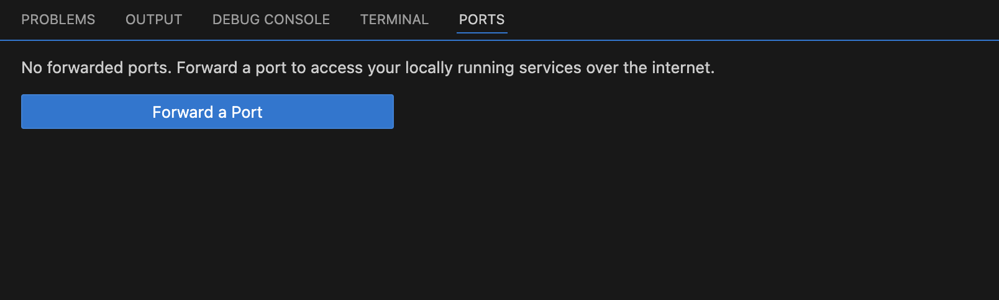

This guide provides a detailed walkthrough on how to configure Port Forwarding in Gitspaces, enabling you to run and test applications on your local machine.

**Port Forwarding** in Gitspaces acts as a bridge between a remote development environment and your local machine. It allows developers to access services running inside Gitspaces as if they were running locally on their system. This feature is also helpful for debugging and testing directly in the browser without additional setup, saving time and effort.

## Forwarding a Port: VS Code Browser

### Pre-Requisites
To enable port forwarding:
- Ensure your application binds to the ```0.0.0.0``` host address. This allows the application to listen for incoming connections from all network interfaces.
- Most applications default to localhost. Change the host address to ```0.0.0.0``` to make port forwarding work.
- Ensure the correct port is configured in your application's configuration file. 

For instance, in a Node.js project, you'll have to update the host address and port number in your server.js file, as it serves as the entry point for your application.

### Adding “forwardPorts” to devcontainer.json
You can specify which ports to forward using the forwardPorts property in the ```devcontainer.json``` file. 

Here's an example configuration:
```
{
    "image":"mcr.microsoft.com/devcontainers/javascript-node:1-22-bookworm",
    "postCreateCommand": "npm install",
    "forwardPorts": [9000]
}
```

1. In your ```.devcontainer/devcontainer.json``` file in your source code repository, add the “forwardPorts” attribute to forward a port. You can specify any port number as required for port forwarding.


2. Save the file and create your Gitspace with this configuration. (Ensure you have selected VS Code Browser as your IDE while creating the Gitspace)  


3. Once your Gitspace is active and running, click on “Open VS Code Online.” You’ll be redirected to VS Code Browser. (Copy this Gitspace URL)


4. You can access the forwarded port URL by appending `-port no.` (a hyphen followed by the port number) before the region in the Gitspace URL. Let’s explore the port URL in more detail.

### Understanding Port URLs
A port URL includes:
- ```Gitspace ID```: Unique identifier for your Gitspace.
- ```Port No```: Forwarded port number is added to the port URL just before the region identifier.
- ```Region```: Hosting region of the Gitspace.
- ```Token```: A secure token generated for the session.

A Gitspace URL exists in the following form:

- https://[```Gitspace ID```].[```Region```].gitspace.harness.io[```Token```]

Once the port number is added before the region, the port URL exists in the following form:

- https://[```Gitspace ID```]-[```Port Number```].[```Region```].gitspace.harness.io[```Token```]

The port URL is public, so you can share it with others to give them access to your application.

## Forwarding a Port: VS Code Desktop
If you're using VS Code Desktop:
- Ensure your Gitspace is active and running with VS Code Desktop as the selected IDE.
- Open the Ports section in VS Code Desktop.
- Click **Forward a Port** and enter the port number (e.g., 9000).


- Open https://localhost:9000 in your browser to access your application.


