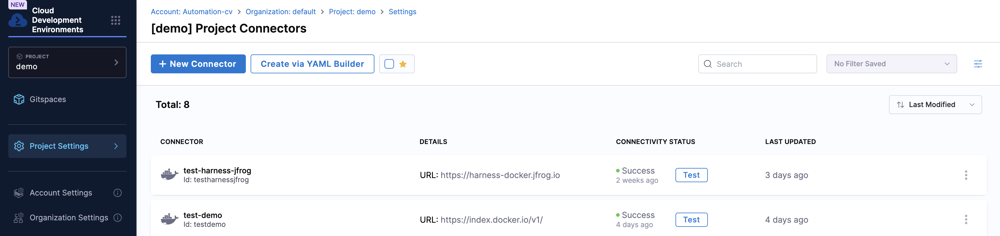
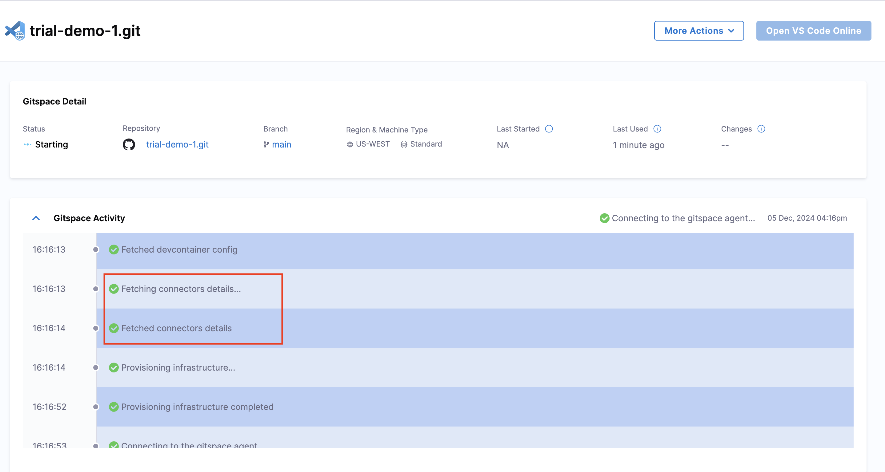
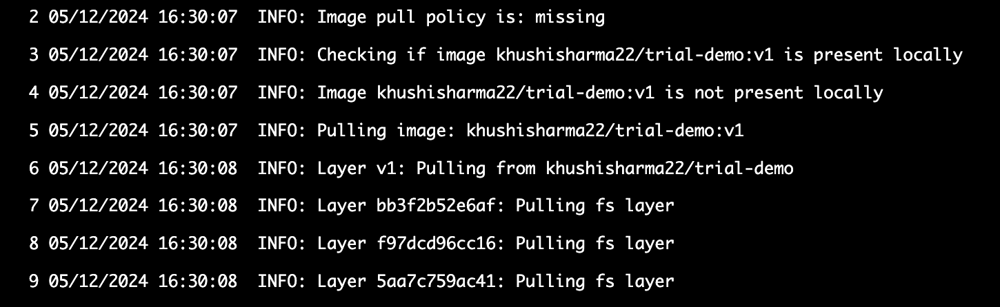

This guide explains how to pull private Docker images (hosted in a public registry) for your Gitspaces. Currently, we support **Docker Registry** (OCI container registry) and **JFrog Artifactory** for this use case (more connectors coming soon). Let’s go through the steps required to use private Docker images from these connectors to run your Gitspaces.

## Pre-Requisite
To proceed, ensure your private Docker image is uploaded and updated in your Artifact Repository.

## Connecting to the Artifact Repository
To pull your private Docker images, you need to connect Harness to your Artifact Repository by adding a repository connector. Currently, we support [**JFrog Artifactory**](https://developer.harness.io/docs/platform/connectors/cloud-providers/ref-cloud-providers/artifactory-connector-settings-reference) and [**Docker Registry**](https://developer.harness.io/docs/platform/connectors/cloud-providers/ref-cloud-providers/docker-registry-connector-settings-reference) for this integration. (Refer to the [documentation](https://developer.harness.io/docs/platform/connectors/artifact-repositories/connect-to-an-artifact-repo/) to add and configure the artifact repository connector.)



:::info 
If your Artifact Repository is hosted on-premises within your infrastructure, we are working on introducing the "Secure Connect" feature (coming soon) to seamlessly connect Harness with your privately-owned assets, such as on-prem repositories.
:::

After adding the connector, copy its identifier, as it will be required to configure your Gitspace.

## Configuring Gitspaces
Once you have successfully added an Artifact Repository connector, you can configure your Gitspace setup. This involves adding the private Docker image and artifact repository details to your ```devcontainer.json``` file. [(Learn more about devcontainer.json file here)](/docs/cloud-development-environments/deep-dive-into-gitspaces/gitspace-configuration.md)

Here’s what you need to add to your ```devcontainer.json``` file:
- ```image```: Private Docker image URL
- ```identifier```: Artifact repository connector identifier

::: info

- If the artifact repository connector is added at the account level, append **```account.```** to the **connector identifier** in your ```devcontainer.json```.
- If it is added at the org level, append **```org.```** to the **connector identifier** in your ```devcontainer.json```.
- No changes are needed for project-level connectors. 

:::

### Sample Configuration
```
{
  "image": "khushisharma22/trial-demo:v2",
  "customizations": {
    "harnessGitspaces": {
      "connectors": [
        {
          "type": "Artifactory",
          "identifier": "testdemo"
        }
      ]
    }
  },
  "vscode": {
    "extensions": ["streetsidesoftware.code-spell-checker"]
  }
}
```
- Update the image property in your devcontainer.json file with the private Docker image URL.
- Add the connector details under the connectors property within the customizations property.
- The type field should always be "Artifactory" for artifact repository connectors.
- The identifier field should include the connector identifier, adjusted based on its scope level.

:::info 
Currently, you can pull images from only one artifact repository connector per Gitspace. 
:::

### Understanding the Image URL
You can reference your images in the ```devcontainer.json``` file using the URL from the artifact repository connector where the image is hosted:
- For Docker Registry: URL format
- For JFrog Artifactory: URL format

For more details, [please refer to the documnentation here](https://developer.harness.io/docs/platform/connectors/cloud-providers/ref-cloud-providers/artifactory-connector-settings-reference). 


## Verifying the Private Docker Image Setup
Now, you can create a new Gitspace with the above configuration using the Harness UI. (Refer to these docs to learn how to create a new Gitspace.)

Once the Gitspace is created, you can verify the setup by checking the container logs and status stages. If everything is set up correctly, your Gitspace will run using your private Docker image.





