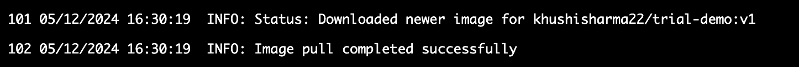

This guide explains how to pull **private Docker images** for your Gitspaces. Currently, we support **Docker Registry** (OCI container registry), **JFrog Artifactory** and **AWS ECR** for this use case (more connectors coming soon). Let’s go through the steps required to use private Docker images from these connectors to run your Gitspaces.

Harness Gitspaces supports the use of private Docker images, allowing you to fully customize your development environment to suit your specific needs. This feature provides the flexibility to install essential tools, libraries, and dependencies for your project, enabling you to personalize your Gitspace seamlessly with your private Docker images.

### Pre-Requisite
To proceed, ensure your private Docker image is uploaded and updated in your Artifact Repository.

## Connecting to the Artifact Repository
To pull your private Docker images, you need to connect Harness to your Artifact Repository by adding a repository connector. Currently, we support the following connectors:

1. [**JFrog Artifactory**](https://developer.harness.io/docs/platform/connectors/cloud-providers/ref-cloud-providers/artifactory-connector-settings-reference)
2. [**Docker Registry**](https://developer.harness.io/docs/platform/connectors/cloud-providers/ref-cloud-providers/docker-registry-connector-settings-reference)
3. [**AWS ECR**](https://developer.harness.io/docs/platform/connectors/cloud-providers/add-aws-connector)

:::info
Please note that Harness Gitspaces currently supports **AWS Access Key** as the only credential type for connecting to your AWS account. Read more about the **AWS connector settings reference** [here](https://developer.harness.io/docs/platform/connectors/cloud-providers/ref-cloud-providers/aws-connector-settings-reference/#credentials). 
:::

Refer to this [documentation](https://developer.harness.io/docs/platform/connectors/artifact-repositories/connect-to-an-artifact-repo/) to add and configure the artifact repository connector.


:::info 
If your artifact repository is hosted on-premises within your infrastructure, you can use the **"Secure Connect"** integration to seamlessly connect Harness to your privately-owned assets, including on-prem repositories and artifact repositories. For more details, refer to the [feature guide here](/docs/cloud-development-environments/features-of-gitspaces/secure-connect.md).
:::

After adding the connector, copy its **`identifier`**, as it will be required to configure your Gitspace.

## Configuring Gitspaces
Once you have successfully added an Artifact Repository connector, you can configure your Gitspace setup. This involves adding the private Docker image and artifact repository details to your ```devcontainer.json``` file. [(Learn more about devcontainer.json file here)](/docs/cloud-development-environments/deep-dive-into-gitspaces/gitspace-configuration.md)

Here’s what you need to add to your ```devcontainer.json``` file:
- ```image```: Private Docker image URL
- ```identifier```: Artifact repository connector identifier

:::info
- If the artifact repository connector is added at the account level, append **```account.```** to the **connector identifier** in your ```devcontainer.json```.
- If it is added at the org level, append **```org.```** to the **connector identifier** in your ```devcontainer.json```.
- No changes are needed for project-level connectors. 
:::

### Sample Configuration
```
{
  "image": "khushisharma22/trial-demo:v2",
  "customizations": {
    "harnessGitspaces": {
      "connectors": [
        {
          "type": "Artifactory",
          "identifier": "testdemo"
        }
      ]
    }
  },
  "vscode": {
    "extensions": ["streetsidesoftware.code-spell-checker"]
  }
}
```
- Update the **```image```** property in your ```devcontainer.json``` file with the private Docker image URL.
- Add the **connector details** under the ```connectors``` property within the ```customizations``` property.
- The `type` field varies for each connector. Below are the details of the `type` field for the currently available connectors:

  | **Connector**    | **Type** |
  | -------- | ------- |
  | [**JFrog Artifactory**](https://developer.harness.io/docs/platform/connectors/cloud-providers/ref-cloud-providers/artifactory-connector-settings-reference) | "Artifactory"    |
  | [**Docker Registry**](https://developer.harness.io/docs/platform/connectors/cloud-providers/ref-cloud-providers/docker-registry-connector-settings-reference) | "DockerRegistry" |
  | [**AWS ECR**](https://developer.harness.io/docs/platform/connectors/cloud-providers/add-aws-connector) | "Aws" |

- The `identifier` field should include the connector identifier, adjusted based on its scope level.

:::info 
Currently, you can use only one connector per Gitspace to pull images from a private Repository.
:::

### Understanding the Image URL
You can reference your images in the ```devcontainer.json``` file using the URL from the artifact repository connector where the image is hosted:

Sample References: 
- For **Docker Registry**:  namespace1/devcontainer:dev-ubuntu
- For **JFrog Artifactory**: harness-ken-docker-repo-1.jfrog.io/base:dev-ubuntu
- For **AWS ECR**: 

For more details, [please refer to the documentation here](https://developer.harness.io/docs/platform/connectors/cloud-providers/ref-cloud-providers/artifactory-connector-settings-reference). 


## Verifying the Private Docker Image Setup
Now, you can create a new Gitspace with the above configuration using the Harness UI. ([Refer to these docs to learn how to create a new Gitspace.](https://developer.harness.io/docs/cloud-development-environments/introduction/getting-started-with-cde))

Once the Gitspace is created, you can verify the setup by checking the **container logs** and **status stages**. If everything is set up correctly, your Gitspace will run using your private Docker image.





