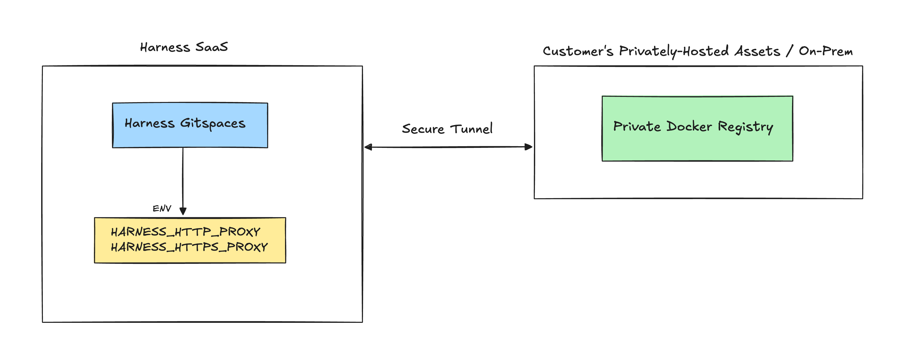
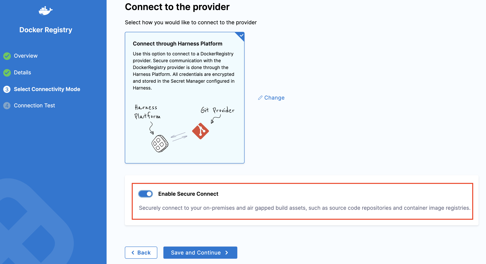

This guide explains how to enable and use **Secure Connect** for your Gitspaces. With Secure Connect, you can directly fetch and pull private Docker images from privately-hosted assets, such as internal Artifact Repositories and on-premises repositories.

:::info
Secure Connect for Harness Gitspaces is currently gated behind the feature flag ```CI_SECURE_TUNNEL```. To enable this feature, please reach out to support@harness.io.
:::

## Secure Connect for Gitspaces
Harness Gitspaces offers the **Secure Connect** feature, providing a robust and secure proxy solution. This feature allows seamless integration with your on-premises, privately-hosted assets such as **Docker Registries** and **Artifact Repositories**. Additionally, you can customize your configurations using proxy environment variables for enhanced flexibility.



Here’s a step-by-step guide to enabling and using this feature.

## Configuring Secure Connect
1. **Create a Harness API Key**: You can start by creating a [Harness API](https://developer.harness.io/docs/platform/automation/api/add-and-manage-api-keys) key with at least RBAC:core_pipeline_view and ABAC:All permissions.

2. **Run the Secure Connect Docker Client**:
You’ll have to run a Docker client within your firewalled environment. This client will act as a proxy server in your network, establishing a secure connection with the Harness server.
Use the following command to start the client:  
    ```
    docker run -it \
    -e REMOTE_PORT=ANY_PORT_FROM_30000_TO_30099 \
    -e REMOTE_SERVER=sc.harness.io \
    -e API_KEY=YOUR_HARNESS_API_KEY \
    harness/frpc-signed
    ```
    - **REMOTE_PORT**: Specify any port from 30000 to 30099.
    - **API_KEY**: Replace with a valid Harness API key.

3. **Enable Secure Connect**:
Once the client is installed, enable the **"Secure Connect"** flag while adding your artifact repository connector. [(Refer to this guide for detailed steps on adding an artifact repository connector.)](https://developer.harness.io/docs/platform/connectors/artifact-repositories/connect-to-an-artifact-repo)


Secure Connect is now successfully configured. You can proceed to create a Gitspace using your privately hosted Docker image. [(Follow this guide to learn more.)](/docs/cloud-development-environments/features-of-gitspaces/private-docker-images.md)


## Secure Connect Environment Variables
During the Secure Connect setup, the proxy URLs are exposed through the following environment variables: ```HARNESS_HTTP_PROXY``` and ```HARNESS_HTTPS_PROXY```. You can configure these environment variables to redirect outbound calls through the specified proxy, ensuring secure and efficient connectivity.

#### Example Configuration
You can configure your proxy settings in the following way:
```
$ env | grep -i PROXY
HARNESS_HTTPS_PROXY=https://<username>:<password>@sc.harness.io:<port>
HARNESS_HTTP_PROXY=http://<username>:<password>@sc.harness.io:<port>
```
Now, you can configure **Gradle** to use a proxy server for downloading plugins or dependencies explicitly specified. You can define the proxy settings in the ```gradle.properties``` file:
```
# Proxy settings for Gradle
systemProp.http.proxyHost=sc.harness.io
systemProp.http.proxyPort=<port>

systemProp.https.proxyHost=sc.harness.io
systemProp.https.proxyPort=<port>

systemProp.http.proxyUser=<username>
systemProp.http.proxyPassword=<password>

systemProp.https.proxyUser=<username>
systemProp.https.proxyPassword=<password>
```
Now when you'll run ```gradle build```, Gradle downloads plugins and dependencies specified in the ```build.gradle file```. With these proxy settings, Gradle will route all its HTTP and HTTPS requests through the proxy server.