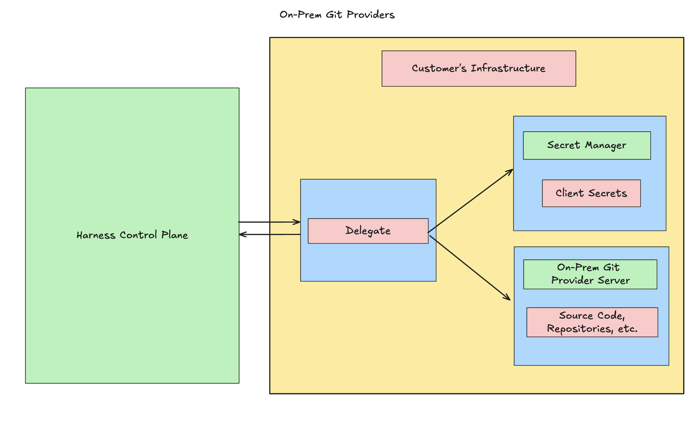
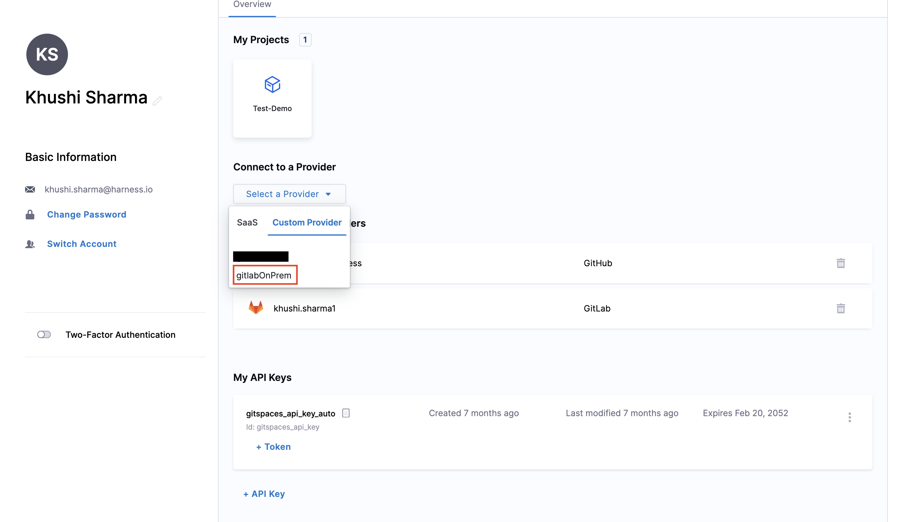
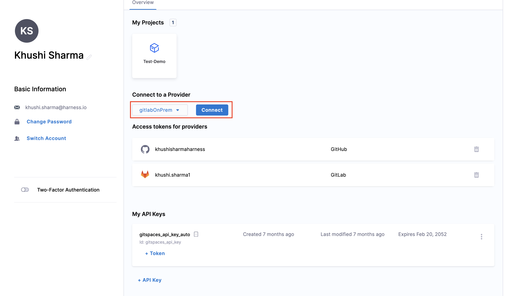

You can configure **On-Prem Git Providers** to spin up cloud development environments for source code repositories hosted in your **own infrastructure**. This provides an added layer of security and control over your source code and metadata and ensures your data never leaves your server and infrastructure. This document takes you through a detailed guide on the fundamentals of on-prem Git providers with Harness Gitspaces and how to configure these providers for Gitspaces.

## Fundamentals

On-prem Git provider support with Harness Gitspaces enables you to adopt a powerful hybrid model, combining data security with developer productivity. This allows you to create and spin up cloud development environments in seconds, with full access to the source code and repositories hosted in your infrastructure.

### Supported On-Prem Git Providers

Harness Gitspaces supports the following **On-Prem Git providers**:

* [GitHub Enterprise Server](https://docs.github.com/en/enterprise-server@3.14/admin/overview/about-github-enterprise-server)
* [GitLab Self-Managed](https://docs.gitlab.com/subscriptions/self_managed/)
* [Bitbucket Data Center](https://www.atlassian.com/enterprise/data-center/bitbucket)

This enables you to create Gitspaces for your source code present in any of the above-supported on-prem Git providers.

### Architecture

The underlying architecture behind this on-prem Git provider feature can be understood through two key components: the **Harness Control Plane** and the **Customer's Infrastructure**.

There are two key components to configuring on-prem Git providers with Harness Gitspaces:

#### Harness Control Plane

The Harness Control Plane is used to **manage the entire customer interaction** through the **Harness UI** and establish a connection with the **customer's infrastructure**. All the customer's source code, repositories, and secrets are stored in their infrastructure via on-prem Git providers and their on-prem secret managers. The Harness Control Plane registers customer interactions and establishes a **connection layer with the Harness Delegate** hosted in the customer’s infrastructure.

#### Customer's Infrastructure

All the **customer's source code, repositories, and secrets** are stored in their infrastructure via **on-prem Git providers** and their **on-prem secret managers**. For the customer’s infrastructure to connect and communicate with the Harness Control Plane, a **Harness Delegate** must be installed. The Harness Delegate is a service you install in your infrastructure to establish and maintain a connection between the Harness Control Plane and your infrastructure. To learn more about the same, refer to [delegate overview](https://developer.harness.io/docs/platform/delegates/delegate-concepts/delegate-overview/).

## Prerequisites

Make sure you have a **Harness Delegate** installed and set up in your infrastructure to send tasks and responses to the Harness Control Plane from the on-prem Git provider server. Ensure the delegate is created at the **Account** level. To learn more, refer to [delegate installation options](https://developer.harness.io/docs/platform/delegates/install-delegates/overview/). Ensure your **Delegate** has access to your on-prem Git provider server and your Secret Manager (if hosted in your infrastructure). 

## Configure On-Prem Providers

You can configure on-prem Git providers with Harness Gitspaces by following these steps:

### 1. Add On-Prem Git Provider

To begin, you need to add and configure the OAuth client details in your on-prem Git providers from your Harness account.

To configure and add **Bitbucket Data Center**, refer to this [documentation](https://developer.harness.io/docs/platform/git-experience/oauth-integration#configure-oauth-for-self-hosted-bitbucket-provider).

To configure and add **GitLab Self-Managed**, refer to this [documentation](https://developer.harness.io/docs/platform/git-experience/oauth-integration#configure-oauth-for-self-hosted-gitlab-provider).

This will allow you to:

1. Provide the **Name** and **Domain URL** of the Git provider
2. Connect your **Secret Manager** and add/create your respective secrets
3. Select your **Delegate** (This is the delegate hosted in your infrastructure. Refer to the [prerequisites](/docs/cloud-development-environments/git-providers/on-prem-providers.md#prerequisites) to learn more.)

:::info
Ensure your **Delegate** has access to your on-prem Git provider server and your Secret Manager (if hosted in your infrastructure). 
:::

### 2. Configure OAuth

Once you've added the Git provider, configure OAuth for the same provider from your **Profile Settings**. This step is essential to authenticate your credentials for the provider.

Follow these steps:

1. Navigate to **User Profile** -> **Profile Overview**. Under **Connect to a Provider**, click **Select a Provider**.
2. Click on the **On-Prem / Custom Provider** section and select the provider you created earlier.

3. Click **Connect**.

4. You’ll be redirected to a permissions page where you must allow Harness to access your account. Click **Allow/Authorize**.
5. Once done, your access token in the Git provider account is created, and OAuth is successfully configured.

### 3. Use On-Prem Git Provider

Once OAuth is configured, you can create your Harness Gitspace and select the specific on-prem Git provider. This will fetch all repositories hosted in that provider.
Refer to [create a Gitspace](/docs/cloud-development-environments/manage-gitspaces/create-gitspaces.md) to learn more.

