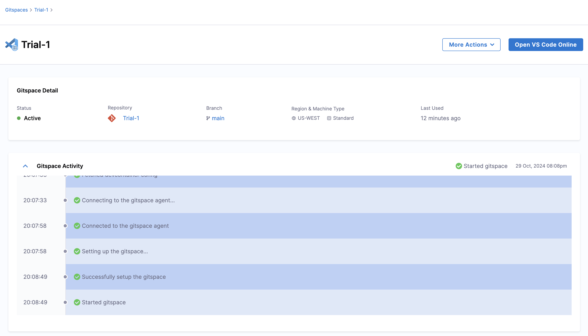

:::info

Harness CDE is now available in public beta. To enable it on your account, contact your sales representative or reach out to the team at cde-interest@harness.io

:::

Harness CDE provides seamless support to connect and access your Gitspaces remotely within your browser via VS Code. This 

This guide will take you through the steps required to access a Gitspace in your VS Code Browser:

1. Start by creating a new Gitspace from the Harness UI. (check the quickstart guide for more details) 
Please ensure that while creating one, you choose “VS Code Browser” as the selected IDE.

2. After the Gitspace is created, click “Open VS Code Onliner” from the Harness UI. 

3. And, you’re all set. You have successfully established a remote connection with the Gitspace right within your browser. 

