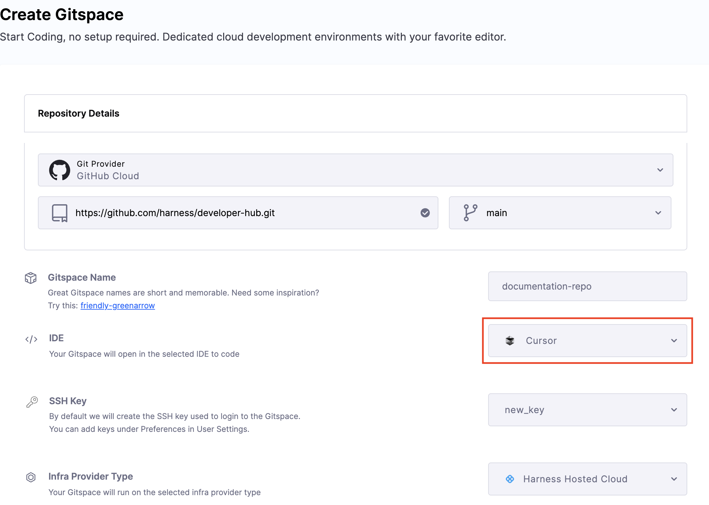
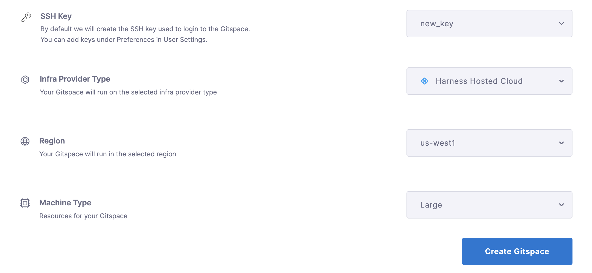
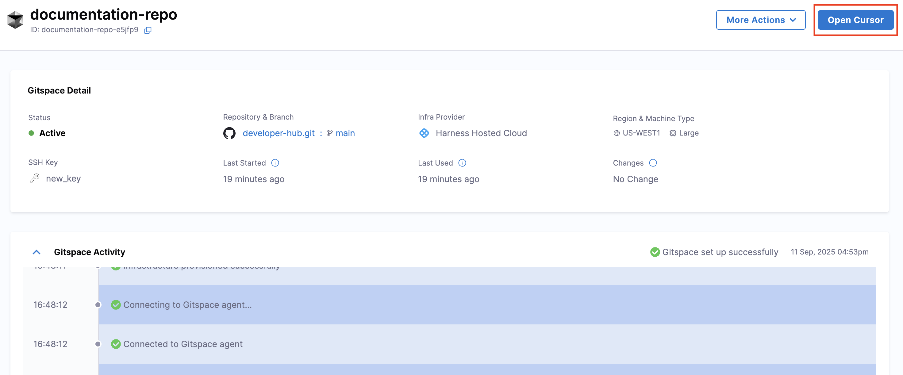
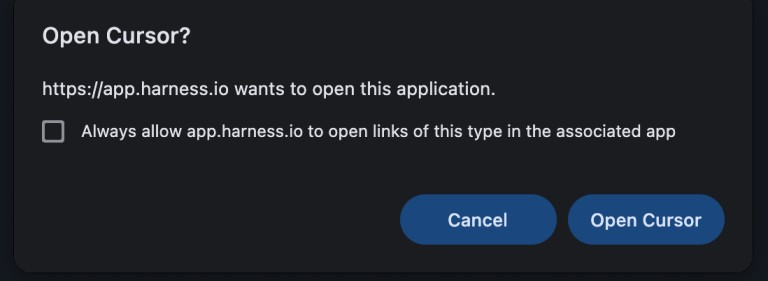
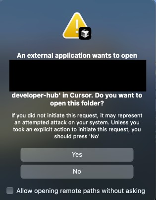
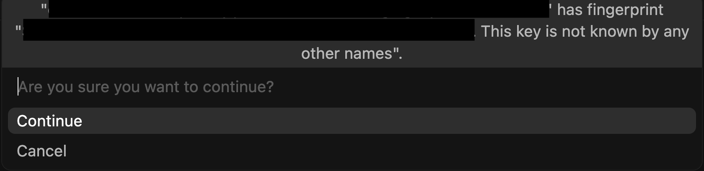
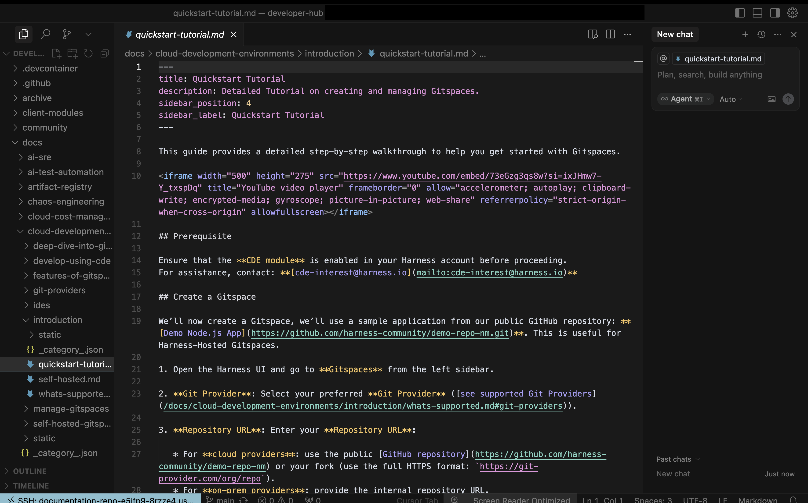

With **Cursor** support, Harness CDE enables seamless and efficient remote development in your Gitspaces within your Cursor IDE. This enables you to use Cursor and agentic AI features to enhance your remote development experience.

This guide provides a step-by-step walkthrough to help you use **Cursor** with your Gitspaces. Let’s get started!

## Getting started with Cursor IDE
Follow these steps to get started with integrating Cursor IDE into your Gitspaces workflow:  
### Create a Gitspace
1. Navigate to the **Harness UI** and [create a new Gitspace](/docs/cloud-development-environments/introduction/quickstart-tutorial.md) for your project repository.
2. Select **"Cursor"** as the IDE during Gitspace creation.

3. Add your SSH key and configure the required Gitspace specifications.

4. Click **"Create Gitspace"**.

### Open the Gitspace in Cursor 
1. Once the Gitspace is created and running, click on the **"Connect to Cursor"** button.

2. A prompt will appear requesting permission for `app.harness.io` to open **Cursor** and establish a connection. Click on **Open Cursor**. 

3. You'll be asked to give permission to establish a connection with a remote server. Click on **Yes**. Your Windsurf IDE will open. 

4. You'll be required to confirm the given SSH key can be used to connect, type **yes** in the text box and click **Enter**. 

5. And that's it! You're all set to start working on your Gitspace directly within Cursor.

### Setup Complete
Once the setup completes, your Gitspace will be successfully connected to Cursor IDE. Congratulations! You are now ready to work on your Gitspace directly within Cursor.

### Harness Gitspaces Plugin
The [Harness Gitspaces plugin](https://open-vsx.org/extension/harness-inc/gitspaces) is a Cursor extension that lets you connect to and manage your Gitspaces directly in the Cursor IDE. It provides a seamless workflow so you can work on Gitspaces without leaving the IDE. With the plugin, you can:

* Start and open a Gitspace
* Stop a Gitspace
* View all your Gitspaces from within Cursor

Follow these steps to set up the Harness Gitspaces plugin in Cursor:

1. Open Cursor and go to **Extensions**.
2. Search for **Harness Gitspaces** and click **Install**.
3. After installation, click **Sign in**. You’ll be redirected to the Harness sign-in page—enter your Harness credentials.
4. Once signed in, you can manage and connect to your Gitspaces directly from the IDE.
