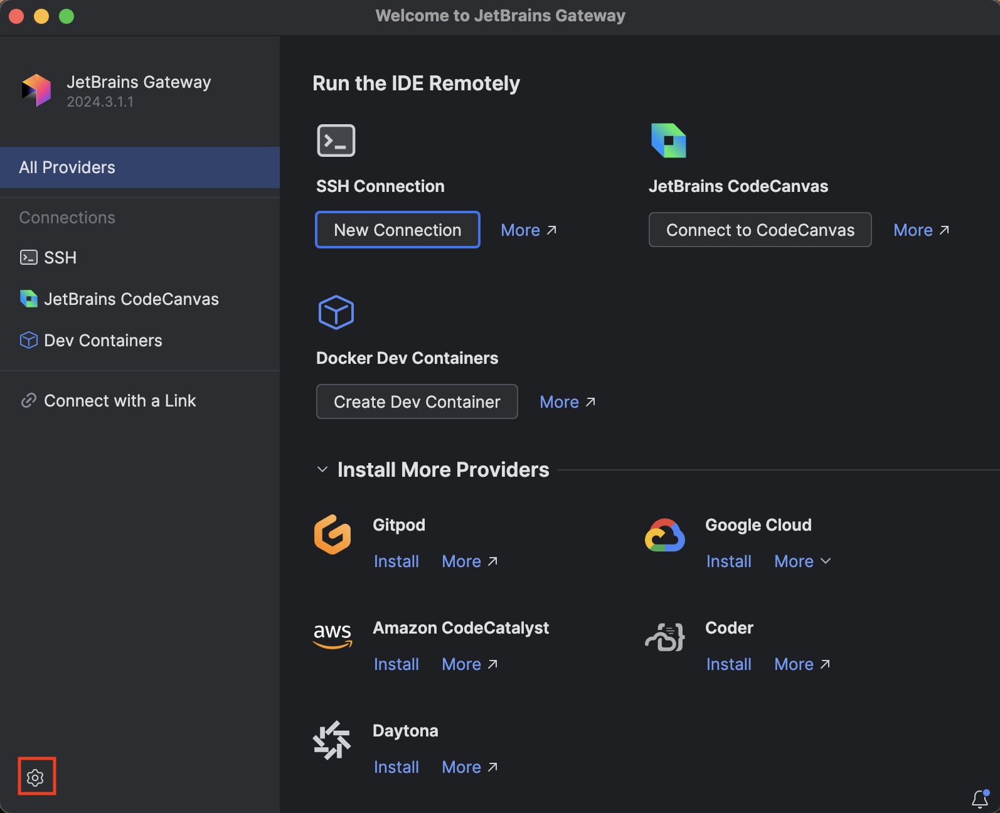
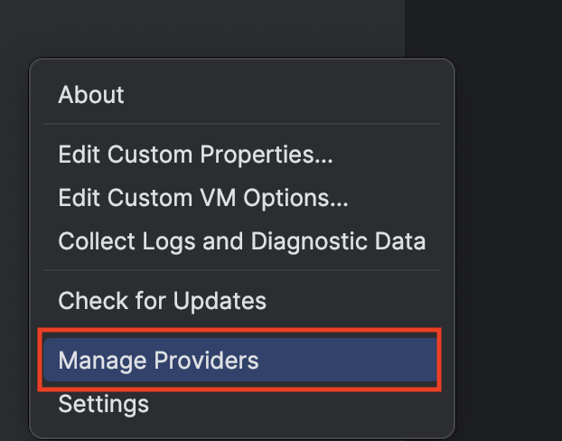
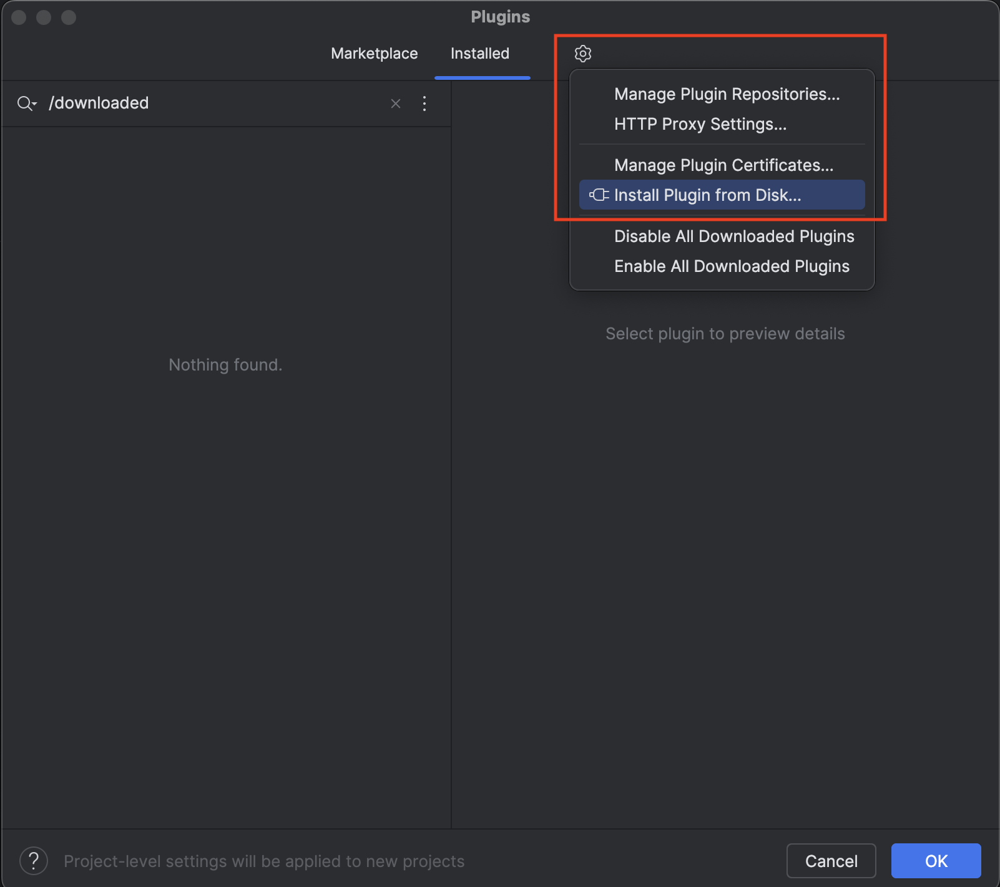
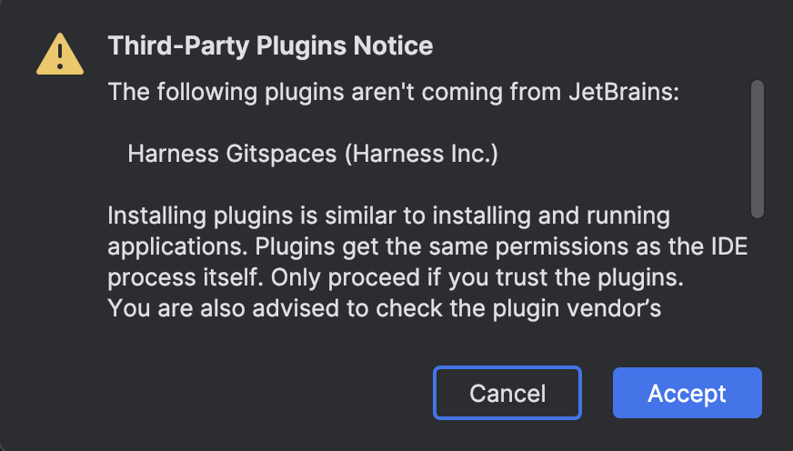
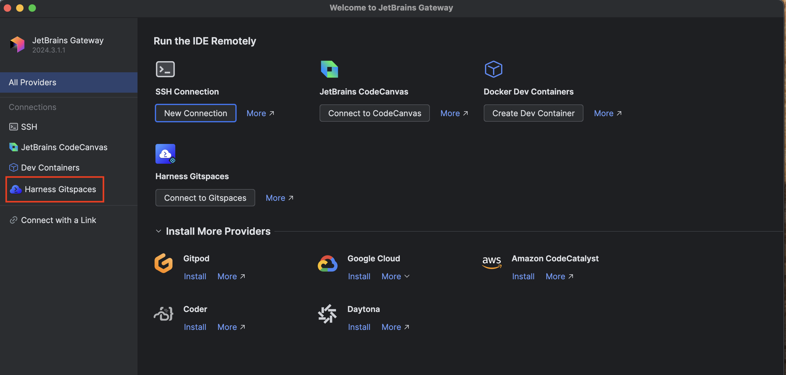

Harness CDE supports seamless and efficient remote development in JetBrains IDEs using JetBrains Gateway. 

The following JetBrains IDEs are supported for remote development:
- IntelliJ IDEA
- PyCharm
- PhpStorm
- GoLand
- CLion
- Rider
- RubyMine
- Webstorm

## JetBrains Gateway Plugin  

JetBrains Gateway is a lightweight desktop application that allows you to work remotely with JetBrains IDEs without downloading the full IDE. It connects to a remote server, fetches the necessary backend components, and opens your project in a JetBrains client.  

With the **JetBrains Gateway Plugin**, you can seamlessly access and manage your **Gitspaces** created in JetBrains IDEs. This plugin ensures smooth navigation and efficient development within your IDE.  

## Prerequisites  

### Install JetBrains Gateway  
Before proceeding, ensure that **JetBrains Gateway** is installed on your device.  

### Recommended Gitspace Configuration  
Refer to this section to understand the **recommended Gitspace requirements** for optimal performance when connecting to your Gitspace in JetBrains IDEs.  

## Installing the Plugin  

Follow these steps to install the **Harness Gitspace Plugin**:  

1. **Download the latest version** of the Harness Gitspace Plugin package.  
2. **Install and open** JetBrains Gateway.  

3. Click the **settings icon** in the bottom-left corner of the application.  
     

4. Select **"Manage Providers."**  
     
5. In the **Installed Plugins** section, click the **settings icon** on the right and choose **"Install Plugin from Disk."**  
     

6. Locate and **select the downloaded Harness Gitspaces Plugin package.**  
7. A warning will appear indicating that this is a third-party plugin (Harness Gitspaces Plugin) and not a JetBrains plugin. Click **"Accept."**  
     
8. That’s it! You will now see the plugin successfully installed in your **JetBrains Gateway connections.**  
     

## Configuring the Plugin

## Managing your Gitspaces