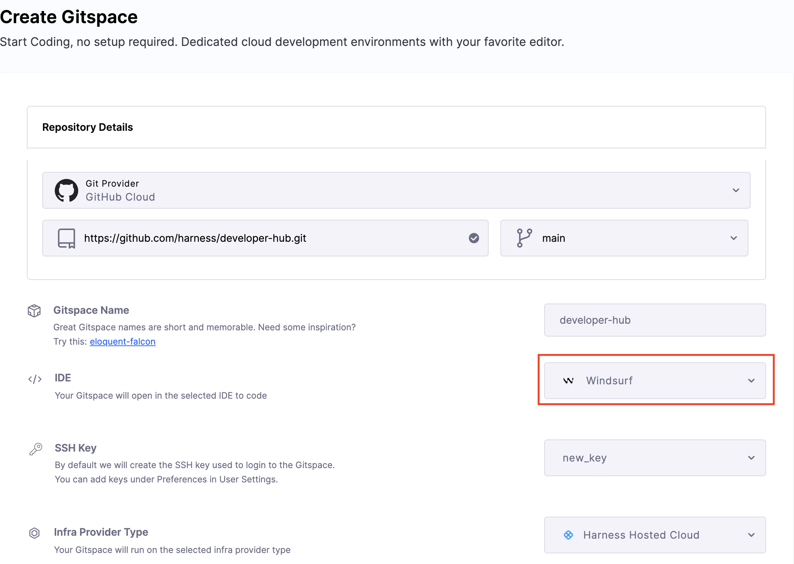
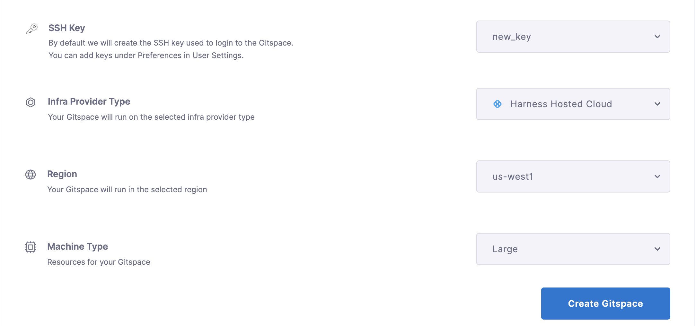
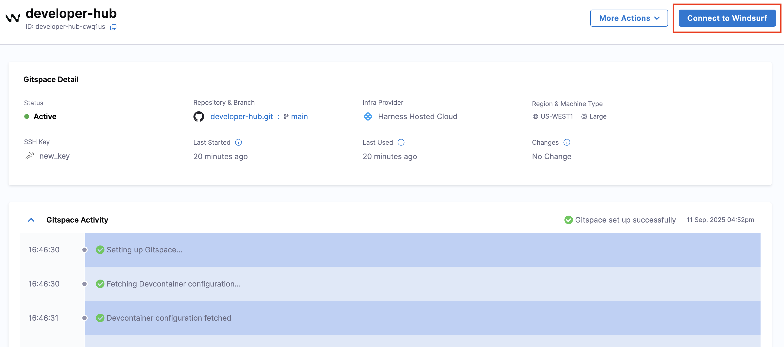
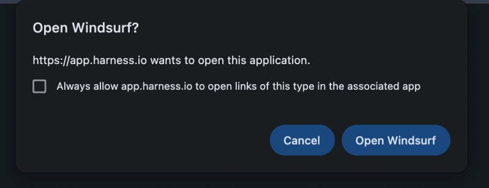
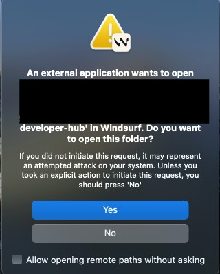
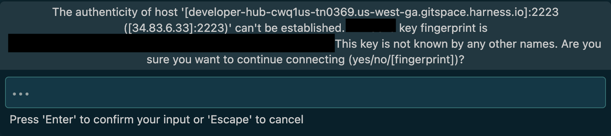
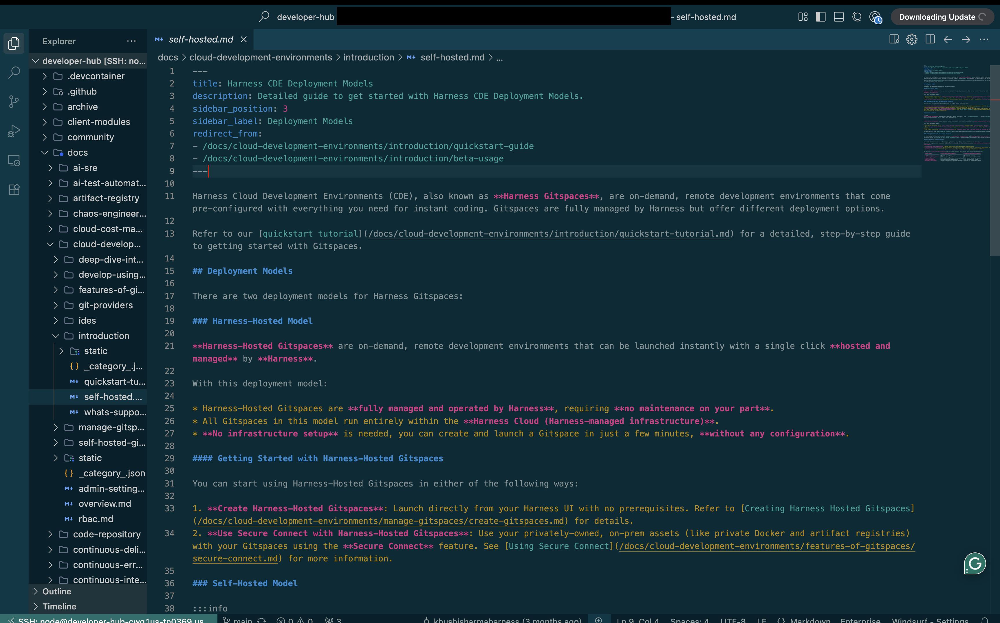

With **Windsurf** support, Harness CDE enables seamless and efficient remote development in your Gitspaces within your Windsurf IDE. This enables you to use Windsurf and agentic AI features to enhance your remote development experience.

This guide provides a step-by-step walkthrough to help you use **Windsurf** with your Gitspaces. Let’s get started!

## Getting started with Windsurf IDE
Follow these steps to get started with integrating Windsurf IDE into your Gitspaces workflow:  
### Create a Gitspace
1. Navigate to the **Harness UI** and [create a new Gitspace](/docs/cloud-development-environments/introduction/quickstart-tutorial.md) for your project repository.
2. Select **"Windsurf"** as the IDE during Gitspace creation.

3. Add your SSH key and configure the required Gitspace specifications.

4. Click **"Create Gitspace"**.

### Open the Gitspace in Windsurf 
1. Once the Gitspace is created and running, click on the **"Connect to Windsurf"** button.

2. A prompt will appear requesting permission for `app.harness.io` to open **Windsurf** and establish a connection. Click on **Open Windsurf**. 

3. You'll be asked to give permission to establish a connection with a remote server. Click on **Yes**. Your Windsurf IDE will open. 

4. You'll be required to confirm the given SSH key can be used to connect, type **yes** in the text box and click **Enter**. 

5. And that's it! You're all set to start working on your Gitspace directly within Windsurf.

### Setup Complete
Once the setup completes, your Gitspace will be successfully connected to Windsurf IDE. Congratulations! You are now ready to work on your Gitspace directly within Windsurf.

