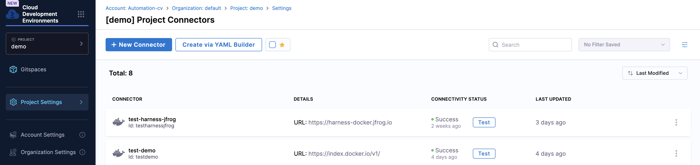
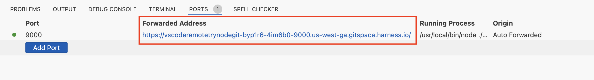

:::info

Harness CDE is now available in public beta. To enable it on your account, contact your sales representative or reach out to the team at cde-interest@harness.io 

:::

Harness CDE (also known as Gitspaces) are on-demand, remote development environments that can be launched instantly with a single click. This document serves as a quickstart guide to help users get started with Harness Gitspaces. Please refer to our [quickstart tutorial](/docs/cloud-development-environments/introduction/quickstart-tutorial.md) guide for a detailed, step-by-step demo on how to get started with Gitspaces.

### Pre-Requisite
Please ensure that the CDE module is enabled in your Harness account before you start with these instructions. You can reach out to the team to get this enabled: cde-interest@harness.io

## Create your first Gitspace
1. Navigate to the **“Cloud Development Environments”** module in the sidebar of your Harness UI. 
    - If no Gitspaces exist, you'll be redirected to the **“Getting Started”** wizard. 
    - In case there's any existing Gitspace for your project, you can click on **"Create a new Gitspace"**. 

        

2. Select the project where you want to create the Gitspace and click **“Getting Started Now”** to proceed to the **“Create Gitspace”** page.

    

3. Specify your Gitspace details:
    - Connect your **Git provider** (Harness Code is the default). For providers like **GitHub** or **GitLab**, [configure OAuth](/docs/cloud-development-environments/features-of-gitspaces/authentication.md) to access private repositories. 
    - Enter your repository’s branch name.
    - Choose your preferred IDE:
        - VS Code Browser
        - VS Code Desktop (This requires the Harness Gitspaces VS Code Desktop extension, [follow this guide to set this up](/docs/cloud-development-environments/ide's/vs-code-desktop.md)).
    - Select your region and machine type.
    
        

4. Click **“Create Gitspace”**.

You’ll be redirected to the Gitspace Details page to monitor events and container logs during creation. Once the Gitspace is ready, open it by clicking **“Open VS Code Online”** or **“Open VS Code Desktop”**.
Congratulations! You’ve created your first Gitspace.

## Develop in your Gitspace
You can start developing in your Gitspace and customise it as per your specific needs. 

The configuration for your Gitspace is stored in the `.devcontainer/devcontainer.json` file within your project’s repository. This file includes all the metadata and settings for your development environment, allowing you to customize your setup using various properties. For more details, refer to the [Gitspace configuration guide](docs/cloud-development-environments/deep-dive-into-gitspaces/gitspace-configuration.md) here.

Here are some key features of developing in Gitspaces:
#### [Private Docker Images](/docs/cloud-development-environments/features-of-gitspaces/private-docker-images.md)
Harness Gitspaces supports the use of **private Docker images**, allowing you to pull private Docker images for your Gitspaces which further enables you to personalize your Gitspace seamlessly with your private Docker images.

#### [Secure Connect Integration](/docs/cloud-development-environments/features-of-gitspaces/secure-connect.md)
Harness Gitspaces offers the **Secure Connect** feature, providing a robust and secure proxy solution. This feature allows seamless integration with your on-premises, privately-hosted assets such as **Docker Registries** and **Artifact Repositories**. 

#### [Port Forwarding](/docs/cloud-development-environments/develop-using-cde/port-forwarding.md)
**Port Forwarding** in Gitspaces acts as a bridge between a remote development environment and your local machine. It allows developers to access services running inside Gitspaces as if they were running locally on their system. 

You can check out more about the different [features of Gitspaces here](https://developer.harness.io/docs/category/features-of-gitspaces). 

## Customize and Manage your Gitspace
You can customize your Gitspace to meet your specific needs by modifying its configuration. Use the `devcontainer.json` properties to set up environment variables, `runArgs`, and configure `containerUser` and `remoteUser` for your Gitspaces. Learn more about how to [customize your Gitspace](https://developer.harness.io/docs/category/developing-in-gitspaces) using the `devcontainer.json` file.

Additionally, Gitspaces can be managed directly from the Harness UI. You can easily start, stop, or delete a Gitspace as needed. Find more details about [managing your Gitspaces](https://developer.harness.io/docs/category/managing-gitspaces).

