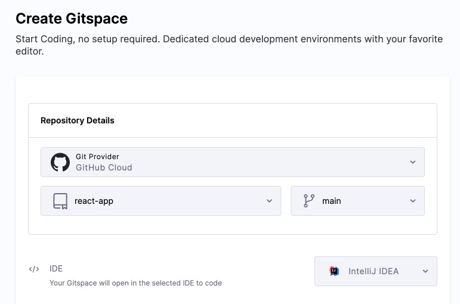

This guide provides a detailed step-by-step walkthrough to help you get started with Gitspaces.

<iframe width="500" height="275" src="https://www.youtube.com/embed/73eGzg3qs8w?si=ixJHmw7-Y_txspDq" title="YouTube video player" frameborder="0" allow="accelerometer; autoplay; clipboard-write; encrypted-media; gyroscope; picture-in-picture; web-share" referrerpolicy="strict-origin-when-cross-origin" allowfullscreen></iframe>

## Prerequisite

Ensure that the **CDE module** is enabled in your Harness account before proceeding.
For assistance, contact: **[cde-interest@harness.io](mailto:cde-interest@harness.io)**

## Create a Gitspace

We’ll now create a Gitspace, we’ll use a sample application from our public GitHub repository: **[Demo Node.js App](https://github.com/harness-community/demo-repo-nm.git)**. This is useful for Harness-Hosted Gitspaces. 

1. Open the Harness UI and go to **Gitspaces** from the left sidebar.

2. **Git Provider**: Select your preferred **Git Provider** ([see supported Git Providers](/docs/cloud-development-environments/introduction/whats-supported.md#git-providers)). 

3. **Repository URL**: Enter your **Repository URL**:

   * For **cloud providers**: use the public [GitHub repository](https://github.com/harness-community/demo-repo-nm) or your fork (use the full HTTPS format: `https://git-provider.com/org/repo`).
   * For **on-prem providers**: provide the internal repository URL.

4. **Branch**: Enter a branch name, or use the default `main`.

5. **IDE**: Select your preferred IDE (e.g., VS Code Desktop). Check [IDE prerequisites](/docs/category/ides) beforehand.



6. **SSH Key**: Required for all IDEs except browser-based ones. Refer to the SSH key setup guide.

7. **Infra Provider Type**:

   * **Harness Hosted** → Select **Harness Default GCP Provider**
   * **Self Hosted** → Select your previously configured infrastructure


8. **Region**:

   * **Harness Hosted** → Choose from pre-defined regions ([see supported regions](/docs/cloud-development-environments/introduction/whats-supported.md)).
   * **Self Hosted** → Select from your configured list ([see how](/docs/cloud-development-environments/self-hosted-gitspaces/steps/gitspace-infra-ui.md#configure-regions)).

9. **Machine Type**:

   * **Harness Hosted** → Choose from available machine types ([see supported machines](/docs/cloud-development-environments/introduction/whats-supported.md)).
   * **Self Hosted** → Choose from the machine types configured in your infra ([see how](/docs/cloud-development-environments/self-hosted-gitspaces/steps/manage-self-hosted.md#add-machines-in-gitspace-infrastructure)).

10. Click **Create Gitspace**.


Once your Gitspace is active, you're ready to begin development!

## Develop in Your GitSpace

Let’s run the sample app and try making a code change:

#### Run the App

1. Open a new terminal.
2. Run the app using:

   ```sh
   npm run dev
   ```
3. The app runs on port `3000`. A pop-up in your IDE will display a link to open it in the browser.

If you don’t see the pop-up:

#### Use Port Forwarding:

1. Go to the **Ports** panel in VS Code and click **Forward a Port**.
2. Enter `3000`, press Enter.
3. Open [https://localhost:3000](https://localhost:3000) in your browser.

[Learn more about Port Forwarding](/docs/cloud-development-environments/develop-using-cde/port-forwarding.md).

<iframe width="500" height="275" src="https://www.youtube.com/embed/MGcNbaEOgR4?si=MwhXfbKzAlZbelW-" title="YouTube video player" frameborder="0" allow="accelerometer; autoplay; clipboard-write; encrypted-media; gyroscope; picture-in-picture; web-share" referrerpolicy="strict-origin-when-cross-origin" allowfullscreen></iframe>

## Make and Commit Changes

1. Ensure you created the Gitspace from your **forked** repo.
2. Modify `haikus.json` — for example, delete a block like:

   ```json
   {
       "text": "traffic in bangalore,\ncondiser fying to work",
       "image": "canary-flying.png"
   }
   ```
3. (Optional) If OAuth is not already set, configure Git:

   ```sh
   git config --global user.email "you@example.com"
   git config --global user.name "Your Name"
   ```
4. Use **Source Control** in VS Code to:

   * Stage changes (click `+` next to files)
   * Add a commit message and click **Commit**
   * Click **Sync Changes** to push

GitHub will prompt you to authorize the push - complete it, and your changes will reflect in your fork.

