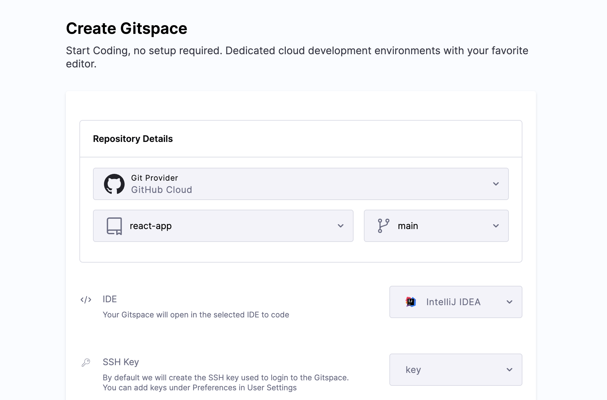
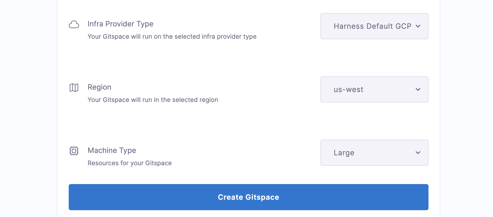
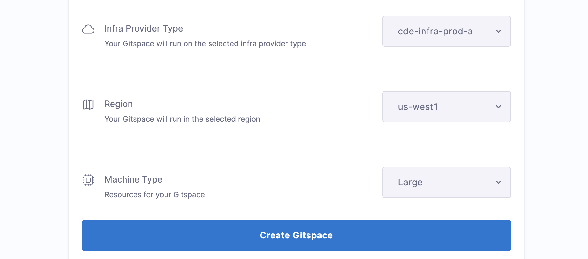

This document will guide you to understand in detail on how to create a new Gitspace. Follow the instructions below to start creating a new Gitspace. 

## Prerequisites

### Enable CDE Module
Ensure that the **CDE module** is enabled in your Harness account before proceeding.
For assistance, contact: **[cde-interest@harness.io](mailto:cde-interest@harness.io)**

### Select Your Deployment Model

Based on the deployment model you choose - **Harness Hosted** or **Self Hosted** - you can proceed accordingly with this tutorial.

#### 1️⃣ Harness Hosted

For Harness Hosted Gitspaces, no infrastructure configuration is required. All you need is your source code repository link and Gitspace details. Read more about [Harness Hosted Gitspaces](/docs/cloud-development-environments/introduction/quickstart-guide.md).

**🔗 Follow the instructions here to create a new Gitspace: [Creating Gitspaces](/docs/cloud-development-environments/manage-gitspaces/create-gitspaces.md#create-gitspaces)**.

#### 2️⃣ Self Hosted

For Self Hosted Gitspaces, you need to ensure your infrastructure is configured and set up beforehand. Read more about [Self Hosted Gitspaces](/docs/cloud-development-environments/introduction/self-hosted.md). All the configuration steps are mandatory before creating any Self Hosted Gitspace.

**🔗 Follow the instructions here to configure Self Hosted Gitspaces: [Get Started with Self Hosted Gitspaces](/docs/cloud-development-environments/introduction/self-hosted.md#get-started-with-self-hosted-gitspaces)**

### Select Your Git Provider

Depending on the Git provider you choose - **Cloud Provider** or **On-Prem** - you can proceed accordingly with this tutorial.

#### 1️⃣ Cloud Git Providers

Gitspaces allow you to configure your preferred **cloud Git provider** for seamless development. This enables you to create a Gitspace directly from your project repository (public or private) hosted on your chosen Git provider.
If you plan to use any of the following Cloud Git Providers, you must configure them beforehand:

* [Harness Code](https://developer.harness.io/docs/code-repository/get-started/overview/)
* [GitHub Cloud](https://docs.github.com/en/get-started/start-your-journey/about-github-and-git)
* [GitLab Cloud](https://about.gitlab.com/)
* [Bitbucket Cloud](https://support.atlassian.com/bitbucket-cloud/docs/get-started-with-bitbucket-cloud/)
* Any Public Git Repository

**🔗 Follow the instructions here to configure OAuth for these providers: [Get Started with Cloud Git Providers](/docs/cloud-development-environments/git-providers/cloud-providers.md)**

#### 2️⃣ On-Prem Git Providers

You can configure On-Prem Git Providers to launch Gitspaces for source code repositories hosted **within your own infrastructure**. This provides an added layer of security and control over your source code and metadata, ensuring that your data never leaves your servers.
If you plan to use any of the following On-Prem Git Providers, you must configure them beforehand:

* [GitHub Enterprise Server](https://docs.github.com/en/enterprise-server@3.14/admin/overview/about-github-enterprise-server)
* [GitLab Self-Managed](https://docs.gitlab.com/subscriptions/self_managed/)
* [Bitbucket Data Center](https://www.atlassian.com/enterprise/data-center/bitbucket)

**🔗 Follow the instructions here to configure On-Prem Git Providers: [Get Started with On-Prem Git Providers](/docs/cloud-development-environments/git-providers/on-prem-providers.md).**

## Create Gitspaces
Follow the instructions below to create a new Gitspace, based on your deployment model:

### Harness Hosted Gitspaces

1. Open the Harness UI and go to **Gitspaces** from the left sidebar.

2. **Git Provider**: Select your **Git Provider** as configured above with the [prerequisites](/docs/cloud-development-environments/manage-gitspaces/create-gitspaces.md#select-your-git-provider). 

3. **Repository URL**: Enter your **Git Repository URL**:

   * For **cloud providers**: use the public repository URL or your fork (use the full HTTPS format: `https://git-provider.com/org/repo`).
   * For **on-prem providers**: provide the internal repository URL.

4. **Branch**: Enter a branch name, or use the default `main`.

5. **IDE**: Select your preferred IDE (e.g., VS Code Desktop). Check [IDE prerequisites](/docs/category/ides) beforehand.

6. **SSH Key**: Required for all IDEs except browser-based ones. Refer to the SSH key setup guide.

7. **Infra Provider Type**: Select **Harness Default GCP Provider**.

8. **Region**: Choose from **pre-defined regions** ([see supported regions](/docs/cloud-development-environments/introduction/whats-supported.md#regions-available)).

9. **Machine Type**: Choose from **available machine types** ([see supported machines](/docs/cloud-development-environments/introduction/whats-supported.md#machine-types)).

10. Click **Create Gitspace**.

### Self Hosted Gitspaces

1. Open the Harness UI and go to **Gitspaces** from the left sidebar.

2. **Git Provider**: Select your **Git Provider** as configured above with the [prerequisites](/docs/cloud-development-environments/manage-gitspaces/create-gitspaces.md#select-your-git-provider). 

3. **Repository URL**: **Repository URL**: Enter your **Git Repository URL**:

   * For **cloud providers**: use the public repository URL or your fork (use the full HTTPS format: `https://git-provider.com/org/repo`).
   * For **on-prem providers**: provide the internal repository URL.

4. **Branch**: Enter a branch name, or use the default `main`.

5. **IDE**: Select your preferred IDE (e.g., VS Code Desktop). Check [IDE prerequisites](/docs/category/ides) beforehand.

6. **SSH Key**: Required for all IDEs except browser-based ones. Refer to the SSH key setup guide.

7. **Infra Provider Type**: Select your previously configured **Self-Hosted infrastructure**.

8. **Region**: Select from your **configured list of regions** ([see how to configure regions in self hosted](/docs/cloud-development-environments/self-hosted-gitspaces/steps/gitspace-infra-ui.md#configure-regions)).

9. **Machine Type**: Choose from the machine types configured in your infrastructure ([see how to configure machine types in self hosted](/docs/cloud-development-environments/self-hosted-gitspaces/steps/manage-self-hosted.md#add-machines-in-gitspace-infrastructure)).

10. Click **Create Gitspace**.

Once your Gitspace is active, you're ready to begin development!

