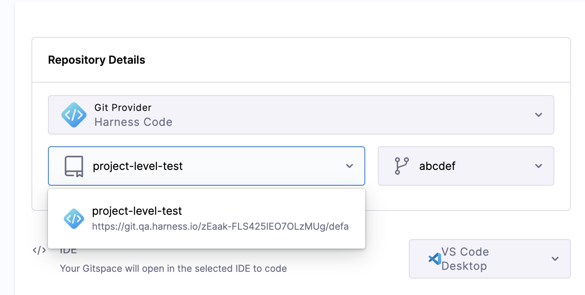
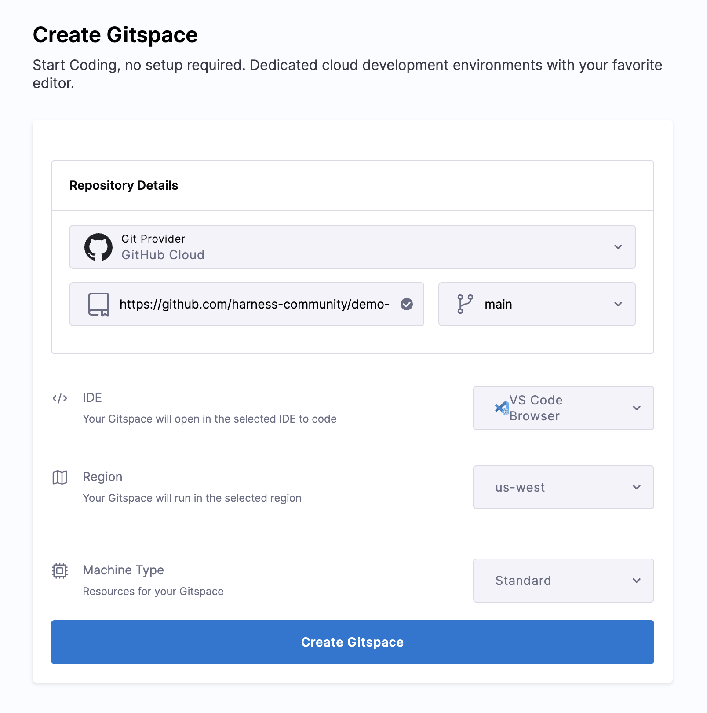
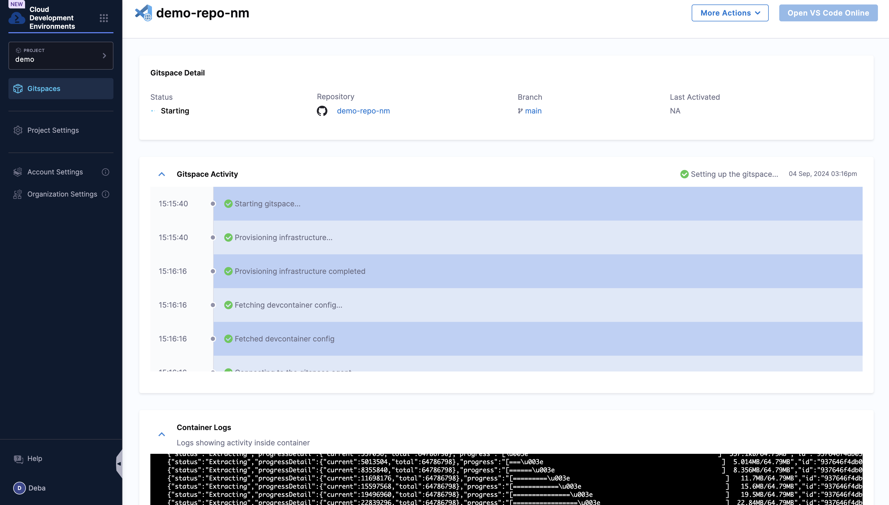

Follow the instructions below to **create a new Gitspace** from the Harness UI:

1. Click on **+New Gitspace**. To create a **Gitspace** using the [sample app](https://github.com/harness-community/demo-repo-nm). You have two options to create Gitspace:

import Tabs from '@theme/Tabs';
import TabItem from '@theme/TabItem';

<Tabs queryString="Create Gitspace">
<TabItem value="using-harness-code" label="Using Harness Code">

2. Select the **Repository** from the dropdown, followed by updating the **branch**. 

</TabItem>
<TabItem value="other-git-repositories" label="Other Git Repositories">

1. You can add a public or private repository URL for supported [git providers](/docs/cloud-development-environments/introduction/whats-supported#git-providers).

2. For **public repositories**, the URL must strictly follow this format: https://git-provider.com/organisation/repository (e.g., for GitHub: https://github.com/harness-community/demo-repo-nm). Any extra text after this may cause an error.

3. If OAuth is configured, you’ll be able to select from a list of **private repositories** you have access to.

4. By default the **branch** selected would be **main** which you can change according to your choice.

</TabItem>
</Tabs>

### Select IDE
Move back to the CDE Create Gitspace window and select your preferred IDE from the given options. 

### Select Region 
Select the **region** in which you want to provision your CDE. 

### Select Machine 
Select the machine type to be either **Standard** or **Large**. 

It will take few minutes to provision the Gitspace and you could see all the steps and logs involved. 

Now you can your Gitspace in the selected IDE and start developing. 

### Create Gitspace

Here's how you can create a Self Hosted Gitspace:

1. Navigate to the desired **Organization** and **Project**.
2. Click on **Gitspaces** in the left navigation panel.
3. Click on **New Gitspace**.
4. Enter the required Gitspace details. Refer to this [documentation](/docs/cloud-development-environments/manage-gitspaces/create-gitspaces.md) for field descriptions.
5. Under **Infra Provider Type**, select the infrastructure you configured earlier. You can identify it by the **Infrastructure Name** you provided.
6. Choose the **Region**, populated from the region details configured in your infrastructure.
7. Select the **Machine Type**, populated from the machines you added to the infrastructure.
8. Click **Create Gitspace**.

And that’s it, your Self Hosted Gitspace is now up and running entirely within your own infrastructure.