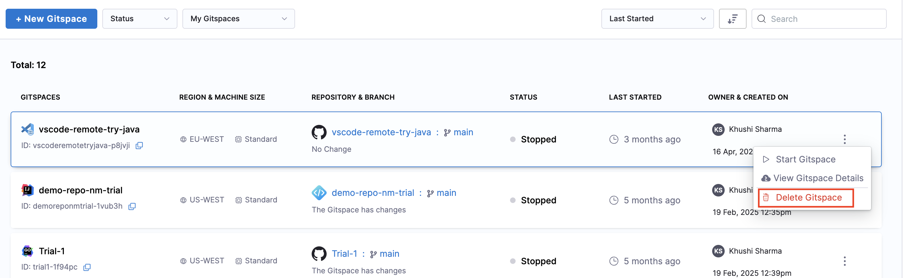
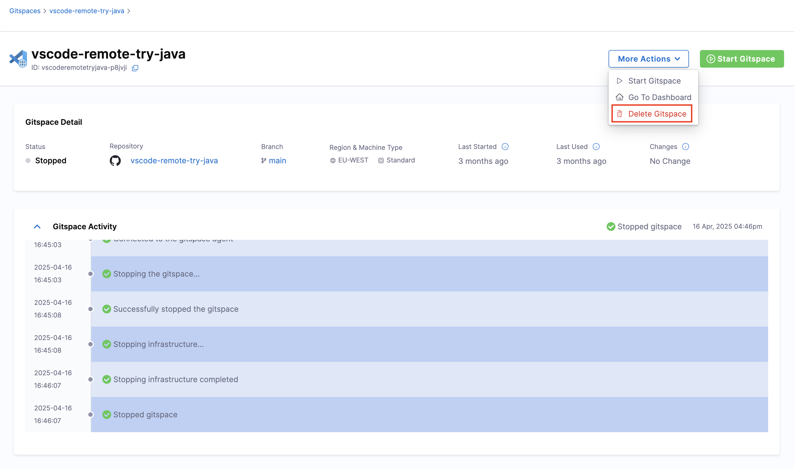

**Deleting a Gitspace** is an irreversible action since **deleted Gitspace cannot be restored**. Make sure you are sure of this action. 

There are 2 ways to delete an existing Gitspace: 
- Deleting directly from the Gitspaces Dashboard
- Deleting from the Gitspace Details UI

---

## Gitspaces Dashboard
Follow the instructions below to delete an existing Gitspace: 
1. From your CDE module, go to the **Gitspaces Dashboard** page. 
2. For the specific Gitspace you want to delete, click on the **3 dots** and select **Delete Gitspace**. You will see a warning stating that this action cannot be undone. If you are sure you want to delete the Gitspace, click on **Delete**.

---

## Gitspace Details UI
Follow the instructions below to delete an existing Gitspace: 
1. From your CDE module, go to the **Gitspaces Dashboard** page. 
2. Click and go to the **Gitspace Details** UI for the specific Gitspace you want to delete. Click on **More Actions** -> **Delete Gitspace**. 

---