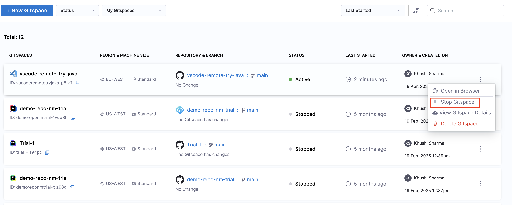
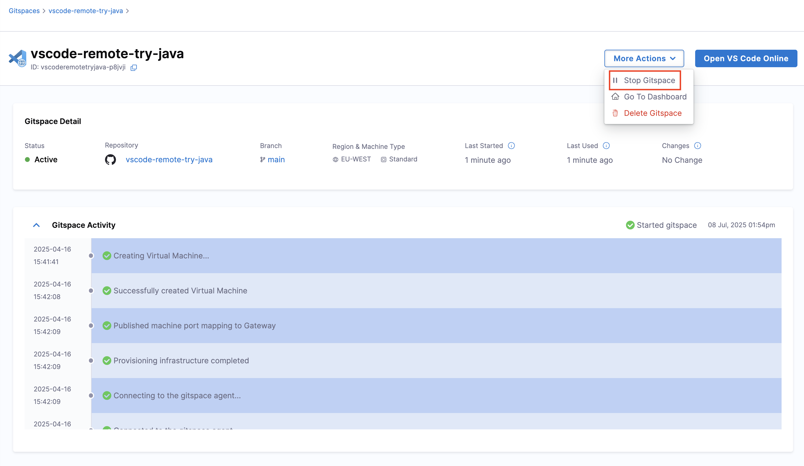
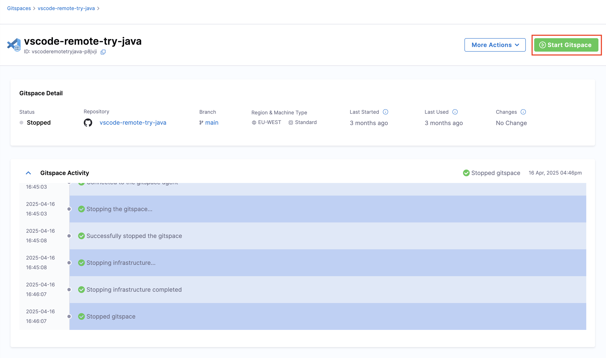
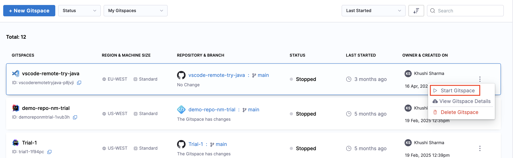

To save on compute you can stop a Gitspace when not in use and start it again at a later time. You will **not lose any uncommitted changes** across Gitspace restarts. 

### Stop a Gitspace
There are two ways to **stop an existing Gitspace**: 
1. On the **Gitspaces Dashboard**, for any active Gitspace, click on the **3 dots** menu and select **Stop Gitspace**.

2. On the **Gitspace Details** UI under **More Actions**, there's an option to **Stop Gitspace**.

### Restart a Gitspace

There are two ways to **restart an existing Gitspace**: 

1. On the **Gitspaces Dashboard**, for any stopped Gitspace, click on the **3 dots** menu and select **Start Gitspace**.

2. On the **Gitspace Details** UI, **Start Gitspace** is available in the **More Options** menu.

