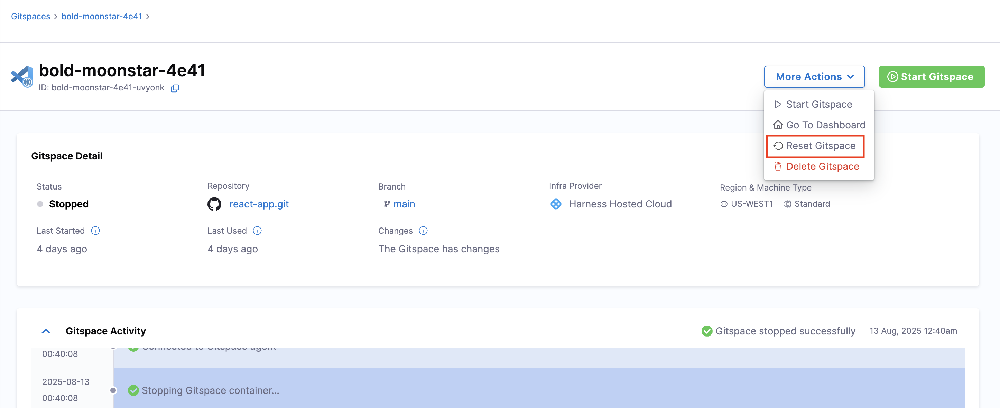

This document will take you through the steps required to **reset** your Gitspaces. There can be different situations and scenarios where you may need to reset Gitspaces. The following sections will guide you through the process.

---

## Resetting Gitspaces

Resetting your Gitspaces is a process that allows you to reset their state and revert the entire configuration to fetch the latest changes from the original source. This process involves the following steps:

* Resets the existing Gitspace `devcontainer` configuration and fetches the latest configuration from the source code repository.
* Rebuilds the Gitspace infrastructure to apply the latest changes.
* Stores and reattaches the persistent disk changes to your Gitspace (all your changes configured in your home directory are preserved).

This process is useful when you want to apply the latest changes made in your Gitspace configuration or infrastructure, and reset the Gitspace to the latest state.

---

## Change of States

Gitspaces exist in different states, moving from transient states to stable states. Go to [Lifecycle of Gitspaces](/docs/cloud-development-environments/deep-dive-into-gitspaces/lifecycle-of-gitspaces.md) to learn more about these states and processes.

For resetting Gitspaces, note the following:

* You can reset Gitspaces from **any state**.
* When you reset a Gitspace, the state changes to `cleaning` and then to `uninitialized`. This cleans up all configuration and infrastructure, and resets the Gitspace to the latest state.
* You must **restart the Gitspace** to apply all the changes and use it. See [Start Gitspaces](/docs/cloud-development-environments/manage-gitspaces/existing-gitspaces.md) to learn more about restarting Gitspaces.

---

## Steps to Reset Gitspaces

Follow these steps to reset any Gitspace:

1. Go to the **Gitspaces Dashboard** in the **Cloud Development Environments** module of your Harness account.
2. Select the Gitspace you want to reset and open the **Gitspace Details** page.
3. Go to **More Actions** and select **Reset Gitspace** → **Reset**.

---