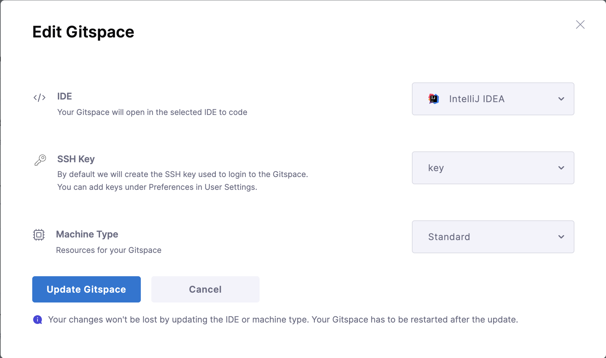

This document will take you through the steps required to **update** your Gitspaces. Once you have an active Gitspace, you might want to update its configuration or settings to apply the latest changes. This feature enables you to change your Gitspace settings and allows you to use the Gitspace without having to recreate a new Gitspace with new settings. 

---

## Updating Gitspaces 
You can update and change your Gitspace settings by using this feature. There can be different scenarios where you might want to update your Gitspace settings. Here's a list of settings that you can update: 
- **Machine Type**: You can update and change the machine type of your Gitspace. This allows you to upgrade your Gitspace to a bigger/smaller machine as and when required. Please note that only those machine types are available that are supported by your infrastructure option. 
- **IDE**: You can change the IDE of your Gitspace to any other IDE as well. 
- **SSH Key**: You can update the SSH key of your Gitspace to a new key. This allows you to change and update the remote access credentials to your Gitspace accordingly. 

:::info DevContainer File Changes
Please note that in case you have made some changes in your `devcontainer.json` file and want to update those in your Gitspace, you cannot do so by using the **update** feature. You'll have to **reset your Gitspace** to apply those changes. Go to [Reset Gitspaces](/docs/cloud-development-environments/manage-gitspaces/reset-gitspaces.md) to learn more. 
:::

This feature allows you to change all the above Gitspace settings and reuse the same Gitspace without having to recreate a new one with updated settings. 

---

## Allowed States to Update Gitspaces

You can update your Gitspace only from the following Gitspace states: 
- Uninitialized
- Stopped
- Error

You cannot update your Gitspace from any transient state (Starting, Stopping, Cleaning, etc.) The Gitspace should be in a stable state to update its settings. 

:::info
You cannot update your Gitspace if its in **active** state. You'll have to **stop** the Gitspace and then update its settings to apply the changes. Go to [Stop Gitspaces](/docs/cloud-development-environments/manage-gitspaces/existing-gitspaces.md) to learn more. 
:::

---

## Steps to Update Gitspaces

Follow these steps to update your Gitspaces: 
1. Ensure your Gitspace is in a stable state. Go to [Allowed States to Update Gitspaces](/docs/cloud-development-environments/manage-gitspaces/update-gitspaces.md#allowed-states-to-update-gitspaces) to learn more. 
2. You can edit your Gitspace in two ways: 
    - **Gitspace Dashboard**: Click on the "three dots" menu of your Gitspace and click on **Edit Gitspace**. 
    
    - **Gitspace Details**: Click on the **More Actions** menu of your Gitspace and click on **Edit Gitspace**. 
    
3. Change the settings you want to update and click on "Update". 

4. Restart your Gitspace to apply the changes. Go to [Restart Gitspaces](/docs/cloud-development-environments/manage-gitspaces/existing-gitspaces.md) to learn more. 

:::info Apply Changes
Please note that you'll have to **restart** your Gitspace to apply your updated changes. Go to [Restart Gitspaces](/docs/cloud-development-environments/manage-gitspaces/existing-gitspaces.md) to learn more. 
:::

    