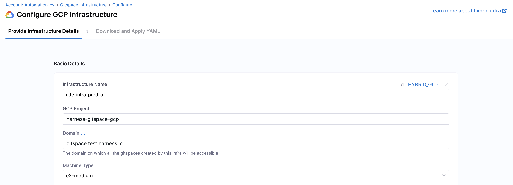
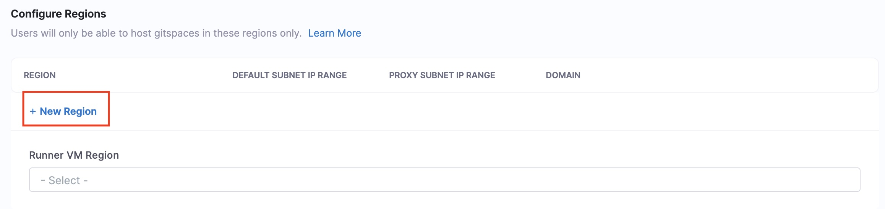
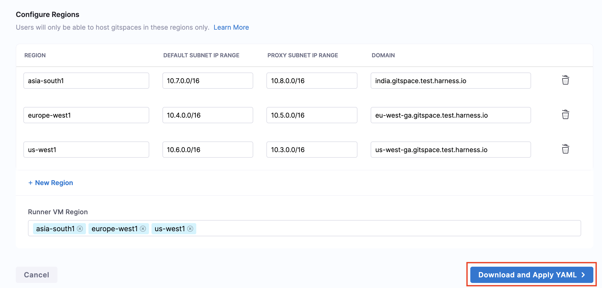

import RedirectIfStandalone from '@site/src/components/DynamicMarkdownSelector/RedirectIfStandalone';

<RedirectIfStandalone label="AWS" targetPage="/docs/cloud-development-environments/self-hosted-gitspaces/steps/gitspace-infra-ui" />

This is your **first step** in configuring **Self Hosted Gitspaces** on Amazon Web Services. 

In order to get started with Self Hosted Gitspaces, you'll first need to **configure your infrastructure**. This infrastructure is where your Gitspaces will be hosted, so you must **define and configure it from Harness UI**. This guide will take you through the detailed steps to configure your AWS infrastructure using the Harness UI.

## Prerequisites

1. Ensure you've read through the [Fundamentals and Prerequisites](/docs/cloud-development-environments/self-hosted-gitspaces/fundamentals.md) of Self Hosted Gitspaces. This will help you gain a deeper understanding of the basic concepts and setup steps.
2. Only users with **Account-level access** can configure Gitspace infrastructure for now. Read more about the [Permissions Hierarchy](https://developer.harness.io/docs/platform/role-based-access-control/rbac-in-harness#permissions-hierarchy-scopes).
3. Ensure that your AWS account has the following services enabled:
      <ul>
        <li>Amazon EC2</li>
        <li>Amazon VPC</li>
        <li>AWS Certificate Manager</li>
        <li>AWS Identity and Access Management (IAM)</li>
        <li>Amazon Route 53</li>
      </ul>

## Configure Gitspace Infrastructure

Configuring your Gitspace Infrastructure involves adding your infrastructure details in the Harness UI using the steps below. This process generates an **Infra Config YAML** — a YAML file that captures your entire infrastructure configuration. This YAML is a required input when running the Harness Gitspace Terraform Module to provision the necessary AWS infrastructure.

### Access Gitspace Infrastructure

1. Only users with the **Account-level access** can configure Gitspace Infrastructure.
2. Navigate to the **Cloud Development Environments** module and open your **Account Settings**.
3. In the side navbar under Account Settings, select **Gitspace Infrastructure**.


### Provide Basic Infrastructure Details

1. **Infrastructure Name**: Provide a **name** for your **Gitspace infrastructure**. This name will be used while referencing your infrastructure for creating Gitspaces.
2. **AWS Account ID**: Enter your **AWS Account ID**. This is where the AWS EC2 instances hosting your Gitspaces will reside.
3. **Domain**: Provide the **domain** under which all Gitspaces created in this infrastructure will be accessible.
4. **Gateway Instance Type**: Specify the **EC2 instance type** for your Gateway.



### Configure Regions

You can add and configure regions for Gitspaces. Note that users will only be able to host Gitspaces in these defined regions. Click on **New Region** to add a new region.


:::info
You can create and manage Self Hosted Gitspaces only if your infrastructure has at least one region added. 
:::

Use the following input parameters:
1. **Region Name**: Enter the **region name**. Refer to the [AWS documentation](https://docs.aws.amazon.com/AWSEC2/latest/UserGuide/using-regions-availability-zones.html) to view available regions.
2. **IP Details**: Provide the **IP configuration** for each region. 
   - **Default Subnet IP Range**: This is the IP range for the default subnet in your VPC.
   - **Proxy Subnet IP Range**: This is the IP range for the proxy subnet in your VPC.

Here's how **all the added regions** will look for your infrastructure.


### Download the Infrastructure Config YAML

Once all details have been entered, click on **Download and Apply YAML**. This will generate the **Infra Config YAML**, which contains the entire Gitspace Infra configuration. This YAML is a mandatory input for [configuring and setting up the Harness Gitspaces Terraform Module](/docs/cloud-development-environments/self-hosted-gitspaces/steps/gitspace-infra-terraform.md), which provisions the AWS infrastructure in your selected account.



This is what a **sample Infrastructure Config YAML** looks like: 
```YAML
account_identifier: vpCkHKsDSxK9_KYfjCTMKA
infra_provider_config_identifier: aws-test
name: aws-test
gitspace_vm_tags:
- aws-gitspace
aws_account:
  id: "123456789012"
  name: "my-aws-account"
domain: aws.gitspace.test.harness.io
gateway_instance_type: t3.medium
gateway_disk_size_gb: 20
gateway_disk_type: gp2
region_configs:
  us-east-1:
    region_name: us-east-1
    default_subnet_ip_range: 10.6.0.0/16
    proxy_subnet_ip_range: 10.7.0.0/16
    certificates:
      contents:
      - domain: useast1.aws.gitspace.test.harness.io
```

## Manage Gitspace Infrastructure

### Edit Gitspace Infrastructure
Once your infrastructure is configured, you also have the option to **edit and update it**. Please note that only **Gitspace Admins** with **Account-level access** are permitted to make changes.

Here's how you can edit your infrastructure: 
1. Go to your **Gitspace Infrastructure UI**. 
2. Click on the **Edit** button on the top-right corner. 


3. Whenever you make changes to your infrastructure configuration, you'll need to **download the updated Infra Config YAML**.
Use this updated YAML to [reapply your Terraform module](/docs/cloud-development-environments/self-hosted-gitspaces/steps/gitspace-infra-terraform.md) to reflect the changes. You can learn more about this process in the [next steps](#next-steps).

### Delete Gitspace Infrastructure
:::warning **Warning: Irreversible Action**

Deleting your infrastructure is **permanent** and **cannot be undone**. This action will permanently remove your entire infrastructure configuration. 

Please proceed **only if you are absolutely certain** you want to delete this infrastructure.
:::

You can **delete your infrastructure** from the **Gitspace Infrastructure UI**. Please note that only users with **account-level access** are permitted to perform this action.

You can delete the **Gitspace Infrastructure** only if the following conditions are met:

* All **Gitspaces** associated with this infrastructure have been deleted.
* All **Machines** associated with this infrastructure have been deleted.

If these conditions are not met, you will not be able to delete the Gitspace Infrastructure.

#### Deleting Gitspaces
You can **delete Gitspaces** (created within a specific infrastructure) using the Harness UI. Refer to the [documentation](/docs/cloud-development-environments/manage-gitspaces/delete-gitspaces.md) for detailed steps on deleting a Gitspace.

#### Deleting Machines
Follow this [documentation](/docs/cloud-development-environments/self-hosted-gitspaces/steps/manage-self-hosted.md#delete-machines-from-gitspace-infrastructure) to get detailed instructions on how to **delete Machines** from your Gitspace Infrastructure. 

#### Deleting Infrastructure
Here's how you can delete your infrastructure: 
1. Go to your **Gitspace Infrastructure UI**. 
2. Scroll down to the bottom of the page. You'll find the option to **Delete Infrastructure**. Click this button to permanently delete the selected infrastructure.


### Assess Gateway Group Health for Gitspace Infrastructure
You can assess the **Gateway Group Health** for your Gitspace infrastructure from the Infra Details UI. Go to **Locations and Machines**, and click on the region for which you want to assess the Gateway health. In case the Gateway is **Unhealthy**, you will not be able to create any Gitspaces since no requests will be routed forward. You can find the following details:

* **Gateway Group Name**: System-generated name of the Gateway Group
* **Gateway Group Health**: Health status of the Gateway Group
* **Gateway Instance Name**: System-generated name of the Gateway Group instance
* **Envoy Health**: Health status of Envoy
* **Gateway Version Number**: Gateway image version number


## Next Steps
Now that you have the [Infrastructure Config YAML](#download-the-infrastructure-config-yaml) downloaded, proceed to [configure and apply the Terraform module](/docs/cloud-development-environments/self-hosted-gitspaces/steps/gitspace-infra-terraform.md) to provision your self-hosted Gitspaces.
