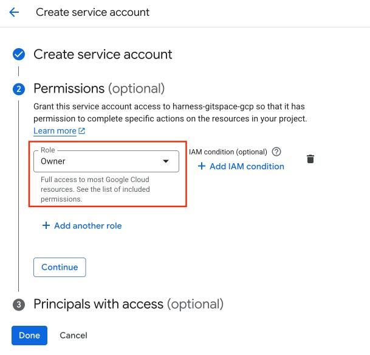
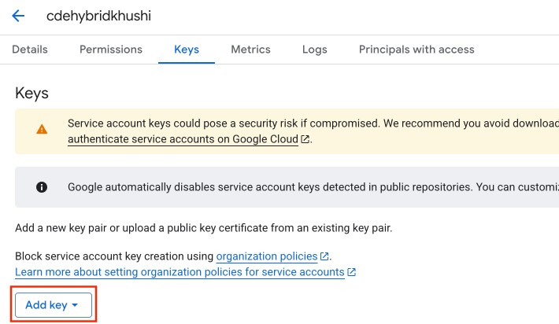

import RedirectIfStandalone from '@site/src/components/DynamicMarkdownSelector/RedirectIfStandalone';

<RedirectIfStandalone label="AWS" targetPage="/docs/cloud-development-environments/self-hosted-gitspaces/steps/gitspace-infra-terraform" />

This is your **second step** in configuring **Self Hosted Gitspaces** on **GCP Cloud Infrastructure**. 

Once you have added and configured the **GCP Cloud Infrastructure in your Harness UI**, you need to configure and set up the [Harness Gitspaces Terraform Module](https://registry.terraform.io/modules/harness/harness-gitspaces/gcp/latest) to provision the **GCP infrastructure** and complete the setup in your selected GCP project. This guide will walk you through the detailed steps to configure and set it up.

## Prerequisites

1. Ensure you’ve read through the [Overview & Key Concepts](/docs/cloud-development-environments/self-hosted-gitspaces/fundamentals.md) of Self Hosted Gitspaces. This will help you gain a deeper understanding of the basic concepts and setup steps.
2. Make sure you have completed all the steps detailed out in [Configuring GCP Cloud Infrastructure in Harness UI](/docs/cloud-development-environments/self-hosted-gitspaces/steps/gitspace-infra-ui.md). This is a **mandatory prerequisite**, as the [Infra Config YAML](/docs/cloud-development-environments/self-hosted-gitspaces/steps/gitspace-infra-ui.md#download-the-infrastructure-config-yaml) generated from that step is a required input here.
3. You must have a **Service Account with the "Owner" role** in the same GCP project where your GCP VM instance will be created.
  Refer to the [GCP documentation](https://cloud.google.com/iam/docs/service-accounts-create) to learn how to create a service account. You can also follow the detailed steps in [this section](/docs/cloud-development-environments/self-hosted-gitspaces/steps/gitspace-infra-terraform.md#generate-the-service-account-key) of our guide.
4. You must **create and download a Service Account Key** for the same service account within the same GCP project.
  Refer to the [GCP documentation](https://cloud.google.com/iam/docs/keys-create-delete) for more information. Detailed steps are also provided in [this section](/docs/cloud-development-environments/self-hosted-gitspaces/steps/gitspace-infra-terraform.md#generate-the-service-account-key) of our guide.
5. Ensure that your GCP project (as defined in your infra config) has the following APIs enabled, here's a quick [reference guide](https://cloud.google.com/endpoints/docs/openapi/enable-api) to learn more about enabling APIs in your GCP project: 
      <ul>
        <li>[Cloud Resource Manager API](https://cloud.google.com/resource-manager/reference/rest) – `api/cloudresourcemanager.googleapis.com`</li>
        <li>[Compute Engine API](https://cloud.google.com/compute/docs/reference/rest/v1) – `api/compute.googleapis.com`</li>
        <li>[Certificate Manager API](https://cloud.google.com/certificate-manager/docs/reference/certificate-manager/rest) – `api/certificatemanager.googleapis.com`</li>
        <li>[Identity and Access Management (IAM) API](https://cloud.google.com/iam/docs/reference/rest) – `api/iam.googleapis.com`</li>
        <li>[Cloud DNS API](https://cloud.google.com/dns/docs/reference/rest/v1) – `api/dns.googleapis.com`</li>
      </ul>

## Functions of the Terraform Module

The [Harness Gitspaces Terraform Module](https://registry.terraform.io/modules/harness/harness-gitspaces/gcp/latest) is responsible for **configuring and creating the infrastructure in GCP** needed to host Self Hosted Gitspaces. This includes provisioning VPCs, Subnetworks, IAM, Cloud NAT, and other supporting services. It also creates the VM instance required to set up **Runner** and **Delegate** for self-hosted Gitspaces.

### Terraform Inputs

The following Terraform variables are **mandatory inputs** required to apply and set up the Terraform module:

| **Variable Name**               | **Type** | **Description**                                                                                   | **Mandatory** | **Default / Validation**             |
|---------------------------------|----------|---------------------------------------------------------------------------------------------------|--------------|--------------------------------------|
| `service_account_key_file`     | string   | Path to the **service account key file**.                                                         | Yes          | —                                    |
| `infra_config_yaml_file`       | string   | Path to the **infra config YAML file** with infrastructure configuration.                         | Yes          | —                                    |
| `manage_dns_zone`              | bool     | Indicates whether the **DNS zone should be managed by the module**.                               | Yes          | —                                    |
| `use_gcp_certificate_manager`  | bool     | Indicates whether **Google Certificate Manager** should be used for SSL certificates.             | No           | `true`                               |
| `private_key_path`             | string   | Path to the **private key file** for the SSL certificate (if not using Certificate Manager).      | No           | `""`                                 |
| `certificate_path`             | string   | Path to the **SSL certificate file** (if not using Certificate Manager).                          | No           | `""`                                 |

Refer to this [documentation](https://registry.terraform.io/modules/harness/harness-gitspaces/gcp/latest?tab=inputs) to learn more about the **Inputs** required for the Terraform Module. 

### Terraform Outputs

This module creates the GCP infrastructure and generates a `pool.yaml` file with all infrastructure details.

Refer to this [documentation](https://registry.terraform.io/modules/harness/harness-gitspaces/gcp/latest?tab=outputs) to get a detailed overview of all the **Outputs** generated from the Terraform Module. 


## Configuring the Terraform Module

Follow these steps to configure and apply the Terraform module. Ensure all prerequisites are completed before proceeding.


### 1. Prepare the Terraform Input Variables

#### Mandatory Input Variables

To apply the Terraform module, you need three mandatory input parameters:

- **Service Account Key File**: A Service Account Key with necessary permissions in your GCP project. Learn how to [generate a Service Account Key](/docs/cloud-development-environments/self-hosted-gitspaces/steps/gitspace-infra-terraform.md#generate-the-service-account-key).
- **Infra Config YAML File**: Contains all infrastructure details for setting up the Terraform module. Learn how to [retrieve it here](/docs/cloud-development-environments/self-hosted-gitspaces/steps/gitspace-infra-terraform.md#retrieve-the-infra-config-yaml).
- **`manage_dns_zone`**: Controls DNS management:
  - `yes`: DNS will be managed automatically by the module.
  - `no`: You'll need to manage DNS manually.

#### Optional Input Variables

These have default values and are not mandatory:

- **`use_gcp_certificate_manager`**: Set to `true` (default) to use GCP Certificate Manager for SSL.
- **`private_key_path`**: Provide if not using Certificate Manager (default: `""`).
- **`certificate_path`**: Provide if not using Certificate Manager (default: `""`).

### 2. Generate the Service Account Key

You need a **Service Account Key** with **Owner** role to apply the Terraform module: 

1. In your GCP project, create a Service Account with the `Owner` role. Follow this [guide](https://cloud.google.com/iam/docs/service-accounts-create) to learn more about the same.

2. Create a key for the Service Account. Follow this [guide](https://cloud.google.com/iam/docs/keys-create-delete) to learn more about the same.

3. Download the key file in `.json` or `.p12` format.

### 3. Retrieve the Infra Config YAML

Use the **Infra Config YAML** file downloaded during [Gitspace Infrastructure configuration in Harness UI](/docs/cloud-development-environments/self-hosted-gitspaces/steps/gitspace-infra-ui.md#download-the-infra-config-yaml). This is required for the Terraform module.

### 4. Create the Terraform Configuration

Now that all input parameters are ready:

1. In the folder containing the **Infra Config YAML** and **Service Account Key File**, create a `main.tf` file.
2. Paste the following Terraform snippet (taken from the [Harness Gitspaces Terraform Module](https://registry.terraform.io/modules/harness/harness-gitspaces/gcp/latest)):

```hcl
module "harness-gitspaces" {
    source  = "harness/harness-gitspaces/gcp"
    version = "[TO BE REPLACED FROM THE REGISTRY'S OFFICIAL DOCUMENTATION]"
    # insert the required input variables below
}
```
3. Insert the required parameters with their respective path values:
```module "harness_gitspacs_gcp" {
    infra_config_yaml_file      = "[INFRA CONFIG YAML FILE PATH]"
    service_account_key_file    = "[SERVICE ACCOUNT KEY FILE PATH]"
    manage_dns_zone             = true
}
```
4. Optionally, add additional parameters.
5. Save the configuration.

#### Example Terraform Configuration
```
module "harness-gitspaces" {
    source                      = "harness/harness-gitspaces/gcp"
    version                     = "0.0.3"
    infra_config_yaml_file      = "infra_config.yaml"
    service_account_key_file    = "service-account-key.json"
    manage_dns_zone             = true
    use_gcp_certificate_manager = true
    certificate_path            = "sample_domain.cert"
    private_key_path            = "sample_domain.key"
}
```

###  5. Initialize and Apply the Terraform Configuration

Once your Terraform config is ready:
1. **Initialize Terraform**: Run ``terraform init`` to **initialize your backend**. Refer to this [guide](https://developer.hashicorp.com/terraform/cli/commands/init) to learn more about this command reference. 
2. **Plan Terraform**: Run ``terraform plan`` to **preview changes**. Refer to this [guide](https://developer.hashicorp.com/terraform/cli/commands/plan) to learn more about this command reference. 
3. **Apply Terraform**: Run ``terraform apply`` to **execute and provision infrastructure**. Refer to this [guide](https://developer.hashicorp.com/terraform/cli/commands/apply) to learn more about this command reference. 

This setup provisions the required infrastructure in your GCP project, including a **GCP VM instance** to host the Harness Delegate and Runner.

### 6. Download the Pool YAML File
After applying the [Harness Gitspaces Terraform Module](https://registry.terraform.io/modules/harness/harness-gitspaces/gcp/latest), a ``pool.yaml`` file is generated in the same folder as your ``main.tf``. This file defines the VM specs for your Gitspace instances.

Keep this file handy — it will be required in the next step.

## Next Steps
Now that your GCP infrastructure is fully set up, proceed to [Configure the Runner and Delegate](/docs/cloud-development-environments/self-hosted-gitspaces/steps/runner-delegate.md) on the GCP VM instance created. Make sure you have the [`pool.yaml` file ready](/docs/cloud-development-environments/self-hosted-gitspaces/steps/gitspace-infra-terraform.md#download-the-pool-yaml-file) for the next steps.
