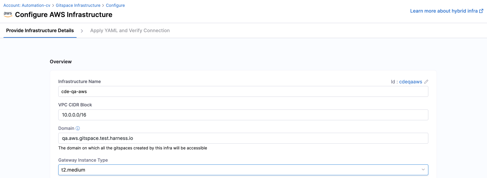
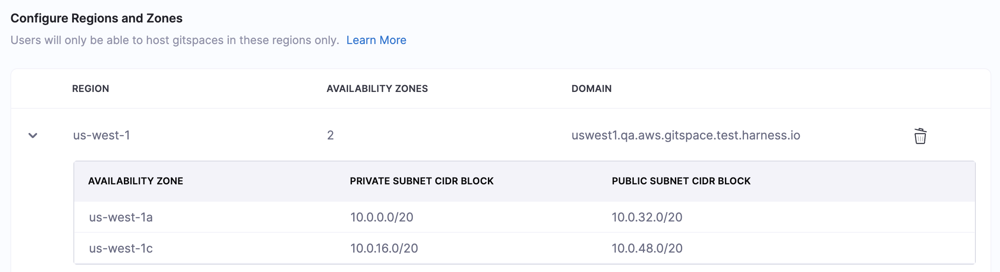
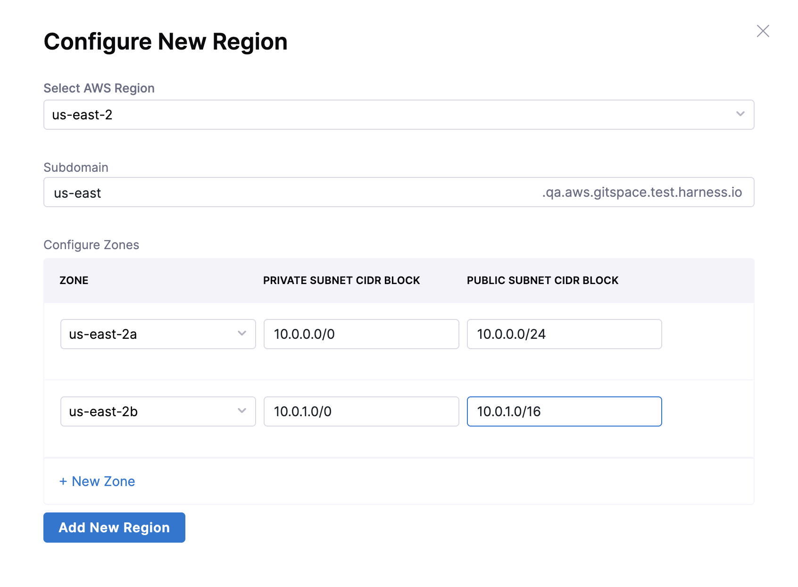
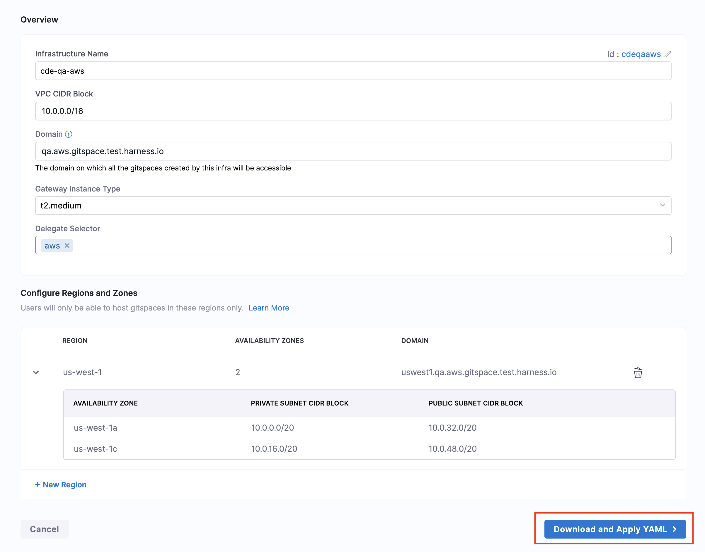
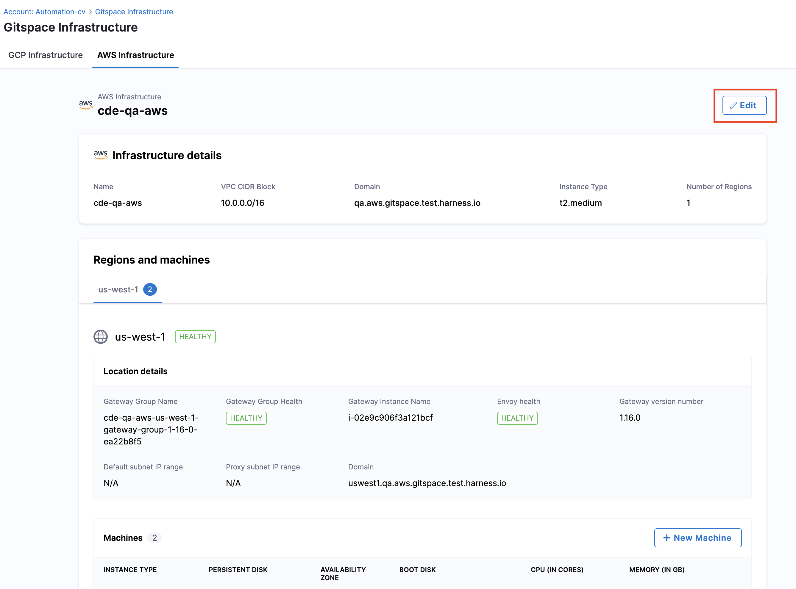
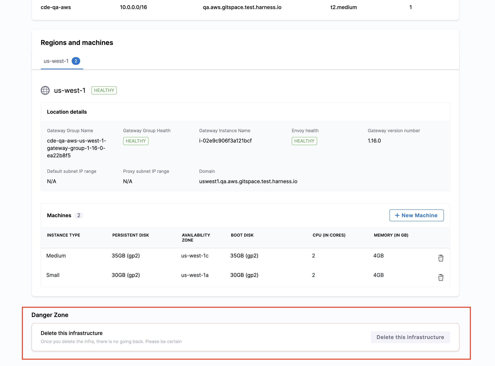
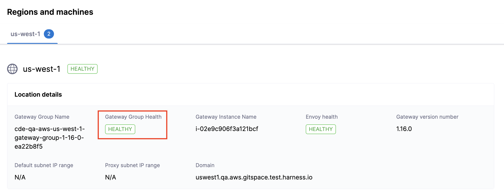

import RedirectIfStandalone from '@site/src/components/DynamicMarkdownSelector/RedirectIfStandalone';

<RedirectIfStandalone label="AWS" targetPage="/docs/cloud-development-environments/self-hosted-gitspaces/steps/gitspace-infra-ui" />

This is your **first step** in configuring **Self Hosted Gitspaces** on **AWS Cloud Infrastructure**. 

In order to get started with Self Hosted Gitspaces, you'll first need to **configure your infrastructure**. This infrastructure is where your Gitspaces will be hosted, so you must **define and configure it from Harness UI**. This guide will take you through the detailed steps to configure your AWS infrastructure using the Harness UI.

---

## Prerequisites

1. Enable the feature flag ``CDE_HYBRID_ENABLED`` in your Harness account since Self Hosted Gitspaces are currently available behind this feature flag. Contact [Harness Support](mailto:support@harness.io) to enable this feature flag.
2. Read [Selt Hosted Gitspaces Overview & Key Concepts](/docs/cloud-development-environments/self-hosted-gitspaces/fundamentals.md) to gain a deeper understanding of the basic concepts and setup steps.
3. Only users with **Account-level access** can configure Gitspace infrastructure for now. Go to [Permissions Hierarchy](https://developer.harness.io/docs/platform/role-based-access-control/rbac-in-harness#permissions-hierarchy-scopes) for more details.

---

## Configure AWS Cloud Infrastructure

Configuring your Gitspace Infrastructure involves adding your infrastructure details in the Harness UI using the steps below. This process generates an **Infra Config YAML** — a YAML file that captures your entire infrastructure configuration. This YAML is a required input when running the Harness Gitspace Terraform Module to provision the necessary AWS infrastructure.

### Access Gitspace Infrastructure

1. Only users with the **Account-level access** can configure Gitspace Infrastructure.
2. Navigate to the **Cloud Development Environments** module and open your **Account Settings**.
3. In the side navbar under Account Settings, select **Gitspace Infrastructure**.


### Provide Basic Infrastructure Details

1. **Infrastructure Name**: Provide a **name** for your **Gitspace infrastructure**. This name will be used while referencing your infrastructure for creating Gitspaces.
2. **VPC CIDR Block**: Enter your **VPC CIDR Block** to specify the IP range for the VPC.
3. **Domain**: Provide the **domain** under which all Gitspaces created in this infrastructure will be accessible.
4. **CDE Gateway Instance Type**: Specify the **instance type** for your CDE Gateway.



### Configure Regions
Add and configure regions for Gitspaces. 

:::info gitspace regions
You can only be able to host Gitspaces in these defined regions. 
:::

Click on **New Region** to add a new region. 
For **AWS Cloud Infrastructure** for your Self Hosted Gitspaces, ensure that you have the following: 
1. It's mandatory to add at least **two availability zones** for each region in your infrastructure. 
2. For every availability zone, you need to provide the **private subnet CIDR block** and **public subnet CIDR block**. 



Use the following **input parameters**:
1. **AWS Region**: Select the **AWS region**. Refer to the [AWS documentation](https://docs.aws.amazon.com/global-infrastructure/latest/regions/aws-regions.html) to view available regions.
2. **Subdomain**: Provide the **subdomain** for the region. 
3. **Zones**: It's mandatory to add at least **two availability zones** for each region in your infrastructure. Select the availability zones from this field. You can add more than two availability zones if needed using the **"New Zone"** button. 
4. **IP Details**: Provide the **IP configuration** for each availability zone per region. 
   - **Private Subnet CIDR Block**: This is the private IP range required for the subnet. Ensure this IP range is within the VPC CIDR block. 
   - **Public Subnet CIDR Block**: This is the corresponding public IP range required for the subnet. Ensure this IP range is within the VPC CIDR block. 



### Download the Infrastructure Config YAML

Once all details have been entered, click on **Download and Apply YAML**. This will generate the **Infra Config YAML**, which contains the entire Gitspace Infra configuration. This YAML is a mandatory input for [configuring and setting up the Harness Gitspaces Terraform Module](/docs/cloud-development-environments/self-hosted-gitspaces/steps/gitspace-infra-terraform.md), which provisions the AWS infrastructure in your selected account.



This is what a **sample Infrastructure Config YAML** looks like: 
```YAML
account_identifier: <ACCOUNT_IDENTIFIER>
infra_provider_config_identifier: <INFRA_PROVIDER_CONFIG_IDENTIFIER>
name: <INFRA_NAME>
domain: <DOMAIN>
vpc_cidr_block: <VPC_CIDR_BLOCK>
gateway:
    instance_type: <INSTANCE_TYPE>
    instances: 1
    version: 1.16.0
    shared_secret: <SHARED_SECRET>
    cde_manager_url: https://app.harness.io/gateway/cde
region_configs:
    <REGION_NAME>:
        region_name: <REGION_NAME>
        availability_zones:
            - zone: <AVAILABILITY_ZONE_1>
              public_cidr_block: <PUBLIC_CIDR_BLOCK_1>
              private_cidr_block: <PRIVATE_CIDR_BLOCK_1>
            - zone: <AVAILABILITY_ZONE_2>
              public_cidr_block: <PUBLIC_CIDR_BLOCK_2>
              private_cidr_block: <PRIVATE_CIDR_BLOCK_2>
        domain: <DOMAIN>
        gateway_ami_id: <GATEWAY_AMI_ID>
```

---

## Manage Gitspace Infrastructure

### Edit Gitspace Infrastructure
Once your infrastructure is configured, you also have the option to **edit and update it**. Please note that only **Gitspace Admins** with **Account-level access** are permitted to make changes.

Here's how you can edit your infrastructure: 
1. Go to your **Gitspace Infrastructure UI**. 
2. Click on the **Edit** button on the top-right corner. 



3. Whenever you make changes to your infrastructure configuration, you'll need to **download the updated Infra Config YAML**.
Use this updated YAML to [reapply your Terraform module](/docs/cloud-development-environments/self-hosted-gitspaces/steps/gitspace-infra-terraform.md) to reflect the changes. You can learn more about this process in the [next steps](#next-steps).

### Delete Gitspace Infrastructure
:::warning **Warning: Irreversible Action**

Deleting your infrastructure is **permanent** and **cannot be undone**. This action will permanently remove your entire infrastructure configuration. 

Please proceed **only if you are absolutely certain** you want to delete this infrastructure.
:::

You can **delete your infrastructure** from the **Gitspace Infrastructure UI**. Please note that only users with **account-level access** are permitted to perform this action.

You can delete the **Gitspace Infrastructure** only if the following conditions are met:

* All **Gitspaces** associated with this infrastructure have been deleted.
* All **Machines** associated with this infrastructure have been deleted.

If these conditions are not met, you will not be able to delete the Gitspace Infrastructure.

#### Deleting Gitspaces
You can **delete Gitspaces** (created within a specific infrastructure) using the Harness UI. Refer to the [documentation](/docs/cloud-development-environments/manage-gitspaces/delete-gitspaces.md) for detailed steps on deleting a Gitspace.

#### Deleting Machines
Follow this [documentation](/docs/cloud-development-environments/self-hosted-gitspaces/steps/manage-self-hosted.md#delete-machines-from-gitspace-infrastructure) to get detailed instructions on how to **delete Machines** from your Gitspace Infrastructure. 

#### Deleting Infrastructure
Here's how you can delete your infrastructure: 
1. Go to your **Gitspace Infrastructure UI**. 
2. Scroll down to the bottom of the page. You'll find the option to **Delete Infrastructure**. Click this button to permanently delete the selected infrastructure.



### Assess Gateway Group Health for Gitspace Infrastructure
You can assess the **Gateway Group Health** for your Gitspace infrastructure from the Infra Details UI. Go to **Locations and Machines**, and click on the region for which you want to assess the Gateway health. In case the Gateway is **Unhealthy**, you will not be able to create any Gitspaces since no requests will be routed forward. You can find the following details:

* **Gateway Group Name**: System-generated name of the Gateway Group
* **Gateway Group Health**: Health status of the Gateway Group
* **Gateway Instance Name**: System-generated name of the Gateway Group instance
* **Envoy Health**: Health status of Envoy
* **Gateway Version Number**: Gateway image version number



---

## Next Steps
Now that you have the [Infrastructure Config YAML](#download-the-infrastructure-config-yaml) downloaded, proceed to [configure and apply the Terraform module](/docs/cloud-development-environments/self-hosted-gitspaces/steps/gitspace-infra-terraform.md) to provision your self-hosted Gitspaces.
