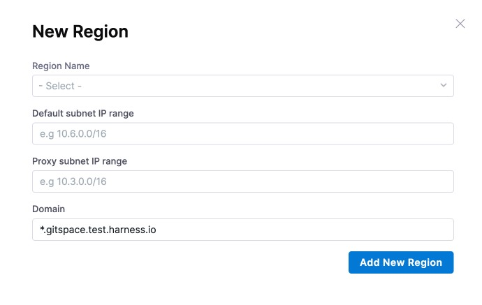
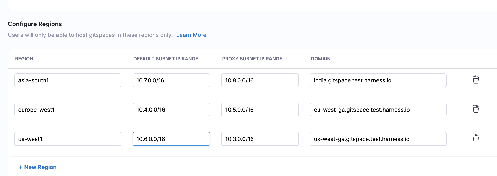
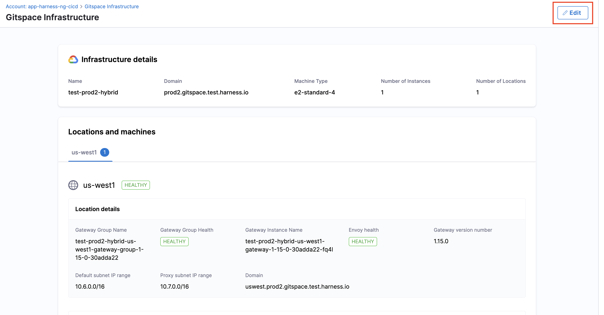

import RedirectIfStandalone from '@site/src/components/DynamicMarkdownSelector/RedirectIfStandalone';

<RedirectIfStandalone label="GCP" targetPage="/docs/cloud-development-environments/self-hosted-gitspaces/steps/gitspace-infra-ui" />

This is your **first step** in configuring **Self Hosted Gitspaces** on **GCP Cloud Infrastructure**. 

In order to get started with Self Hosted Gitspaces, you'll first need to **configure your infrastructure**. This infrastructure is where your Gitspaces will be hosted, so you must **define and configure it from Harness UI**. This guide will take you through the detailed steps to configure your infrastructure using the Harness UI.

---

## Prerequisites

1. Ensure you've enabled the feature flag ``CDE_HYBRID_ENABLED`` in your Harness account since Self Hosted Gitspaces are currently available behind this feature flag. Contact [Harness Support](mailto:support@harness.io) to enable this feature flag.
2. Ensure you’ve read through the [Fundamentals and Prerequisites](/docs/cloud-development-environments/self-hosted-gitspaces/fundamentals.md) of Self Hosted Gitspaces. This will help you gain a deeper understanding of the basic concepts and setup steps.
3. Only users with **Account-level access** can configure Gitspace infrastructure for now. Read more about the [Permissions Hierarchy](https://developer.harness.io/docs/platform/role-based-access-control/rbac-in-harness#permissions-hierarchy-scopes). 
4. Ensure that your GCP project (as defined in your infra config) has the following APIs enabled, here's a quick [reference guide](https://cloud.google.com/endpoints/docs/openapi/enable-api) to learn more about enabling APIs in your GCP project: 
      <ul>
        <li>[Cloud Resource Manager API](https://cloud.google.com/resource-manager/reference/rest) – `api/cloudresourcemanager.googleapis.com`</li>
        <li>[Compute Engine API](https://cloud.google.com/compute/docs/reference/rest/v1) – `api/compute.googleapis.com`</li>
        <li>[Certificate Manager API](https://cloud.google.com/certificate-manager/docs/reference/certificate-manager/rest) – `api/certificatemanager.googleapis.com`</li>
        <li>[Identity and Access Management (IAM) API](https://cloud.google.com/iam/docs/reference/rest) – `api/iam.googleapis.com`</li>
        <li>[Cloud DNS API](https://cloud.google.com/dns/docs/reference/rest/v1) – `api/dns.googleapis.com`</li>
      </ul>

---

## Configure GCP Cloud Infrastructure

Configuring your Gitspace Infrastructure involves adding your infrastructure details in the Harness UI using the steps below. This process generates an **Infra Config YAML** — a YAML file that captures your entire infrastructure configuration. This YAML is a required input when running the Harness Gitspace Terraform Module to provision the necessary GCP VM infrastructure.

### Access Gitspace Infrastructure

1. Only users with the **Account-level access** can configure Gitspace Infrastructure.
2. Navigate to the **Cloud Development Environments** module and open your **Account Settings**.
3. In the side navbar under Account Settings, select **Gitspace Infrastructure**.


### Provide Basic Infrastructure Details

1. **Infrastructure Name**: Provide a **name** for your **Gitspace infrastructure**. This name will be used while referencing your infrastructure for creating Gitspaces.
2. **GCP Project**: Enter the name of your **GCP project**. This is where the GCP VM Instance hosting your Gitspaces will reside.
3. **Domain**: Provide the **domain** under which all Gitspaces created in this infrastructure will be accessible.
4. **Gateway Machine Type**: Specify the **VM machine type** for your Gateway.
5. **Gateway Machine Image Name**: Specify the **VM image name** for your Gateway. In case you don't have a custom image, you can use the default image provided by Harness.


### Configure Regions

You can add and configure regions for Gitspaces. Note that users will only be able to host Gitspaces in these defined regions. Click on **New Region** to add a new region.


:::info
You can create and manage Self Hosted Gitspaces only if your infrastructure has at least one region added. 
:::

Use the following **input parameters**:
1. **Region Name**: Enter the **region name**. Refer to the [GCP documentation](https://cloud.google.com/compute/docs/regions-zones) to view available regions.
2. **IP Details**: Provide the **IP configuration** for each region. 
    - **Default Subnet IP Range**: This is the primary IP range of the subnet and is used to assign internal IPs to your resources. 
    - **Proxy IP Range**: This is a special subnet created specifically for certain Google-managed services and is used by Google's proxies for internal LB traffic routing. 
3. **Sub-Domain**: Enter the **domain** for each region. This field consists of a sub-domain and a root-domain. The root-domain is the same domain entered above in the basic details. 


Here's how **all the added regions** will look for your infrastructure.


### Configure Runner VM Region
You'll have to configure the Runner VM region details to ensure that your GCP VM instance required for hosting the Runner and Delegate is provisioned as per these details. 

Use the following **input parameters**: 
1. **Region**: Choose the **VM runner region** from the added regions above. 
2. **Availability Zone**: Choose the **availability zone** from the region selected above for your VM Runner instance. 
3. **Machine Image Name**: Provide a **custom image** for your VM Runner instance or use the default image provided by Harness.

### Download the Infrastructure Config YAML

Once all details have been entered, click on **Download and Apply YAML**. This will generate the **Infra Config YAML**, which contains the entire Gitspace Infra configuration. This YAML is a mandatory input for [configuring and setting up the Harness Gitspaces Terraform Module](/docs/cloud-development-environments/self-hosted-gitspaces/steps/gitspace-infra-terraform.md), which provisions the GCP infrastructure in your selected project.


This is what a **sample Infrastructure Config YAML** looks like: 
```YAML
account_identifier: <ACCOUNT_IDENTIFIER>
infra_provider_config_identifier: <INFRA_PROVIDER_CONFIG_IDENTIFIER>
name: <INFRA_NAME>
gitspace_vm_tags:
- gcp-gitspace
project:
  id: <PROJECT_ID>
  service_account: <SERVICE_ACCOUNT>
domain: <DOMAIN>
delegateselectors:
- selector: gitspaces
  origin: ""
gateway:
  instances: 1
  machine_type: <MACHINE_TYPE>
  vm_tags:
  - gateway
  vm_image:
    family: debian-11
    project: debian-cloud
  shared_secret: <SHARED_SECRET>
  cde_manager_url: https://app.harness.io/gateway/gratis/cde
  version: 1.15.0
runner_vm_region:
- <REGION_NAME>
runner:
  vm_image: <VM_IMAGE>
region_configs:
  <REGION_NAME>:
    region_name: <REGION_NAME>
    default_subnet_ip_range: <DEFAULT_SUBNET_IP_RANGE>
    proxy_subnet_ip_range: <PROXY_SUBNET_IP_RANGE>
    certificates:
      contents:
      - domain: <DOMAIN>
```

---

## Manage Gitspace Infrastructure

### Edit Gitspace Infrastructure
Once your infrastructure is configured, you also have the option to **edit and update it**. Please note that only **Gitspace Admins** with **Account-level access** are permitted to make changes.

Here's how you can edit your infrastructure: 
1. Go to your **Gitspace Infrastructure UI**. 
2. Click on the **Edit** button on the top-right corner. 

3. Whenever you make changes to your infrastructure configuration, you’ll need to **download the updated Infra Config YAML**.
Use this updated YAML to [reapply your Terraform module](/docs/cloud-development-environments/self-hosted-gitspaces/steps/gitspace-infra-terraform.md) to reflect the changes. You can learn more about this process in the [next steps](/docs/cloud-development-environments/self-hosted-gitspaces/steps/gitspace-infra-ui.md#next-steps).

### Delete Gitspace Infrastructure
:::warning **Warning: Irreversible Action**

Deleting your infrastructure is **permanent** and **cannot be undone**. This action will permanently remove your entire infrastructure configuration. 

Please proceed **only if you are absolutely certain** you want to delete this infrastructure.
:::

You can **delete your infrastructure** from the **Gitspace Infrastructure UI**. Please note that only users with **account-level access** are permitted to perform this action.

You can delete the **Gitspace Infrastructure** only if the following conditions are met:

* All **Gitspaces** associated with this infrastructure have been deleted.
* All **Machines** associated with this infrastructure have been deleted.

If these conditions are not met, you will not be able to delete the Gitspace Infrastructure.

#### Deleting Gitspaces
You can **delete Gitspaces** (created within a specific infrastructure) using the Harness UI. Refer to the [documentation](/docs/cloud-development-environments/manage-gitspaces/delete-gitspaces.md) for detailed steps on deleting a Gitspace.

#### Deleting Machines
Follow this [documentation](/docs/cloud-development-environments/self-hosted-gitspaces/steps/manage-self-hosted.md#delete-machines-from-gitspace-infrastructure) to get detailed instructions on how to **delete Machines** from your Gitspace Infrastructure. 

#### Deleting Infrastructure
Here's how you can delete your infrastructure: 
1. Go to your **Gitspace Infrastructure UI**. 
2. Scroll down to the bottom of the page. You’ll find the option to **Delete Infrastructure**. Click this button to permanently delete the selected infrastructure.


### Assess Gateway Group Health for Gitspace Infrastructure
You can assess the **Gateway Group Health** for your Gitspace infrastructure from the Infra Details UI. Go to **Locations and Machines**, and click on the region for which you want to assess the Gateway health. In case the Gateway is **Unhealthy**, you will not be able to create any Gitspaces since no requests will be routed forward. You can find the following details:

* **Gateway Group Name**: System-generated name of the Gateway Group
* **Gateway Group Health**: Health status of the Gateway Group
* **Gateway Instance Name**: System-generated name of the Gateway Group instance
* **Envoy Health**: Health status of Envoy
* **Gateway Version Number**: Gateway image version number


---

## Next Steps
Now that you have the [Infra Config YAML](/docs/cloud-development-environments/self-hosted-gitspaces/steps/gitspace-infra-ui.md#download-the-infra-config-yaml) downloaded, proceed to [configure and apply the Terraform module](/docs/cloud-development-environments/self-hosted-gitspaces/steps/gitspace-infra-terraform.md) to provision your self-hosted Gitspaces. 