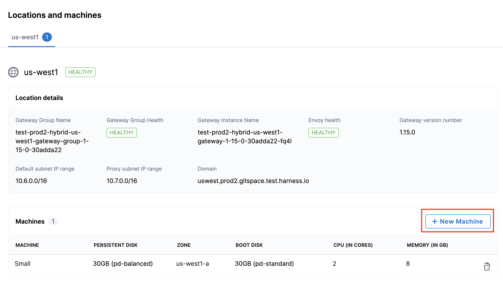
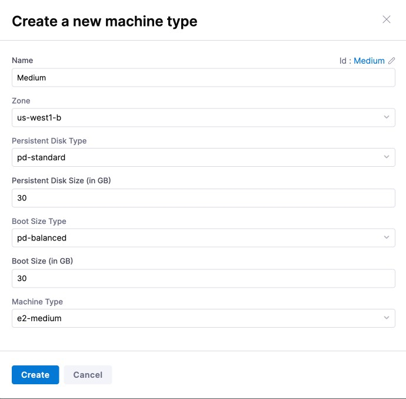
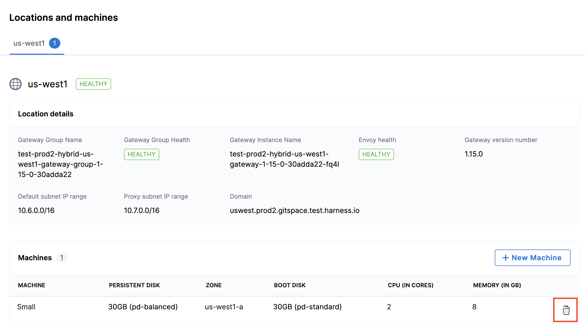

This is your **fourth step** in configuring **Self Hosted Gitspaces**. 

Once you have configured your infrastructure and established a **healthy connection** between the **Harness Control Plane** and the **Harness Delegate**, you are all set to create and manage your **Self Hosted Gitspaces**.

## Prerequisites

1. Ensure you have completed all the necessary steps to **get started with Self Hosted Gitspaces**. Refer to [Fundamentals of Self Hosted Gitspaces](/docs/cloud-development-environments/self-hosted-gitspaces/fundamentals.md#get-started-with-self-hosted-gitspaces) for a detailed walkthrough.

2. Verify that the **Gateway Group Health** status for the added region is marked as **Healthy** before creating any Self Hosted Gitspaces. Learn more in the [Manage Gitspace Infrastructure](/docs/cloud-development-environments/self-hosted-gitspaces/steps/gitspace-infra-ui.md#assess-gateway-group-health-for-gitspace-infrastructure) guide.

## Add Machines in Gitspace Infrastructure

You must add **Machines** to your Gitspace Infrastructure to create and manage **Machine Types** for your Self Hosted Gitspaces. These machines **allocate the necessary compute resources** required for running Gitspaces. Adding Machines is **mandatory**. Without them, you will not be able to create Self Hosted Gitspaces.

Follow the given steps to add Machines:

1. After configuring your infrastructure and setting up the Delegate, navigate to the **Infrastructure Details** UI.
2. In the **Locations and Machines** section, click on **New Machine**.

3. Fill in the required machine details and click **Create**.

This action will register a new machine in your Gitspace Infrastructure, enabling it to host Self Hosted Gitspaces.

## Select Delegate from Delegate Selector

Once you’ve installed and configured your Delegate, you must enter the specific **Delegate Name** in the **Delegate Selector** field within your Gitspace Infrastructure UI.

Follow the given steps to select a Delegate:

1. Navigate to the **Infrastructure Details** UI after configuring your infrastructure and setting up the Delegate.
2. Click on **Edit** to edit the infrastructure details. 
3. Update the **Delegate Selector** field there using either the **Delegate Name** or **Delegate Tags**. You can also select Delegates in the Delegate Selector field using **Delegate Tags**. Read more about [Delegate Tags](https://developer.harness.io/docs/platform/delegates/manage-delegates/select-delegates-with-selectors#delegate-tags). 

## Delete Machines from Gitspace Infrastructure
You can also delete **Machines** from your Gitspace Infrastructure. Here's how you can do that: 
1. Go to your **Gitspace Infrastructure** UI. 
2. Go to the **Locations and Machines** section. 
3. Click the **delete** icon for the specific machine you want to delete. 

## Next Steps
Now that everything is set up, you can start **creating and managing Gitspaces**. To learn more, refer to [Managing Gitspaces](/docs/category/manage-gitspaces).
