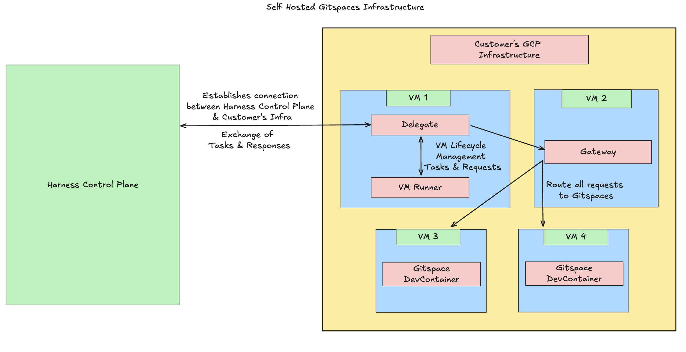

This is your **third step** in configuring **Self Hosted Gitspaces**. 

To configure self hosted Gitspaces in your own infrastructure, you need to host and setup **Harness Delegate** and **VM Runner** in your own infrastructure. Both Harness Delegate and VM Runner are required to be hosted in your infrastructure to establish a seamless connection between the Harness Control Plane and your infrastructure. 

Once you have the respective Terraform module setup, you'll need an active **VM instance** in your infrastructure which will be used to host your Harness Delegate and VM Runner. 

## Functions of VM Runner and Delegate
This section explains the key functions of **Harness Delegate and VM Runner**. Refer to [Self Hosted Gitspaces Architecture](/docs/cloud-development-environments/deep-dive-into-gitspaces/self-hosted-architecture.md) to understand the underlying architecture in detail. 

### Harness Delegate 
**Harness Delegate** is a service that you install in your infrastructure to **establish and maintain a connection** between **Harness Control Plane and your infrastructure**. Self Hosted Gitspaces **run in your own infrastructure**, but are **managed by Harness Control Plane**. Thus to establish and maintain communication between the Harness Control Plane and Customer's infrastructure, customer need to install Harness Delegate in their infrastructure. Read more about [Harness Delegate Overview](https://developer.harness.io/docs/platform/delegates/delegate-concepts/delegate-overview/).

### VM Runner
The **VM Runner** is responsible for **managing the VM lifecycle**. The VM Runner creates a VM on demand for executing the tasks. When the Delegate receives any Task Request from the Harness Control Plane, it forwards the request to the Runner, which executes the task on the created VM and manages the VM lifecycle according to the request. Read more about [VM Runner](https://docs.drone.io/runner/vm/overview/).

## Infrastructure Provider
Before we start with setting up Runner and Delegate, choose your cloud infrastructure provider to get the detailed steps. 

import DynamicMarkdownSelector from '@site/src/components/DynamicMarkdownSelector/DynamicMarkdownSelector';

<DynamicMarkdownSelector
  options={{
    GCP: {
      path: "/cloud-development-environments/self-hosted-gitspaces/steps/content/runner-delegate-gcp.md",
      logo: "gcp-logo.svg",
      logoSize: 24
    },
    AWS: {
      path: "/cloud-development-environments/self-hosted-gitspaces/steps/content/runner-delegate-aws.md",
      logo: "aws-logo.svg",
      logoSize: 24
    }
  }}
/>