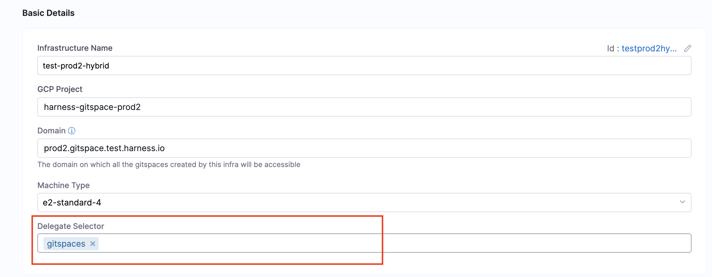

This is your **third step** in configuring **Self Hosted Gitspaces**. 

To configure self hosted Gitspaces in your own infrastructure, you need to host and setup **Harness Delegate** and **VM Runner** in your own infrastructure. Both Harness Delegate and VM Runner are required to be hosted in your GCP infrastructure to establish a seamless connection between the Harness Control Plane and your GCP infrastructure. 

Once you have the [Harness Gitspaces Terraform Module configured and setup](/docs/cloud-development-environments/self-hosted-gitspaces/steps/gitspace-infra-terraform.md), you'll have a **GCP VM instance active** and running in your GCP project which will be used to host your Harness Delegate and VM Runner. 

## Prerequisites
1. Ensure you’ve read through the [Fundamentals and Prerequisites](/docs/cloud-development-environments/self-hosted-gitspaces/fundamentals.md) of Self Hosted Gitspaces. This will help you gain a deeper understanding of the basic concepts and setup steps.
2. Please make sure you have completed the steps mentioned in [Configuring the Harness Gitspaces terraform module](/docs/cloud-development-environments/self-hosted-gitspaces/steps/gitspace-infra-terraform.md). This step is a mandatory prerequisite as this step **sets up the GCP infrastructure**, **creates a GCP VM instance in your infra** and **generates the ``pool.yaml`` file** which is required to host and setup the VM Runner. 
3. Ensure you have the **GCP VM instance active and running** in your GCP project. (This VM instance is created while your terraform configuration is configured and setup.) Please refer to this [documentation](/docs/cloud-development-environments/self-hosted-gitspaces/steps/gitspace-infra-terraform.md) to understand more about configuring this Terraform Module. 

## Functions of VM Runner and Delegate
This section explains the key functions of **Harness Delegate and VM Runner**. Refer to [Self Hosted Gitspaces Architecture](/docs/cloud-development-environments/deep-dive-into-gitspaces/self-hosted-architecture.md) to understand the underlying architecture in detail. 


### Harness Delegate 
**Harness Delegate** is a service that you install in your infrastructure to **establish and maintain a connection** between **Harness Control Plane and your infrastructure**. Self Hosted Gitspaces **run in your own infrastructure**, but are **managed by Harness Control Plane**. Thus to establish and maintain communication between the Harness Control Plane and Customer's infrastructure, customer need to install Harness Delegate in their infrastructure. Read more about [Harness Delegate Overview](https://developer.harness.io/docs/platform/delegates/delegate-concepts/delegate-overview/).

### VM Runner
The **VM Runner** is responsible for **managing the VM lifecycle**. The VM Runner creates a VM on demand for executing the tasks. When the Delegate receives any Task Request from the Harness Control Plane, it forwards the request to the Runner, which executes the task on the created VM and manages the VM lifecycle according to the request. Read more about [VM Runner](https://docs.drone.io/runner/vm/overview/).

## Setting up VM Runner and Delegate 
You can follow this detailed guide (as described below) to setup Runner and install Harness Delegate in your infrastructure:  

### SSH into the VM Instance 
:::info
To connect to a VM with SSH, you'll need your **SSH Key to propogate into your VM**. Make sure you have a fully functioning SSH Key added into your GCP Console. Refer to this guide to learn more on [how to add a SSH Key to VMs](https://cloud.google.com/compute/docs/connect/add-ssh-keys). 
:::

You'll have to [SSH into your GCP VM instance](https://cloud.google.com/compute/docs/connect/standard-ssh) to host your Runner and Delegate there. In order to do that, you can follow the given steps: 
1. Go to your **GCP Console** and go to **VM Instances**. You can find your specific VM instance created as per the details you entered while configuring your infrastructure in the Harness UI. Click on that instance and head over to the **Details** page. 
2. Click on **SSH** and select **View gcloud command**. This is your command to SSH into the instance from your machine. Run this command in your local terminal. 


Once you are into the VM Instance, you can continue and complete the following steps. 

### Install Docker 
You'll need **Docker** installed in your GCP VM instance to configure self hosted Gitspaces. Refer to this [installation guide](https://docs.docker.com/engine/install/) on how to install Docker in your VM instance. 

### Start the VM Runner 
Now that you're into the VM instance and you've installed Docker, follow the given steps to start the **Runner**: 
1. Create a ``/runner`` directory on your VM instance and ``cd`` into it:

```
mkdir -p /runner

cd /runner
```

2. In the ``/runner`` directory, create a new file called ``pool.yaml`` in your instance and copy the [same YAML file content](/docs/cloud-development-environments/self-hosted-gitspaces/steps/gitspace-infra-terraform.md#download-the-pool-yaml-file) as you had when you configured the Terraform Module. Refer to [Setup Terraform Module](/docs/cloud-development-environments/self-hosted-gitspaces/steps/gitspace-infra-terraform.md#download-the-pool-yaml-file) to learn more about the same. 
3. Run the following command to **create a new network**: 
```
docker network create harness
```
4. Run the following command to **start a Runner in your VM instance**, make sure you have changed the ``pool.yaml`` file name as the same name you have saved the file with: 
```
docker run -d \
  --network harness \
  --hostname vm-runner \
  -v /runner:/runner \
  -p 3000:3000 \
  --platform linux/amd64 \
  drone/drone-runner-aws:latest \
  delegate \
  --pool /runner/<POOL.YAML FILE>

```
This **starts a VM Runner** in your VM which will **interact with the Harness Delegate** to complete all the various tasks involved in connecting the Harness Control Plane to your self hosted Infrastructure. 

### Install the Delegate 
Now that you have the VM Runner setup and started, you can continue and install **Harness Docker Delegate** in your VM instance to be able to establish a **seamless connection between the Harness Control Plane and your GCP infrastructure**. To learn more about delegates and delegate installation, go to [Delegate installation overview](https://developer.harness.io/docs/platform/delegates/install-delegates/overview). Please refer to the detailed steps below to install the Delegate: 
:::info
Please ensure you are installing the **Docker Delegate** in your VM instance. For now, Self Hosted Gitspaces will only work with Delegates created at the **Account level**. 
:::

1. In Harness, go to **Account Settings**, select **Account Resources**, and then select **Delegates**.

2. Select **New Delegate** or **Install Delegate**.

3. Select **Docker**.

4. Enter a **Delegate Name**.

5. Copy the **Delegate install command** and run it in your GCP VM. 
  - Make sure the **"ACCOUNT_ID"** and **"DELEGATE_TOKEN"** are filled in the given command. These are **mandatory parameter**s. 
  - Add the **runner URL** by adding this snippet into your delegate install command: ``-e RUNNER_URL="http://vm-runner:3000/" \`` to ensure the delegate has the runner url. Your final install command will look something like this: 

```
docker run -d \
  --network harness \
  --cpus=1 \
  --memory=2g \
  -e DELEGATE_NAME=docker-delegate \
  -e DEPLOY_MODE=KUBERNETES_ONPREM \
  -e NEXT_GEN="true" \
  -e DELEGATE_TYPE="DOCKER" \
  -e ACCOUNT_ID=<ACCOUNT_ID_COPIED_FROM_THE_UI_COMMAND> \
  -e DELEGATE_TOKEN=<DELEGATE_TOKEN_COPIED_FROM_THE_UI_COMMAND>= \
  -e DELEGATE_TAGS=<TAGS TO BE ADDED> \
  -e RUNNER_URL="http://vm-runner:3000/" \
  -e MANAGER_HOST_AND_PORT=https://app.harness.io \
  us-west1-docker.pkg.dev/gar-setup/docker/delegate:25.03.85504
```

Once your Delegate is up and running, you have successfully setup the infrastructure and established a successful connection between the Harness Control Plane and your infrastructure. 

### Delegate Selector
Once you’ve installed and set up your Delegate, enter the specific **Delegate Name** in the **Delegate Selector** field within your Gitspace Infrastructure UI. You can either add it while configuring the Gitspace Infra UI or once you've setup everything, you can edit the infrastructure and add a specific Delegate. Read more about how to use [Delegate Selector](/docs/cloud-development-environments/self-hosted-gitspaces/steps/manage-self-hosted.md#select-delegate-from-delegate-selector). 

You can also select Delegates in the Delegate Selector field using **Delegate Tags**. Read more about [Delegate Tags](https://developer.harness.io/docs/platform/delegates/manage-delegates/select-delegates-with-selectors#delegate-tags). 



## Next Steps
Now that you’ve successfully installed and configured the Delegate, you’re ready to **create machines and self hosted Gitspaces** within your GCP infrastructure.
Proceed to the [Create Machines](/docs/cloud-development-environments/self-hosted-gitspaces/steps/manage-self-hosted.md) guide to get started.