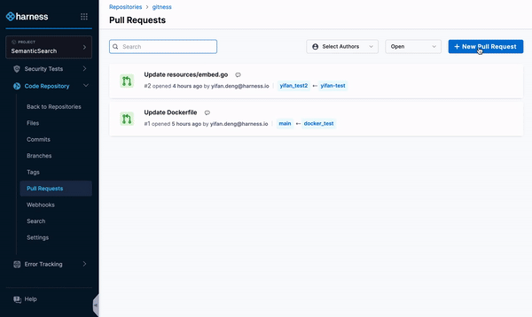

Use the [Harness AI](/docs/platform/harness-aida/aida-overview) Pull Request Summary Generation functionality to automatically create PR descriptions.

Automatic pull request summaries enhance the collaborative development process by automatically generating comprehensive and informative summaries for pull requests within version control systems.

This automation leverages predefined templates or AI-driven analysis of code changes to succinctly describe what the pull request comprises, including:

* The purpose of the changes.
* The issues it addresses.
* Potential impacts on the existing codebase.

By providing a clear and detailed context right from the start, automatic pull request descriptions facilitate quicker and more effective review processes. Reviewers can easily understand the intent and scope of the changes without needing to delve deeply into the code itself.

This not only speeds up the integration of new features and fixes but also improves overall code quality by promoting better communication and understanding among team members.

**[Enable Harness AI today to start automatically generating PR summaries.](/docs/platform/harness-aida/aida-overview)**

### Generate PR Summary with Harness AI

