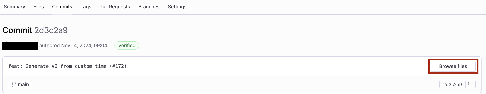

With Harness Code, you can commit directly in the Harness Code UI or you can [clone your repo](./clone-repos.md) and commit and push from your local machine.

Commits you see in the Harness Code UI exist on your remote branches. If you're working from a [local clone](./clone-repos.md), you need to commit and push to the remote to see your changes in Harness Code.

This topic primarily explains how to work with commits in the Harness Code UI. For details about committing, pushing, and reverting with command line Git, an IDE, or another local Git SCM tool, refer to the documentation for your preferred tool.

## Create a commit

1. In your Harness project, go to the **Code** module, select **Repositories**, and then select your repository.
2. Go to **Branches** and select the branch you want to work on.

   Commits made in the Harness Code UI can be committed directly to the selected branch. *You are editing a remote branch when you commit in Harness Code.* Make sure you select the correct branch or [create a branch](./branch.md#create-a-branch) to isolate your changes.

3. On the **Files** page, select the file you want to edit or create a **New File**.
4. Modify the file as desired. If you are editing an existing file, select **Edit** to enable editing.

   You must commit your changes to save them. There is no way to preserve an uncommitted draft within the Harness Code UI. However, you can isolate work-in-progress by selecting the **Create a new branch** option when you commit changes.

5. Select **Commit changes**.
6. Enter a **Commit message** and optional extended description.
7. Select whether you want to **Commit directly to the current branch** or **Create a new branch and start a PR**.
8. Select **Commit** to commit your changes.

   If you selected **Commit directly to the current branch**, your changes are instantly applied to the current branch.

   If you selected **Create a new branch and start a PR**, a new branch is created and you're be prompted to [create a PR](../pull-requests/create-pr.md).

## Inspect a commit

When viewing a repository in Harness Code, there are several ways you can inspect commits to get SHAs or view diffs.

The **Commits** page lists the commit history for a specific branch or tag. The default branch is selected automatically. Select the default branch name to select a different branch or tag, and then select the commit short SHA for the commit you want to inspect.

You can also access commits from these pages:

* On the **Branches** page, select the commit short SHA for the latest commit to that branch.
* On the **Files** page, select the commit short SHA for the latest commit to each file in the context of the current branch or select the commit short SHA for the latest commit to the branch.
* When viewing pull requests, the **Commits** tab lists the commits that are included in that PR.

:::tip

Select the **Copy** icon next to a commit's short SHA to copy the full commit SHA.

:::

Upon selecting a short SHA, the **Commits** page opens to the diff view. Here you can compare line-by-line changes in the selected commit, including changes, additions, and deletions.

Select the **Settings** icon to select your preferred **Diff View** and **Line Breaks** options.

Select **Browse files** to view a list of all files in that commit.

<!--  -->

<docimage path={require('./static/inspect-commit.png')} />

## Revert a commit

You can't directly revert commits in the Harness Code UI. Instead, you need to [create a commit](#create-a-commit) to overwrite the previous commit.

Alternately, if you're working from a [local clone](./clone-repos.md), you can use more nuanced controls available through command line Git, your IDE, or another Git tool.
