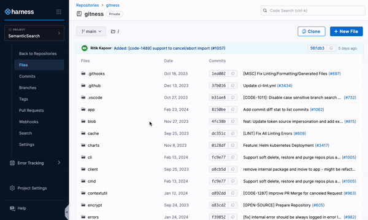

Use the [Harness AI](/docs/platform/harness-aida/aida-overview) Semantic Code Search functionality to search your entire codebase using natural language queries. Ask a question and let Harness AI retrieve source code that best answers your question. This is useful when you aren't sure what specific keywords to search for or you want to better understand what the code achieves.

## Natural language processing

With Semantic Code Search enabled, Harness AI treats your search query as a natural language question and searches for code that matches the semantic meaning of your question, rather than looking for specific keywords or regular expressions. More detailed questions allow Harness AI to provide more refined results.

### Semantic search question examples

* Where are the swagger docs defining how to build on top of the authentication API?
* What repositories does the group 'platform-devs' own code in?

## Refine the search results

Semantic search is based on the *meaning* of your query and not literal keywords. With semantic search, Harness AI assesses the natural-language meaning of your query and returns results based on that meaning.

Unlike keyword searches, the code returned from a semantic search might not contain any of the words used in your query.

To get more accurate results from semantic search:

* Ask specific questions with details of what you need.
* Combine broader semantic searches with targeted [keyword searches](/docs/code-repository/work-in-repos/keyword-search) to find the exact code you need.

## How to enable Semantic Code Search

To use Semantic Search, you need to enable the feature flag and trigger indexing for your repository.

Step 1: Enable the feature flag `SEMANTIC_SEARCH_ENABLED` in your Harness account.

Step 2: Make the following API call to start the indexing process for your repository:

```
curl -X POST 'https://app.harness.io/gateway/code/api/v1/repos/{repo-identifier}/semantic/index?accountIdentifier={account-identifier}&orgIdentifier={org-identifier}&projectIdentifier={project-identifier}' \
  -H 'X-Api-Key: YOUR_HARNESS_API_KEY' 
```

:::note
After triggering indexing, it may take a little time before semantic search is fully functional. If you try to search too early, you might see a temporary 500 error.
:::
### Use Harness Harness AI for semantic searches of your code



