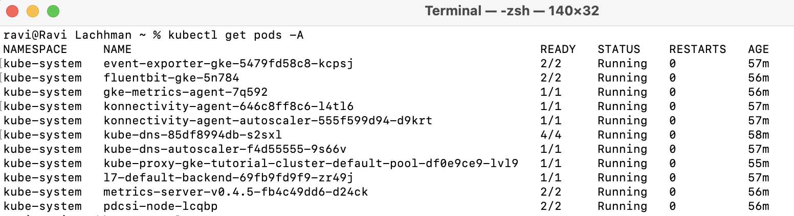

```mdx-code-block
import Tabs from '@theme/Tabs';
import TabItem from '@theme/TabItem';
```

# Harness Kubernetes Delegate Install

Your on-ramp to the Harness Platform is the [Harness Delegate](https://docs.harness.io/article/2k7lnc7lvl-delegates-overview). In a nut-shell the Harness Delegate performs work on your behalf, so imagine this as a worker node which is installed on your infrastructure or machine.

There are multiple ways to install a Harness Delegate and there is strategy that can be applied with scaling Harness Delegates across an organization e.g Delegate placement, packaging, and access. Though as you are getting started with the Harness Platform, an easy way to install a single Harness Delegate into a Kubernetes cluster of your choice.

<!-- Video:
https://harness-1.wistia.com/medias/rpv5vwzpxz-->
<docvideo src="https://harness-1.wistia.com/medias/rpv5vwzpxz" />

### Installing the Harness Delegate in a Kubernetes Cluster

The Harness Delegate can be installed into a wide set of Kubernetes clusters. From locally on your machine such as [minikube](https://minikube.sigs.k8s.io/docs/start/) or [k3d](https://k3d.io/v5.4.4/) to a variety of cloud providers. The Harness Platform needs connectivity to talk to the Harness Delegate which can be configured for example if you are behind a proxy. For clusters on your own machine or ones readily available by public cloud providers, the Harness wirings will work automatically.


If you don’t have Minikube on a Windows Machine, you can use [Chocolatey](https://chocolatey.org/install) to install, or if using a Mac, [Homebrew](https://brew.sh/).


```mdx-code-block
<Tabs>
<TabItem value="Windows">
```

```bash
choco install minikube

#Start Minikube and Validate
minikube config set memory 8128
minikube start
kubectl get pods -A
```

```mdx-code-block
</TabItem>
<TabItem value="Mac">
```

```bash
brew install minikube

#Start Minikube and Validate
minikube config set memory 8128
minikube start
kubectl get pods -A
```

```mdx-code-block
</TabItem>
</Tabs>
```

Validate that you have kubectl access to your cluster.

`kubectl get pods -A`



Once validated, you can now create your first Harness Delegate.

### Creating an Account Level Delegate

As you explore different Harness Modules, keeping a Harness Delegate at the Account Level allows you to reuse the same Delegate for multiple tasks.

Harness Platform -> Account Settings -> Account Resources -> Delegates


Click on Delegates then +Create a Delegate. Can select Kubernetes as the Delegate Type.


Click Continue and fill out a few details.

- Delegate Name: _my-harness-delegate_
- Delegate Size: An appropriate one for your cluster. Laptop is fine for examples.
- Installer: _Kubernetes_
- Delegate Token: _default_token_
- Delegate Permissions: Cluster wide read/write. This will allow the Delegate to deploy and spin up workloads, resources, objects, etc that are needed on the Kubernetes cluster that the Delegate is deployed to.


Click Continue and now you can apply the Kubernetes YAML that has been generated. Can download the YAML and apply.


With the downloaded _harness-delegate.yml_ can apply this to your wired Kubernetes cluster.

`kubectl apply -f harness-delegate.yml`


Click Continue and in a few moments after the health checks pass, your Harness Delegate will be available for you to leverage.


Click Done and can verify your new Delegate is on the list.


You are now ready to explore Harness.
