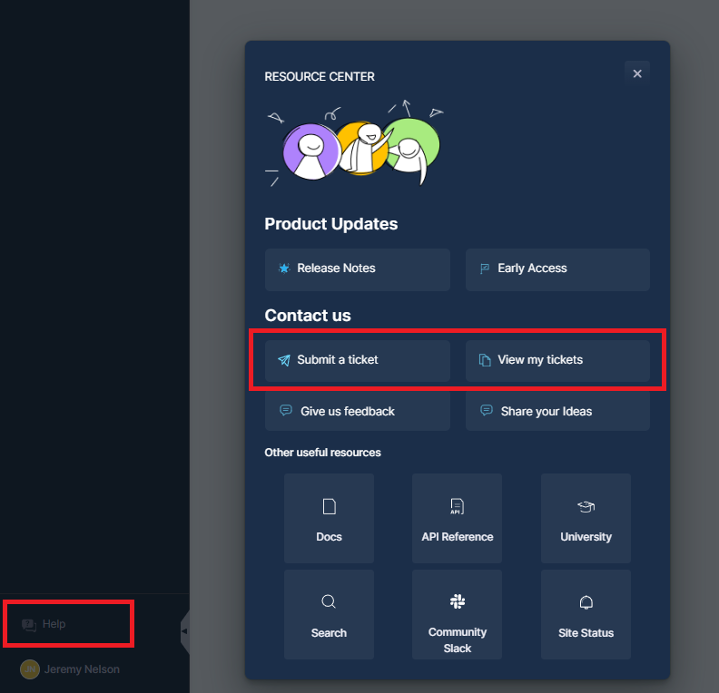
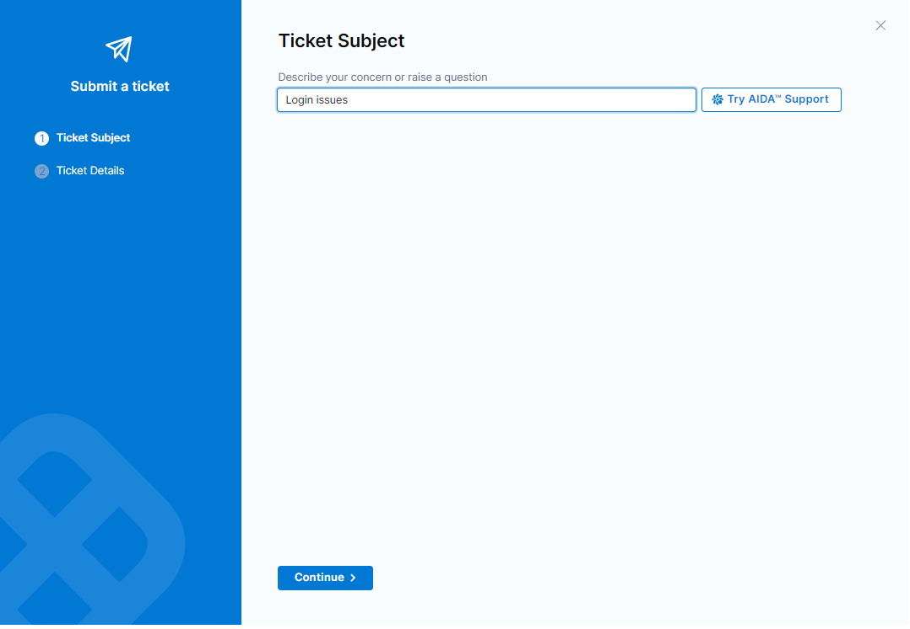
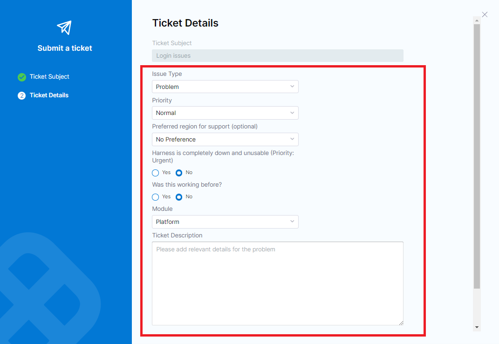

:::warning
#### **Notice**&nbsp; -- Support via Armory's Support Portal (powered by ServiceNow) will officially end on: **November 15th, 2024**.  
:::

Your new Harness support account has been created, and you should have received an email invitation from **noreply@harness.io**. If you have not received this, please contact our support team by email at **support@harness.io**, and we will assist you immediately.

### Accessing Harness Support

To access Harness Support, go to[ https://support.harness.io/](https://support.harness.io/). If you’re not already logged in, you will be redirected to[ https://app.harness.io/](https://app.harness.io/) to sign in using the email and password from your invitation. If you haven’t set up your account yet, please look for an invite from **noreply@harness.io** in your inbox, for example:

*Next, simply enter your credentials as seen in the below example:*

### Submitting a new Harness Support case

Upon successful login above, you will be presented with a simple dashboard.  Located at the bottom left, there is a ‘Help’ button that, when clicked, will present the following menu options:

To submit a new case, select **“Submit a ticket”**, which will open a modal first asking for the ticket subject:

### Ticket details

Enter a description of the issue you are having in the form above, and click **‘Continue’** to proceed to enter the case details.  After clicking 'Continue' The **'Ticket Details'** screen will then be displayed as seen here:

:::info

* First, select the **issue type** from the dropdown: options include **Problem, Question, Feature Request,** or **Other**.
* Then, choose the **priority** level using our[ priority guidelines](https://www.harness.io/support/tiers-and-definitions) to ensure fair support for all users.
* If you have a preferred region, you can select it from an optional dropdown to align your case with the engineering team closest to your region.
* Use the radio buttons above to both mark the case as **Urgent** (for critical scenarios where Armory is unavailable/unusable), and **Was this working before?** if there were no changes made to indicate a potential regression.
* For **Module**, select **Spinnaker** from the dropdown.
* In the **description field**, provide detailed information to help expedite resolution. You can also upload **attachments** (images, logs, etc.) that may assist.
* Click **Submit** to confirm your case. A success message and case ID link will appear at the top of the UI, allowing direct access to Zendesk portal for Harness Support when clicked.

:::

### Manage cases directly via Zendesk portal

The other option available in the help menu seen in the '**Accessing Zendesk**' section above, is **‘View my tickets’**. Upon clicking this you will be directed to the Zendesk interface, which you may also access via [https://support.harness.io](https://support.harness.io) after authentication via your support account.  Here you may manage cases you have submitted as well as cases across your organization, example:

 

:::info
You may also:

* Create new cases in the portal by selecting **‘Submit a request’** at the top right.
* Reply to cases you have submitted as well as comment on cases from others in your organization.
* Update the **priority** and other fields for cases you’ve submitted accordingly.
* Close any cases you have resolved by changing their status to **Solved**.
* Choose to follow other cases and be notified whenever they are updated via email.
:::

### Submitting tickets via email

You can also submit support tickets by emailing **support@harness.io**; however, this method doesn’t capture the same level of detail as the support portal, and is not recommended unless you are unable to access you Harness Support account. If emailing, please mention **Spinnaker** in the email submission to ensure proper routing to the correct support engineers.

--Armory Support
