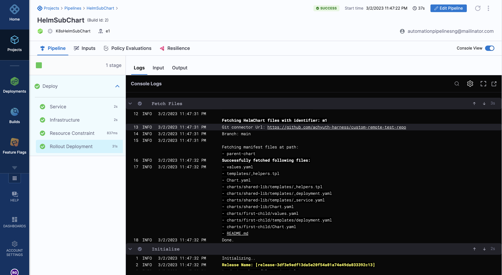
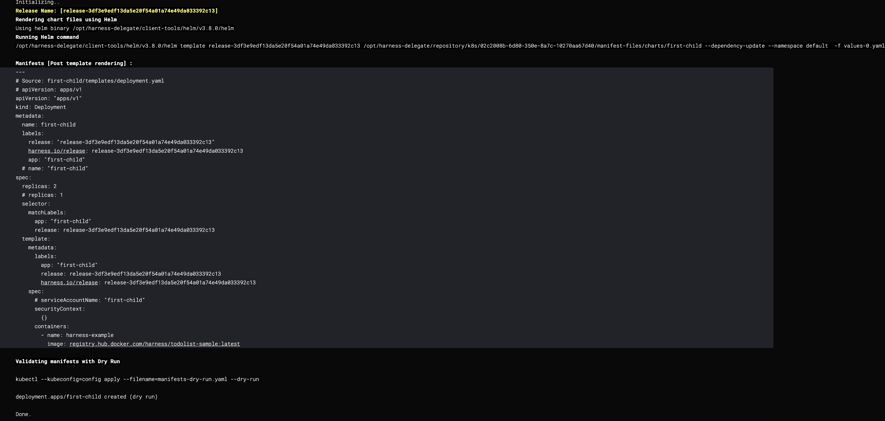

Helm charts can have dependencies called subcharts. You can define subcharts in your service YAML. Helm downloads these dependencies from exisiting or seperate repositories. Harness fetches the defined subcharts during pipeline execution.

:::note
This feature is currently behind the feature flag, `NG_CDS_HELM_SUB_CHARTS`. Contact [Harness Support](mailto:support@harness.io) to enable this feature. 
:::

## Limitations

* Helm subcharts are supported for the following deployment types only.
    - Kubernetes deployments using canary, blue/green, and rolling deployment strategies
    - Native Helm deployments using basic strategy
* Harness Continuous Delivery (CD) captures the parent chart as the deployed instance. Harness Continuous Verification (CV) detects and verifies the parent chart as the deployed instance. CV cannot simultaneously verify all subcharts as deployed instances. 

## Service configuration

To configure Helm subcharts, you must define the subchart name and path in your service YAML. 

To resolve dependencies, you must configure the Helm command `Template` with the flag, `--dependency-update`. This allows Harness to fetch your dependencies defined in `Chart.yaml`.

:::important
Helm charts store their dependencies in the `charts/` folder. Make sure that all subcharts are located within the `charts/` folder inside your parent chart. Look at the sample [Harness respository](https://github.com/thisrohangupta/custom-remote-test-repo/tree/main/parent-chart) for structural guidance.

Here is a sample directory: 

```
charts/
	- subchart1/
		 - templates/
			 - app.yaml
		 - Chart.yaml
		 - values.yaml
```
:::

Here is a sample service YAML where a subchart is defined.

```
service:
  name: K8sHelmSubChart
  identifier: K8sHelmSubChart
  serviceDefinition:
    type: Kubernetes
    spec:
      manifests:
        - manifest:
            identifier: m1
            type: HelmChart
            spec:
              store:
                type: Github
                spec:
                  connectorRef: gitHubAchyuth
                  gitFetchType: Branch
                  folderPath: parent-chart
                  branch: main
              subChartName: first-child
              skipResourceVersioning: false
              enableDeclarativeRollback: false
              helmVersion: V3
              commandFlags:
                - commandType: Template
                  flag: "--dependency-update"
  gitOpsEnabled: false

```
## Pipeline execution of a Helm chart with subcharts

During pipeline execution, Harness fetches the subcharts and fetch the dependencies for the deployment based on the values in the service YAML. 

You can see the subchart and the list of files fetched in the fetch section of the pipeline execution log.



You can see the `template` command with the `--dependency-update` flag running in the prepare section of the pipeline execution.

