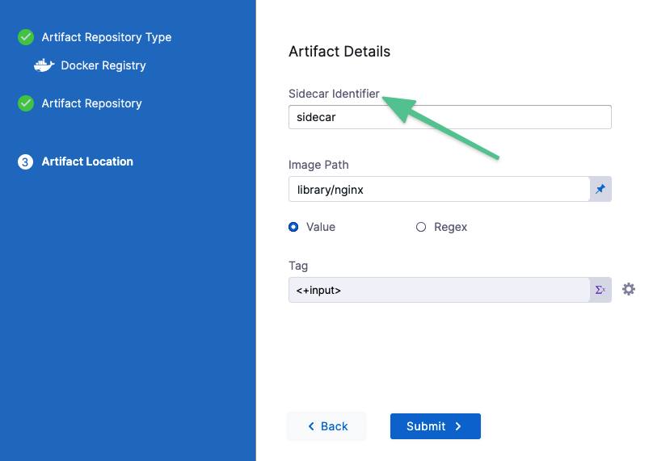
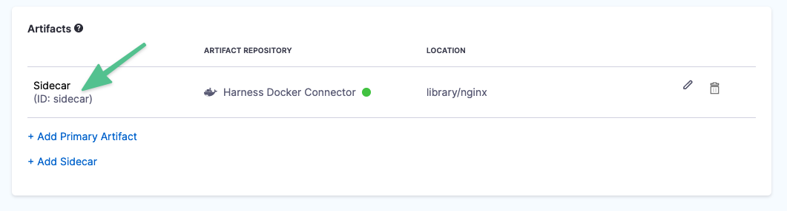
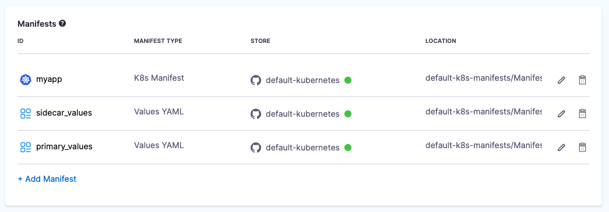
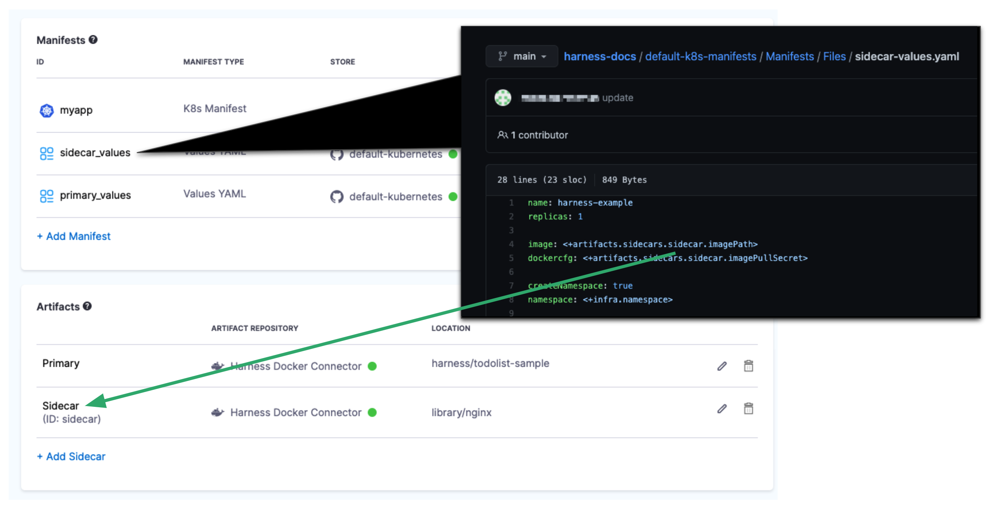
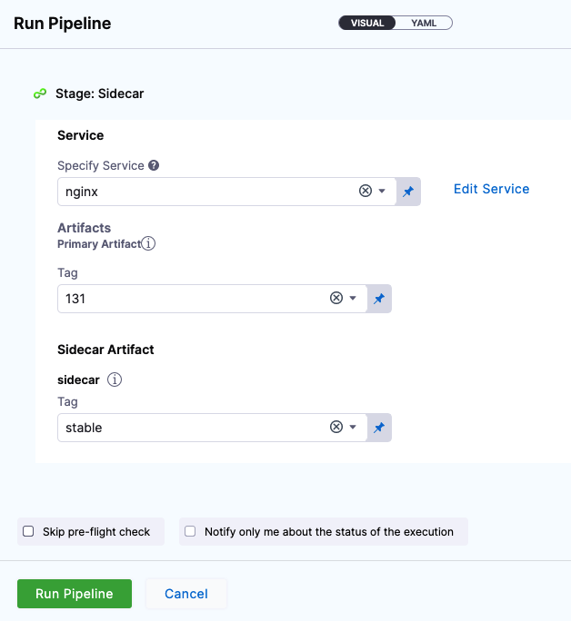

This topic describes how to deploy sidecar workloads using Harness.

You can use Harness to deploy both primary and sidecar Kubernetes workloads. Sidecar containers are common where you have multiple colocated containers that share resources.

For details on what workloads you can deploy, see [What Can I Deploy in Kubernetes?](../../cd-technical-reference/cd-k8s-ref/what-can-i-deploy-in-kubernetes.md).Harness treats primary and sidecar workloads the same. We simply provide ways of identifying the workloads as primary and sidecar.

In the Harness Service, in addition to the manifest(s) for the primary artifact used by Harness, you simply add manifests for however many sidecar containers you need. Or you can add one manifest that includes the specs for both primary and sidecar workloads.

The containers in the manifest can be hardcoded or you can add artifact streams to Harness as Artifacts and reference them in your manifests using the `<+artifacts.sidecars.[sidecar_identifier].imagePath>` expression.

This topic provides an example of a simple sidecar deployment.

## Before You Begin

* [Add Container Images as Artifacts for Kubernetes Deployments](add-artifacts-for-kubernetes-deployments.md): review how to add container images as Artifacts for Kubernetes Deployments. Sidecar artifact are described there also.
* [Install a Kubernetes Delegate](../../../platform/2_Delegates/delegate-guide/install-a-kubernetes-delegate.md): you must have a Harness Kubernetes Delegate running in your target Kubernetes cluster.
* [Kubernetes Deployments Overview](kubernetes-deployments-overview.md)
* [Kubernetes CD Quickstart](../../onboard-cd/cd-quickstarts/kubernetes-cd-quickstart.md)
* [What Can I Deploy in Kubernetes?](../../cd-technical-reference/cd-k8s-ref/what-can-i-deploy-in-kubernetes.md)

## Option: Use Harness Artifacts

You can hardcode the image location in your sidecar manifests or use the the **Artifacts** settings in the Harness Service Definition to connect Harness to an artifact stream (for example, a Docker registry).

When you use **Artifacts**, your sidecar manifest refers to the sidecar artifact you added in **Artifacts** using the expression `<+artifacts.sidecars.[sidecar_identifier].imagePath>`.

The `[sidecar_identifier]` path is the **Sidecar Identifier** you specified when you added the sidecar artifact.



Once your artifact is added, you can see the Id in **Artifacts**. For example, the Id here is **sidecar**.



To add a sidecar artifact, open your Harness stage.

In **Service**, in **Artifacts**, click **Add Sidecar**.

Select an artifact repository type. In this example, we'll use Docker Registry.

Select **Docker Registry**, and click **Continue**.

The **Docker Registry** settings appear.

Select a [Docker Registry Connector](../../../platform/7_Connectors/ref-cloud-providers/docker-registry-connector-settings-reference.md) or create a new one.

Click **Continue**.

In **Sidecar Identifier**, give a name to identify this artifact. As mentioned earlier, this is the name you will use to refer to this artifact in your manifest using the expression `<+artifacts.sidecars.[sidecar_identifier].imagePath>`.

In **Image path**, the name of the artifact you want to deploy, such as **library/nginx**. You can also use a [runtime input](../../../platform/20_References/runtime-inputs.md) (`<+input>`) or Harness variable expression.

In **Tag**, add the Docker tag of the image you want to deploy. If you leave this as `<+input>` you are prompted for the tag at runtime. Harness pulls the available tags, and you simply select one.

Click **Save**.

The artifact is added to **Artifacts**.

## Step 1: Prepare the Sidecar Manifest

If you are using Harness **Artifacts**, in the deployment manifest or values.yaml file for this deployment, you reference this artifact using the expression `<+artifacts.sidecars.[sidecar_identifier].imagePath>`.

Using the earlier example of the Id **sidecar**, the reference is `<+artifacts.sidecars.sidecar.imagePath>`. Here's the values.yaml:


```yaml
name: harness-example  
replicas: 1  
  
image: <+artifacts.sidecars.sidecar.imagePath>  
dockercfg: <+artifacts.sidecars.sidecar.imagePullSecret>  
  
createNamespace: true  
namespace: <+infra.namespace>  
...
```

Other sidecar expressions are:

* `<+artifacts.sidecars.sidecar.imagePullSecret>`
* `<+artifacts.sidecars.[sidecar_identifier].imagePath>`
* `<+artifacts.sidecars.[sidecar_identifier].type>`
* `<+artifacts.sidecars.[sidecar_identifier].tag>`
* `<+artifacts.sidecars.[sidecar_identifier].connectorRef>`

Now that you have your sidecar manifests set up, you can add them to Harness.

## Review: Primary and Sidecar Manifest and Values Files

If your stage deploys both primary and sidecar resources, you add one **K8s Manifest** in the **Manifests** section that points to the folder(s) containing the primary and sidecar manifests.

Next, you add one or separate **Values YAML** files for the primary and sidecar resources.



If you are using Harness **Artifacts**, you reference Primary and Sidecar **Artifacts** using different expressions:

* **Primary:** `<+artifact.image>`
* **Sidecar:** `<+artifacts.sidecars.[sidecar_identifier].imagePath>`

For example, here is a single values.yaml for one primary artifact and two sidecars:


```yaml
...  
image1: <+artifact.image>  
dockercfg1: <+artifact.imagePullSecret>  
  
image2: <+artifacts.sidecars.sidecar1.image>  
dockercfg2: <+artifacts.sidecars.sidecar1.imagePullSecret>  
  
image3: <+artifacts.sidecars.sidecar2.image>  
dockercfg3: <+artifacts.sidecars.sidecar2.imagePullSecret>  
...
```

The corresponding manifest would also need entries for image1, image2, and image3.

```yaml
...  
apiVersion: apps/v1  
kind: Deployment  
metadata:  
  name: {{ template "todolist.fullname" . }}  
  namespace: {{ .Values.namespace }}  
  labels:  
    app: {{ template "todolist.name" . }}  
    chart: {{ template "todolist.chart" . }}  
    release: "{{ .Release.Name }}"  
    harness.io/release: {{ .Release.Name }}  
    heritage: {{ .Release.Service }}  
spec:  
  replicas: {{ .Values.replicaCount }}  
  selector:  
    matchLabels:  
      app: {{ template "todolist.name" . }}  
      release: {{ .Release.Name }}  
  template:  
    metadata:  
      labels:  
        app: {{ template "todolist.name" . }}  
        release: {{ .Release.Name }}  
        harness.io/release: {{ .Release.Name }}  
    spec:  
      {{- if .Values.dockercfg1}}  
      imagePullSecrets:  
      - name: {{.Values.name}}-dockercfg1  
      - name: {{.Values.name}}-dockercfg2  
      - name: {{.Values.name}}-dockercfg3  
      {{- end}}  
      containers:  
        - name: {{ .Chart.Name }}-1  
          image: {{.Values.image1}}  
          imagePullPolicy: {{ .Values.pullPolicy }}  
          {{- if or .Values.env.config .Values.env.secrets}}  
          envFrom:  
          {{- if .Values.env.config}}  
          - configMapRef:  
              name: {{.Values.name}}  
          {{- end}}  
          {{- if .Values.env.secrets}}  
          - secretRef:  
              name: {{.Values.name}}  
          {{- end}}  
          {{- end}}  
        - name: {{ .Chart.Name }}-2  
          image: {{.Values.image2}}  
          imagePullPolicy: {{ .Values.pullPolicy }}  
          {{- if or .Values.env.config .Values.env.secrets}}  
          envFrom:  
          {{- if .Values.env.config}}  
          - configMapRef:  
              name: {{.Values.name}}  
          {{- end}}  
          {{- if .Values.env.secrets}}  
          - secretRef:  
              name: {{.Values.name}}  
          {{- end}}  
          {{- end}}  
        - name: {{ .Chart.Name }}-3  
          image: {{.Values.image3}}  
          imagePullPolicy: {{ .Values.pullPolicy }}  
          {{- if or .Values.env.config .Values.env.secrets}}  
          envFrom:  
          {{- if .Values.env.config}}  
          - configMapRef:  
              name: {{.Values.name}}  
          {{- end}}  
          {{- if .Values.env.secrets}}  
          - secretRef:  
              name: {{.Values.name}}  
          {{- end}}  
          {{- end}}
```
## Step 2: Add the Sidecar Manifest and Values YAML

Whether you hardcoded the image location in your manifest files or used **Artifacts**, simply add the manifests and values.yaml to the **Manifests** section, as described in [Add Kubernetes Manifests](define-kubernetes-manifests.md).

When you're done your values.yaml file is added and refers to the sidecar artifact:



## Step 3: Deploy the Sidecar

Sidecars are deployed, rolled back, and have their releases versioned the same as primary containers.

If you are using **Artifacts**, when you deploy a Pipeline with a sidecar Artifact, you are prompted to select the sidecar artifact tag as well as the primary artifact tag:



For examples of standard deployments, see:

* [Create a Kubernetes Rolling Deployment](../../cd-execution/kubernetes-executions/create-a-kubernetes-rolling-deployment.md)
* [Create a Kubernetes Canary Deployment](../../cd-execution/kubernetes-executions/create-a-kubernetes-canary-deployment.md)
* [Create a Kubernetes Blue Green Deployment](../../cd-execution/kubernetes-executions/create-a-kubernetes-blue-green-deployment.md)

