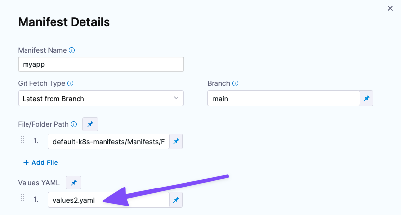
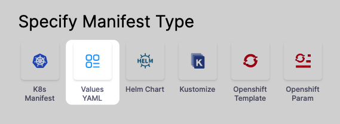
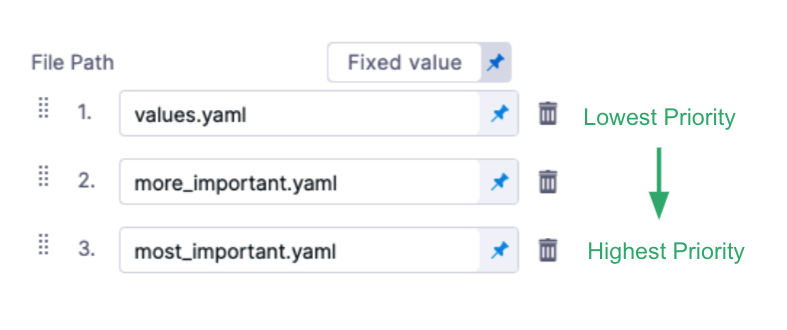
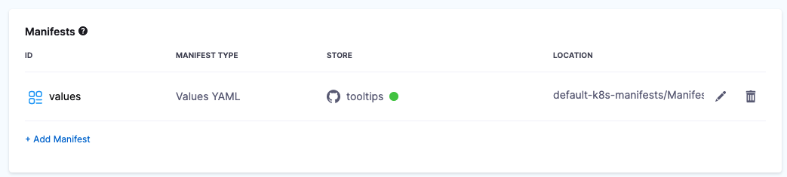
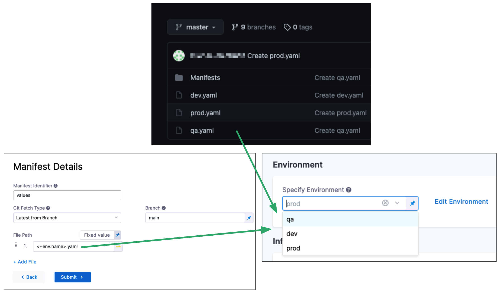
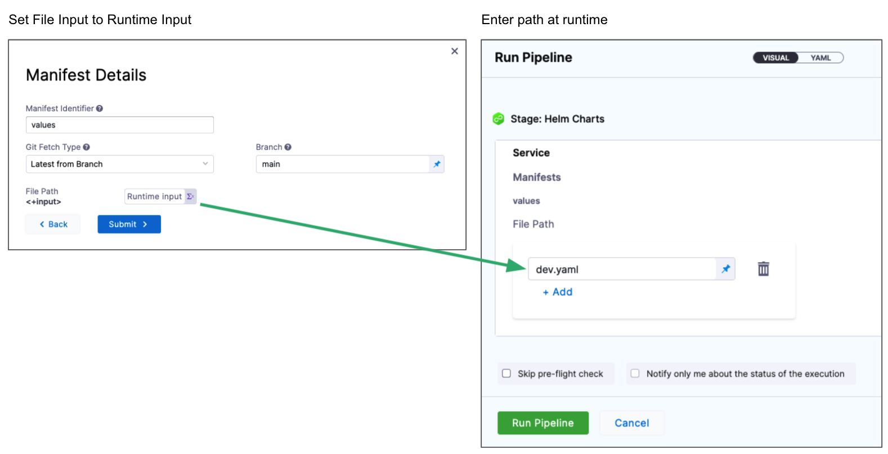

You can use values YAML files for Kubernetes and Helm deployments in Harness.

For Kubernetes manifests, the values file uses Go templating to template manifest files. See [Example Kubernetes Manifests using Go Templating](../../cd-technical-reference/cd-k8s-ref/example-kubernetes-manifests-using-go-templating.md).

For Helm charts, the values file defines the default values for parsing the Kubernetes templates (manifests) when deploying the Helm chart. See [Deploy Helm Charts](../cd-helm-category/deploy-helm-charts.md).

Harness supports Kubernetes and Helm charts without requiring Helm or Tiller and Kubernetes and Helm have equal support for all Harness deployment strategies.

You can overlay and override multiple values files in a stage's Service in a few ways. For example, by overlaying multiple files and by replacing file paths dynamically at runtime.

This topic describes how to add values files, how to override them at the Service and Environment, and how to override them at Pipeline runtime.

## Before You Begin

* [Kubernetes CD Quickstart](../../onboard-cd/cd-quickstarts/kubernetes-cd-quickstart.md)
* [Helm CD Quickstart](../../onboard-cd/cd-quickstarts/helm-cd-quickstart.md)

## Limitations

* For Kubernetes deployments, the values.yaml file used in Harness doesn't support Helm templating, only Go templating.
* Helm templating is fully supported in the remote Helm charts you add to your Harness Service. If you add a Helm chart and a values.yaml, the values.yaml can use Helm templating.

## Review: Propagate and Override between Stages

This topic covers adding and overriding the values.yaml files you add to a Harness Service, but you can also propagate and override entire Services.

See [Propagate and Override CD Services](../../cd-services/cd-services-general/propagate-and-override-cd-services.md).

## Review: Values Files with Kubernetes and Helm Charts

Let's take a quick look at how values files are used with Kubernetes and Helm charts in Harness.

### Kubernetes

You can use values YAML files with your Kubernetes manifests in Harness. This allows you to define several Kubernetes resources as a set.


```bash
files/  
|-values.yaml  
|-templates/  
 |-deployment.yaml  
 |-namespace.yaml  
 |-service.yaml
```

Harness evaluates the values.yaml files you add just like Helm does with its values file. Values.yaml files added to Harness don't use Helm templating, but instead use [Go templating](https://godoc.org/text/template) and [Harness built-in variable expressions](../../../platform/12_Variables-and-Expressions/harness-variables.md). This removes the need for Helm or Tiller to be installed.

### Helm Charts

The typical Helm chart uses the following files:


```bash
chart/              # Helm chart folder  
|-Chart.yaml        # chart definition  
|-requirements.yaml # optional charts to deploy with your chart  
|-values.yaml       # values for the template variables  
|-templates/        # directory containing the template files (Kubernetes manifests)
```

Harness support Helm charts using Helm templating. Harness will evaluate the Helm chart just like Helm. You do not need to install Helm on the Harness Delegate pod/host. Harness manages Helm for you.

Here's a quick video that shows how to add Values YAML files for Kubernetes and Helm Charts. 

<!-- Video:
https://www.youtube.com/watch?v=dVk6-8tfwJc-->
<docvideo src="https://www.youtube.com/watch?v=dVk6-8tfwJc" />


## Review: Artifacts with Manifests and Charts

You can hardcode the deployment artifact in your values.yaml file just as you might in a typical Helm deployment.

Or you can add a path to the artifact in Harness and use a [Harness expression](../../../platform/12_Variables-and-Expressions/harness-variables.md) in your values.yaml to refer to that path.

When Harness executes the Pipeline, the Harness Delegate resolves the expression and pulls the artifact onto the target pods.

Adding artifacts to Harness is covered in [Add Container Images as Artifacts for Kubernetes Deployments](add-artifacts-for-kubernetes-deployments.md).

Once you've added the artifact to Harness, you add the Harness expression `<+artifact.image>` in your values.yaml using the `image` label: `image: <+artifact.image>`.

For example:


```yaml
name: myapp  
replicas: 2  
  
image: <+artifact.image>  
dockercfg: <+artifact.imagePullSecret>  
...
```

Artifacts and manifests are discussed in detail in [Add Kubernetes Manifests](define-kubernetes-manifests.md).

## Step: Add Values YAML

You can add one or more Values YAML files in two ways:

* **Same repo:** If the Values YAML are in the same repo as your Kubernetes manifests or Helm Charts, you can add them when you add those files. You simply use the Values YAML setting.  

* **Different repos:** If the Values YAML are in a repo separate from your Kubernetes manifests or Helm Charts, or you just want to add them separately, you can them by selecting the Values YAML manifest type.  

We'll cover this option below.

1. In your CD stage, click **Service**.
2. In **Service Definition**, select **Kubernetes**.
3. In **Manifests**, click **Add Manifest**.
4. In **Specify Manifest Type**, select **Values YAML**, and click **Continue.**
   
   

1. In **Specify Values YAML Store**, select the Git repo provider you're using and then create or select a Connector to that repo. The different Connectors are covered in [Connect to a Git Repo](../../../platform/7_Connectors/connect-to-code-repo.md).
5. If you haven't set up a Harness Delegate, you can add one as part of the Connector setup.
    This process is described in [Kubernetes deployment tutorial](../../onboard-cd/cd-quickstarts/kubernetes-cd-quickstart.md), [Helm Chart  deployment tutorial](../../onboard-cd/cd-quickstarts/helm-cd-quickstart.md) and [Install a Kubernetes Delegate](../../../platform/2_Delegates/delegate-guide/install-a-kubernetes-delegate.md).
1. Once you've selected a Connector, click **Continue**.
6. In **Manifest Details**, you tell Harness where the values.yaml is located.
7. In **Manifest Identifier**, enter a name that identifies the file, like **values**.
8. In **Git Fetch Type**, select a branch or commit Id for the manifest, and then enter the Id or branch.
9.  For **Specific Commit ID**, you can also use a [Git commit tag](https://git-scm.com/book/en/v2/Git-Basics-Tagging).
10. In **File Path**, enter the path to the values.yaml file in the repo.
    
    You can enter multiple values file paths by clicking **Add File**. At runtime, Harness will compile the files into one values file.
    
    If you use multiple files, the highest priority is given from the last file, and the lowest priority to the first file. For example, if you have 3 files and the second and third files contain the same `key:value` as the first file, the third file's `key:value` overrides the second and first files.
    
    

1. Click **Submit**. The values file(s) are added to the Service.
   
   

## Option: Override Values in an Environment

You can override the values YAML file for a stage's Environment by mapping the Environment name to the values file or folder. Next, you use the `<+env.name>` Harness expression in the values YAML path.

Let's look at an example.

Here is a repo with three values files, dev.yaml, qa.yaml. prod.yaml. In the **File Path** for the values file, you use the `<+env.name>` expression. 

Next, in the **Environment** setting, you add three Environments, one for each YAML file name.



When you select an Environment, such as **qa**, the name of the Environment is used in **File Path** and resolves to **qa.yaml**. At runtime, the **qa.yaml** values file is used.

Instead of selecting the Environment in the **Infrastructure** each time, you can set the Environment as a **Runtime Input** and then enter **dev**, **qa**, or **prod** at runtime. See [Runtime Inputs](../../../platform/20_References/runtime-inputs.md).

## Option: Override Values at Runtime

You can make the values file path a **Runtime Input** and simply enter the name of the values file when you run the Pipeline. See [Runtime Inputs](../../../platform/20_References/runtime-inputs.md).

In **Manifest Details** for the values file, in **File Path**, select **Runtime Input**. At runtime, you simply enter the name of the values file to use.



## See Also

* [Deploy Helm Charts](../cd-helm-category/deploy-helm-charts.md)
* [Propagate and Override CD Services](../../cd-services/cd-services-general/propagate-and-override-cd-services.md)

