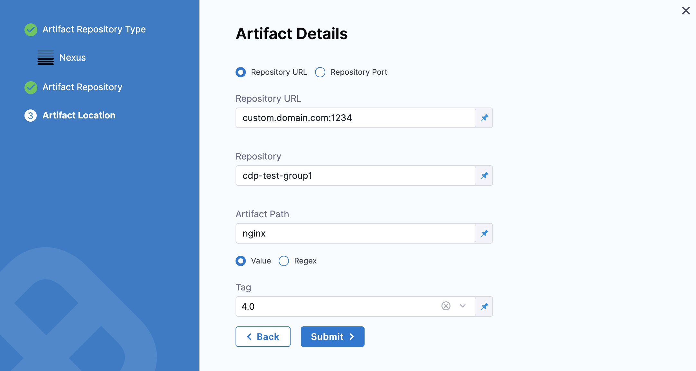

This topic covers adding container image locations as Harness artifacts and referencing them in your Values files.

If a public Docker image location is hardcoded in your Kubernetes manifest (for example, `image: nginx:1.14.2`), then you can simply add the manifest to Harness and the Harness Delegate will pull the image during deployment.

Alternatively, you can add the image location to Harness as an artifact in the **Service Definition**. This allows you to reference the image in your manifests and elsewhere using the Harness expression `<+artifact.image>`.

When you deploy, Harness connects to your repo and you select which image and version/tag to deploy.

With a Harness artifact, you can template your manifests, detaching them from a hardcoded location. This makes your manifests reusable and dynamic.

## Before You Begin

Make sure you've reviewed and set up the following:

* [Install a Kubernetes Delegate](../../../platform/2_Delegates/delegate-guide/install-a-kubernetes-delegate.md). You must have a Harness Kubernetes Delegate running in your target Kubernetes cluster.
* [Kubernetes Deployments Overview](kubernetes-deployments-overview.md)

## Visual Summary

To add a container image to Harness as an Artifact, you add a Harness Connector for your repository and then add the container image as an artifact source. In your Values file (values.yaml), you simply add a Harness expression where you'd normally hardcode the location.


## Review: Artifacts and Manifests in Harness

There are several scenarios to consider before you use artifacts and manifests in the Harness stage:

### Public artifact hardcoded in the manifest

If the image location is hardcoded in your Kubernetes manifest (for example, `image: nginx:1.14.2`), you do not need to use the **Artifacts** settings in the Harness Service Definition. The Harness Delegate will pull the image at runtime. You simply need to ensure that the Delegate can connect to the public repo.

### Public artifact is not hardcoded in the manifest

In this scenario, you'll use the **Artifacts** settings in the Harness Service Definition to identify the artifact to use and select the image and tag in Harness at runtime.

+ **Primary artifact:** In your manifest, you refer to the primary artifact you set up in Harness using the expression `<+artifact.image>`: `image: <+artifact.image>`.
+ **Sidecar artifacts:** In your manifest, you refer to the sidecar artifact you set up in Harness using the expression `<+serviceConfig.serviceDefinition.spec.artifacts.sidecars.[sidecar_identifier].spec.imagePath>:<+serviceConfig.serviceDefinition.spec.artifacts.sidecars.[sidecar_identifier].spec.tag>`.  
In this example, `[sidecar_identifier]` is the sidecar identifier you specified when you added the sidecar artifact to Harness.

### Private repo artifact

In some cases, your Kubernetes cluster might not have the permissions needed to access a private repo (GCR, etc). For these cases, you use the expression `<+artifact.imagePullSecret>` in the Values file and reference it in the Secret and Deployment objects in your manifest.  
This key will import the credentials from the Docker credentials file in the artifact.  
See [Example Manifests](#example_manifests).

### Service account of the Kubernetes Delegate can pull from the private repo

If the Kubernetes service account used by the Connector or Delegate has permission to pull from the private repo, you do not need to use the **Artifacts** settings in the Harness Service Definition. You can hardcode the image location in the manifest, and the Delegate will pull it at runtime.  

If multiple Delegates are selected, make sure that all of their service accounts have permission to pull from the private repo.

### Sidecar artifacts

Sidecar artifacts follow the same rules as primary artifacts.  

If you do not hardcode the sidecar image location in the manifest, you will use the **Artifacts** settings in the Harness Service Definition to identify the sidecar artifact to use and select the image and tag in Harness at runtime.  

As explained above, in your Values file, you refer to the sidecar artifact you set up in Harness using the expression `<+serviceConfig.serviceDefinition.spec.artifacts.sidecars.[sidecar_identifier].spec.imagePath>:<+serviceConfig.serviceDefinition.spec.artifacts.sidecars.[sidecar_identifier].spec.tag>`.  

In this example, `[sidecar_identifier]` is the sidecar identifier you specified when you added the sidecar artifact.

## Review: Container Registry Support

Harness supports all of the popular container registries. You can add your container registry account as a Harness Connector.

The Connector can be added in line when you select your artifacts or separately in **Project Setup** (for Projects) or **Account Resources** (for accounts).

For steps on setting up each artifact server as a Connector, see the following [Connect to an Artifact Repo](../../../platform/7_Connectors/connect-to-an-artifact-repo.md).

If you are using Google Container Registry (GCR) or Amazon Elastic Container Registry (ECR), see [Cloud Platform Connectors](/docs/category/cloud-platform-connectors).

## Review: Primary and Sidecar Artifacts

You can add a primary artifact and multiple sidecar artifacts. The sidecars are treated the same as the primary artifact. Both are deployed to the target infrastructure in the **Infrastructure Definition**.

You don't need to create a separate Service for a sidecar artifact. Both are added in the Service Definition. The steps for adding them are the same.

You must select artifact versions at deployment runtime for all primary and sidecar artifacts.

## Step 1: Add Deploy Stage

For steps on adding a stage, see [Add a Stage](../../../platform/8_Pipelines/add-a-stage.md).

1. When you add a stage, select **Deploy**.
2. Name the stage, and select what you'd like to deploy. For example, select **Service**.
3. Click **Set Up Stage**. The new stage's settings appear.
4. Click **Next** or **Service**.

## Step 2: Create the Harness Service

In **Service**, you can define/select the Service and Service Definition.

Let's take a moment and review Harness Services and Service Definitions (which are explained below). Harness Services represent your microservices/apps logically.  
  
You can add the same Service to as many stages are you need. Service Definitions represent your artifacts, manifests, and variables physically. They are the actual files and variable values.  
  
By separating Services and Service Definitions, you can propagate the same Service across stages and change artifacts, manifests, and variables with each stage.Select or create the Service.

To add your container image, go to **Artifacts** in the Service Definition.

## Step 3: Add the Artifact Source

1. In **Artifacts**, you add connections to the images in their repos. To demonstrate how to add the Artifact Source, we use a Docker image from a Docker Registry Connector.
2. In **Artifacts**, click **Add Primary** **Artifact.**
3. Select the **Artifact Repository Type**.
   
   

4. For Azure Container Registry, use the **Docker Registry** type.

### Option: Docker Registry

1. Select **Docker Registry**, and click **Continue**.
2. The **Docker Registry** settings appear.
3. Select a [Docker Registry Connector](../../../platform/7_Connectors/ref-cloud-providers/docker-registry-connector-settings-reference.md) or create a new one.
4. In your Docker Registry Connector, to connect to a public Docker registry like Docker Hub, use `https://registry.hub.docker.com/v2/`. To connect to a private Docker registry, use `https://index.docker.io/v2/`.Click **Continue**.
5. In **Image path**, enter the name of the artifact you want to deploy, such as **library/nginx**.
6. In **Tag**, enter the [Docker image tag](https://docs.docker.com/engine/reference/commandline/tag/) for the image.
7. Click **Submit**.

The Artifact is added to the Service Definition.


### Option: Nexus

:::note

Currently, this feature is behind the Feature Flag `NG_NEXUS_ARTIFACTORY`. Contact [Harness Support](mailto:support@harness.io) to enable the feature.

:::

1. Select **Nexus**, and click **Continue**.

   

1. Select a [Nexus Connector](../../../platform/8_Pipelines/w_pipeline-steps-reference/nexus-connector-settings-reference.md) or create a new one.

   

2. Click **Continue**. The Artifact Details settings appear.


Based on your server and network configuration, choose one of the following and fill in the details:

* **Repository URL** - You can choose this for custom infrastructure with a specific hostname and/or port.  
  Enter the URL you would use in the Docker login to fetch the artifact. This is the same as the domain name and port you use for `docker login hostname:port`.
  
  
* **Repository Port** - You can choose this for standard Nexus 3 installation without any additional infrastructure.  
  Enter the port you use for `docker login hostname:port`.  
  The port you enter will be used along with the domain, username, and password provided in the Nexus Connector.
  
  
  
*  In **Repository**, enter the name of the repository where the artifact is located.
  
  Harness supports only the Docker repository format as the Artifact source for the Nexus 3 Artifact registry.In **Artifact Path**, enter the name of the artifact you want to deploy. For example `nginx`, `private/nginx`, `public/org/nginx`.
  
*  In **Tag**, select the tag for the image/artifact.
  
  
  
  For details on the settings, see [Nexus Connector Settings Reference](../../../platform/8_Pipelines/w_pipeline-steps-reference/nexus-connector-settings-reference.md).
  
  You can optionally add validations to Tags. To do this, click the settings icon and select the validation type.
  
  

Click **Submit**.

The Artifact is added to the Service Definition.

### Option: Artifactory


Select an [Artifactory Connector](../../../platform/7_Connectors/ref-cloud-providers/artifactory-connector-settings-reference.md) or create a new one.


Click **Continue**. The **Artifact Details** settings appear.

In **Repository URL**, enter the URL you would use in the Docker login to fetch the artifact. This is the same as the domain name and port you use for `docker login hostname:port`. For more information, see [Artifactory Connector Settings Reference](../../../platform/7_Connectors/ref-cloud-providers/artifactory-connector-settings-reference.md).

In **Repository**, enter the name of the repository where the artifact is located.

In **Artifact Path**, enter the name of the artifact you want to deploy. For example `nginx`, `private/nginx`, `public/org/nginx`.

In **Tag**, select the tag for the image/artifact. For more information, see [Artifactory Connector Settings Reference](../../../platform/7_Connectors/ref-cloud-providers/artifactory-connector-settings-reference.md).


Click **Submit**.

The Artifact is added to the Service Definition.

You can add sidecar artifacts the same way.

When you run the Pipeline, select the build of the artifact(s) to use.


### Option: Custom

:::note

Currently, this feature is behind the Feature Flag `CUSTOM_ARTIFACT_NG`. Contact [Harness Support](mailto:support@harness.io) to enable the feature.

:::

You can select a Custom Artifact Source to add your custom repository.

Select **Custom** and click **Continue**.


The **Artifact Details** settings appear.


In **Version**, enter your artifact version.

Click **Submit**.

You can only set an Artifact version number when using a Custom Artifact Source. The version you select determines the Artifact context for the deploy stage. You may refer to it anywhere in the stage by using the expression `<+artifact.version>`.

## Step 4: Reference the Artifact in Your Values File

In this example, the public artifact isn't hardcoded in the manifest and we reference the image in the Service Definition **Artifacts** section using the variable `<+artifact.image>`.

For example, here's a reference in a Values file:


```yaml
...  
name: <+stage.variables.name>  
replicas: 2  
  
image: <+artifact.image>  
dockercfg: <+artifact.imagePullSecret>  
...
```

That `<+artifact.image>` will reference the **Primary** artifact.

In your manifests, you simply use the Go template reference to the `image` value (`{{.Values.image}}`):


```yaml
apiVersion: apps/v1  
kind: Deployment  
...  
    spec:  
      {{- if .Values.dockercfg}}  
      imagePullSecrets:  
      - name: {{.Values.name}}-dockercfg  
      {{- end}}  
      containers:  
      - name: {{.Values.name}}  
        image: {{.Values.image}}  
...
```
See [Example Manifests](#example_manifests) for more details.

## Step 5: Add Your Manifests

Once your manifests and Values file are configured to use the artifact reference `<+artifact.image>`, you can add them to the Service.

See [Define Kubernetes Manifests](define-kubernetes-manifests.md).

## Step 6: Add Infrastructure and Execution

Next, you'll add the target infrastructure and execution steps to your stage.

We won't cover those here, but see the [Kubernetes CD Quickstart](../../onboard-cd/cd-quickstarts/kubernetes-cd-quickstart.md) for a summary.

## Example Manifests

Below are some examples of manifests using the Harness expression for the artifact you added in **Artifacts** (`<+artifact.image>`).

### Basic Values YAML and Manifests for Public Image

This is a simple example using the Artifact reference `<+artifact.image>`. It can be used whenever the public image isn't hardcoded in manifests.

We use Go templating with a values.yaml file and manifests for deployment, namespace, and service. The manifests for deployment, namespace, and service are in a **templates** folder that is a peer of the values.yaml file.

#### values.yaml

This file uses the `image: <+artifact.image>` to identify the primary artifact added in **Artifacts**.

It also uses `name: <+stage.variables.name>` to reference a Stage variable `name`, and `namespace: <+infra.namespace>` to reference the namespace entered in the Stage's **Infrastructure Definition**. Service type and ports are hardcoded.

The name, image, and namespace values are referenced in the manifests described later.


```yaml
name: <+stage.variables.name>  
replicas: 2  
  
image: <+artifact.image>  
# dockercfg: <+artifact.imagePullSecret>  
  
createNamespace: true  
namespace: <+infra.namespace>  
  
# Service Type allow you to specify what kind of service you want.  
# Possible values for ServiceType are:  
# ClusterIP | NodePort | LoadBalancer | ExternalName  
serviceType: LoadBalancer  
  
# A Service can map an incoming port to any targetPort.  
# targetPort is where application is listening on inside the container.  
servicePort: 80  
serviceTargetPort: 80  
  
# Specify all environment variables to be added to the container.  
# The following two maps, config and secrets, are put into a ConfigMap  
# and a Secret, respectively.  
# Both are added to the container environment in podSpec as envFrom source.  
env:  
  config:  
    key1: value10  
  secrets:  
    key2: value2
```
#### templates/deployment.yaml

The deployment manifest references the name and image values from values.yaml. The manifest also contains the ConfigMap and Secret objects.


```go
{{- if .Values.env.config}}  
apiVersion: v1  
kind: ConfigMap  
metadata:  
  name: {{.Values.name}}  
data:  
{{.Values.env.config | toYaml | indent 2}}  
---  
{{- end}}  
  
{{- if .Values.env.secrets}}  
apiVersion: v1  
kind: Secret  
metadata:  
  name: {{.Values.name}}  
stringData:  
{{.Values.env.secrets | toYaml | indent 2}}  
---  
{{- end}}  
  
{{- if .Values.dockercfg}}  
apiVersion: v1  
kind: Secret  
metadata:  
  name: {{.Values.name}}-dockercfg  
  annotations:  
    harness.io/skip-versioning: true  
data:  
  .dockercfg: {{.Values.dockercfg}}  
type: kubernetes.io/dockercfg  
---  
{{- end}}  
  
apiVersion: apps/v1  
kind: Deployment  
metadata:  
  name: {{.Values.name}}-deployment  
spec:  
  replicas: {{int .Values.replicas}}  
  selector:  
    matchLabels:  
      app: {{.Values.name}}  
  template:  
    metadata:  
      labels:  
        app: {{.Values.name}}  
    spec:  
      {{- if .Values.dockercfg}}  
      imagePullSecrets:  
      - name: {{.Values.name}}-dockercfg  
      {{- end}}  
      containers:  
      - name: {{.Values.name}}  
        image: {{.Values.image}}  
        {{- if or .Values.env.config .Values.env.secrets}}  
        envFrom:  
        {{- if .Values.env.config}}  
        - configMapRef:  
            name: {{.Values.name}}  
        {{- end}}  
        {{- if .Values.env.secrets}}  
        - secretRef:  
            name: {{.Values.name}}  
        {{- end}}  
        {{- end}}
```
#### templates/namespace.yaml

The namespace manifest references the namespace value from values.yaml.


```go
{{- if .Values.createNamespace}}  
apiVersion: v1  
kind: Namespace  
metadata:  
  name: {{.Values.namespace}}  
{{- end}}
```

#### templates/service.yaml

The service manifest references the hardcoded service type and ports from values.yaml.


```go
apiVersion: v1  
kind: Service  
metadata:  
  name: {{.Values.name}}-svc  
spec:  
  type: {{.Values.serviceType}}  
  ports:  
  - port: {{.Values.servicePort}}  
    targetPort: {{.Values.serviceTargetPort}}  
    protocol: TCP  
  selector:  
    app: {{.Values.name}}
```

### Private Artifact

When the image is in a private repo, you use the expression `<+artifact.imagePullSecret>` in the Secret and Deployment objects in your manifest.

This key will import the credentials from the Docker credentials file in the artifact.

It's much simpler to simple use the `<+artifact.imagePullSecret>` expression in the values.yaml file and then reference it in other manifests.

Using the values.yaml file above, we simply remove the comment in front of `dockercfg: <+artifact.imagePullSecret>`:


```yaml
name: <+stage.variables.name>  
replicas: 2  
  
image: <+artifact.image>  
dockercfg: <+artifact.imagePullSecret>  
  
createNamespace: true  
namespace: <+infra.namespace>  
...
```

You don't need to make changes to the deployment manifest from earlier. It uses Go templating to check for the `dockercfg` value in values.yaml and applies it to Secret and Deployment.

If using the condition `{{- if .Values.dockercfg}}` to check for `dockercfg` in values.yaml.


```go
...  
{{- if .Values.dockercfg}}  
apiVersion: v1  
kind: Secret  
metadata:  
  name: {{.Values.name}}-dockercfg  
  annotations:  
    harness.io/skip-versioning: true  
data:  
  .dockercfg: {{.Values.dockercfg}}  
type: kubernetes.io/dockercfg  
---  
{{- end}}  
  
apiVersion: apps/v1  
kind: Deployment  
metadata:  
  name: {{.Values.name}}-deployment  
spec:  
  replicas: {{int .Values.replicas}}  
  selector:  
    matchLabels:  
      app: {{.Values.name}}  
  template:  
    metadata:  
      labels:  
        app: {{.Values.name}}  
    spec:  
      {{- if .Values.dockercfg}}  
      imagePullSecrets:  
      - name: {{.Values.name}}-dockercfg  
      {{- end}}  
      containers:  
      - name: {{.Values.name}}  
        image: {{.Values.image}}  
...
```
## Notes

* [Harness Variables and Expressions](../../../platform/12_Variables-and-Expressions/harness-variables.md) may be added to Values files (for example values.yaml), not the manifests themselves. This provides more flexibility.
* The Values file used in a Harness Service Definition doesn't support Helm templating, **only Go templating**. Helm templating is fully supported in the remote Helm charts you add to your Harness Service Definition. See [Helm CD Quickstart](../../onboard-cd/cd-quickstarts/helm-cd-quickstart.md).
* Harness uses Go template version 0.4. If you are used to Helm templating, you can download Go template and try it out locally to find out if your manifests will work. This can help you avoid issues when adding your manifests to Harness.
  * You can install Go template version 0.4 locally to test your manifests.
    + Mac OS: `curl -O https://app.harness.io/public/shared/tools/go-template/release/v0.4/bin/darwin/amd64/go-template`
    + Linux: `curl -O https://app.harness.io/public/shared/tools/go-template/release/v0.4/bin/linux/amd64/go-template`
    + Windows: `curl -O https://app.harness.io/public/shared/tools/go-template/release/v0.4/bin/windows/amd64/go-template`
+ For steps on doing local Go templating, see [Harness Local Go-Templating](https://community.harness.io/t/harness-local-go-templating/460) on Harness Community.
* Harness uses an internal build of Go templating. It cannot be upgraded. Harness uses [Spring templates functions](http://masterminds.github.io/sprig/), excluding those functions that provide access to the underlying OS (env, expandenv) for security reasons.
  * In addition, Harness uses the functions ToYaml, FromYaml, ToJson, FromJson.

