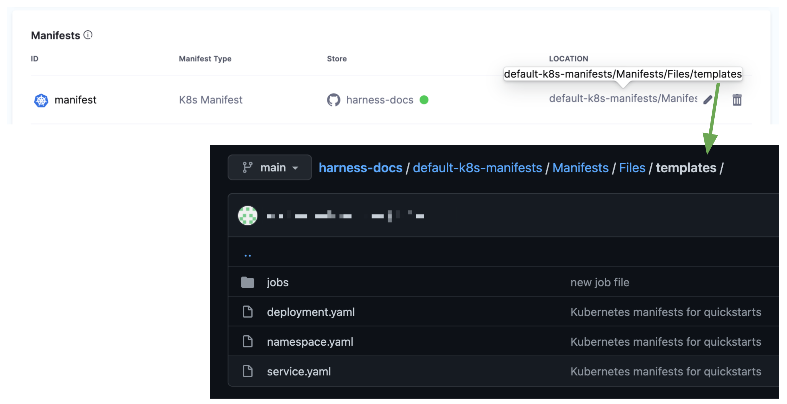
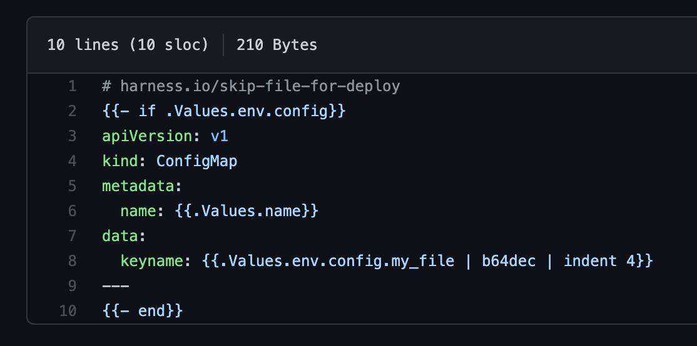
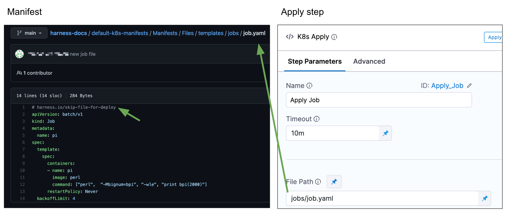

This topic describes how to ignore manifests for the primary deployment and apply them separately using the Apply step.

You might have manifest files for resources that you do not want to deploy as part of the main deployment.

Instead, you can tell Harness to ignore these files and then apply them separately using the Harness [Apply step](../../cd-technical-reference/cd-k8s-ref/kubernetes-apply-step.md). Or you can simply ignore them and deploy them later.

## Before You Begin

* [Add Kubernetes Manifests](define-kubernetes-manifests.md)
* [Kubernetes Deployments Overview](kubernetes-deployments-overview.md)

## Visual Summary

The following image shows how you can ignore a Jobs manifest and then apply it separately using the Apply step.

## Review: What Workloads Can I Deploy?

See [What Can I Deploy in Kubernetes?](../../cd-technical-reference/cd-k8s-ref/what-can-i-deploy-in-kubernetes.md).

## Limitations

* Kubernetes objects and resources deployed by the Apply step are not versioned or rolled back automatically by Harness.

## Step 1: Ignore a Manifest

You add your manifest files to the stage's **Service** section in **Manifests**. You can add manifests individually or by simply adding their parent folder:

To ignore a resource file that is in the directory in the Service **Manifests** section, you add the comment `# harness.io/skip-file-for-deploy` to the **top** of the file.

For example, here is a ConfigMap file using the comment:

Now, when this Pipeline is run, this ConfigMap resource will not be applied.

The comment `# harness.io/skip-file-for-deploy` must be at the **top** of the file. If it is on the second line it will not work and the resource will be deployed as part of the main Workflow rollout.### Option 1: Apply Ignored Resource

The Apply step will apply any resource in a Service **Manifests** explicitly. You must provide the path and name of the file in **Apply**, and Harness will deploy the resource.

For details on the Apply Step, see [Deploy Manifests Separately using Apply Step](../../cd-execution/kubernetes-executions/deploy-manifests-using-apply-step.md).

For example, the following image shows a Jobs resource in a Service **Manifests** section that uses the ignore comment `# harness.io/skip-file-for-deploy` so that the stage does not apply it, and the **Apply** step that specifies the same Jobs resource:

The **File Path** setting in the Apply step must include the folder name and the file name. In the above example, the folder **jobs** is included with the file name **job.yaml**: `jobs/job.yaml`.

The path in **File Path** must be relative to the path you specified for the manifest in the Service **Manifests** section. 

For example, if the path in **Manifests** is `default-k8s-manifests/Manifests/Files/templates` and the Job manifests is in `default-k8s-manifests/Manifests/Files/templates/jobs/job.yaml` you must enter `jobs/job.yaml` in **File Path**.

You can include multiple resource files in the Apply step **File Path** setting.

If you apply the ignore comment `# harness.io/skip-file-for-deploy` to a resource but do not use the resource in an **Apply** step, the resource is never deployed.