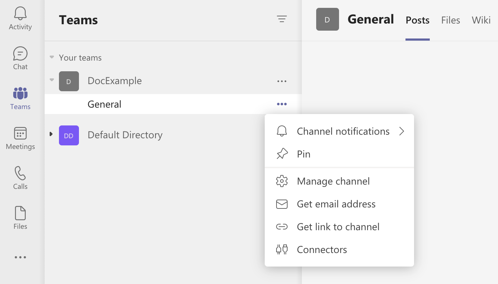
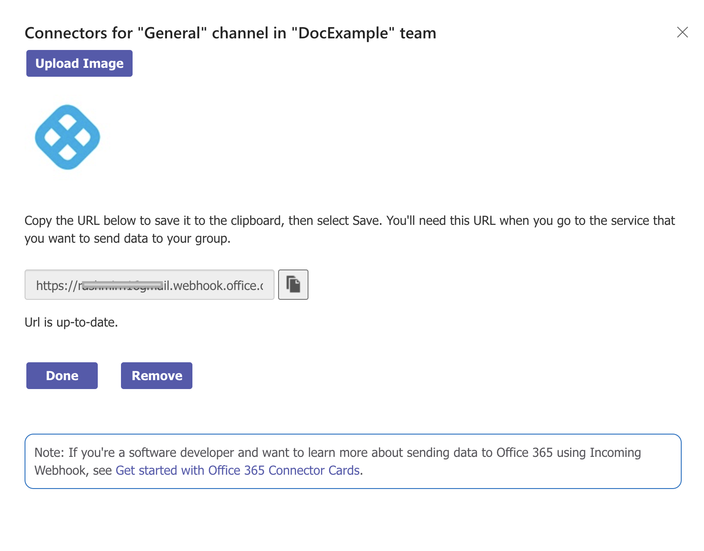
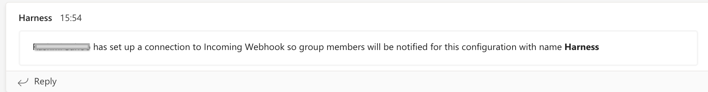

This topic describes how to notify users of different pipeline events using popular notification methods.

You can send Pipeline event notifications using email and popular communication and incident management platforms.

Event notifications are set up using **Notification Rules** in your Pipeline. You select the types of events to send, and then select how you want to send notifications. When those events occur, Harness sends event information to those channels and recipients.

This topic describes how to set up **Notification Rules** in your Pipeline.

You can set notifications preferences on User Groups also. See [Add and Manage User Groups](../../../platform/4_Role-Based-Access-Control/4-add-user-groups.md).

## Before You Begin

* [Send Notifications Using Slack](../../../platform/5_Notifications/send-notifications-using-slack.md)
* [Add and Manage Resource Groups](../../../platform/4_Role-Based-Access-Control/4-add-user-groups.md)

## Limitations

Currently, Harness supports several communication and incident management platforms. If you don't see yours, contact Harness.

## Review: Requirements

To create or enable a Notification Rule, a User must belong to a User Group with a Role that has the Pipeline **Create/Edit** permission.

## Step 1: Add a Notification Rule

In your Pipeline, click **Notify**.


To create a new notification rule, click **Notifications**. The Notification Rule settings appear.

Enter a name for the notification rule. You might want to edit the name after you've selected the events that trigger the rule.

Click **Next**.

## Step 2: Select Events

In **Pipeline Events**, select the events that will trigger the notification.

You can select events for the Pipeline or stages.

If you select the stage events, you can select which stages to use.


Click **Continue**.

There are different communication and incident management platforms to use for the notification rule. Their settings are described below.

The events are self-explanatory, but there are a few considerations:

* If you select both Pipeline End and Pipeline Success, you'll get two notifications.
* Pipeline Pause only applies to a manual pause of the Pipeline execution. Pending Approval steps don't trigger the Pipeline Pause event.

## Option: Email Notifications

For email notifications, simply type in the email addresses that you want to notify.

Enter multiple addresses as a comma-separated list. For example, `john.doe@example.io,qateam@example.io`.

Here's an example of an email notification for the Pipeline Start event:


Along with the start date and who triggered the Pipeline, the email includes a link to the Pipeline execution in Harness.

## Option: Slack Notifications

For Slack notifications, you simply create a webhook in Slack and paste it into the **Slack Webhook URL** setting in the Notification Rule.

Follow the steps in Slack documentation for creating a Slack app, selecting your channel, and creating a webhook:  [Sending messages using Incoming Webhooks](https://api.slack.com/messaging/webhooks).

When you are done, you'll have a webhook that looks something like this:


Copy the webhook.

You either paste the Webhook into **Slack Webhook URL** or add it as an [Encrypted Text](../../../platform/6_Security/2-add-use-text-secrets.md) in Harness and reference it here.

For example, if you have a text secret with the identifier `slackwebhookURL`, you can reference it like this:​


```bash
<+secrets.getValue("slackwebhookURL")>​
```

You can reference a secret within the Org scope using an expression with `org`:​


```bash
<+secrets.getValue("org.your-secret-Id")>​​
```

You can reference a secret within the Account scope using an expression with `account`:​


```bash
<+secrets.getValue(“account.your-secret-Id”)>​​​
```


## Option: PagerDuty Notifications

For PagerDuty notifications, enter the key for a PagerDuty Account/Service or add it as an [Encrypted Text](../../../platform/6_Security/2-add-use-text-secrets.md) in Harness and reference it in **PagerDuty Key**. Harness will send notifications using this key.

For example, if you have a text secret with the identifier `pagerdutykey`, you can reference it like this:​


```bash
<+secrets.getValue("pagerdutykey")>​
```
You can reference a secret within the Org scope using an expression with `org`:


```bash
<+secrets.getvalue("org.your-secret-Id")>
```

You can reference a secret within the Account scope using an expression with `account`:


```bash
<+secrets.getvalue("account.your-secret-Id")>
```

You can copy/paste this key from PagerDuty's **Configuration** > **Services** > **Service Details** dialog > **Integrations** tab, as shown below.


For details, see PagerDuty's documentation on [Creating Integrations](https://support.pagerduty.com/docs/services-and-integrations).

## Option: Microsoft Teams Notifications

For Microsoft Teams notifications, you enter in the Webhook URL for your Microsoft Teams Channel in **Microsoft Teams Webhook URL**.

You create a channel connector in Microsoft Teams to generate the Webhook Harness needs for notification.

In Microsoft Teams, right-click the channel where you want to send notifications, and select **Connectors**.



In **Connectors**, locate **Incoming Webhook**, and click **Configure.**


In **Incoming Webhook**, enter a name, such as **Harness**.

Right-click and save the Harness icon from here:


Click **Upload Image** and add the Harness icon you downloaded.

Next, you'll create the Webhook URL needed by Harness.

In your Microsoft Teams Connector, click **Create**. The Webhook URL is generated.



Click the copy button to copy the Webhook URL, and then click **Done**.

The channel indicates that the Connector was set up.



In Harness, in **Notification Method** settings, enter the Webhook URL for your Microsoft Teams Channel in **Microsoft Teams Webhook URL** or add it as an [Encrypted Text](../../../platform/6_Security/2-add-use-text-secrets.md) and reference it here.

For example, if you have a text secret with the identifier `teamswebhookURL`, you can reference it like this:​


```bash
<+secrets.getValue("teamswebhookURL")>​​
```
You can reference a secret within the Org scope using an expression with `org`:


```bash
<+secrets.getvalue("org.your-secret-Id")>​
```
You can reference a secret within the Account scope using an expression with `account`:​


```bash
<+secrets.getvalue("account.your-secret-Id")>​​
```

## Option: Notify Slack Channels in User Groups

If you have Harness User Groups that have Slack webhooks set up in their Notification Preferences, you can select those groups and Harness will notify them in addition to the Email, Slack, or PagerDuty settings.

See [Send Notifications Using Slack](../../../platform/5_Notifications/send-notifications-using-slack.md).

## Step 3: Enable or Disable Notification Rules

Once you've created Notification Rules, you can enable and disable them in the **Notifications** page.


## See Also

* [Add and Manage User Groups](../../../platform/4_Role-Based-Access-Control/4-add-user-groups.md)

