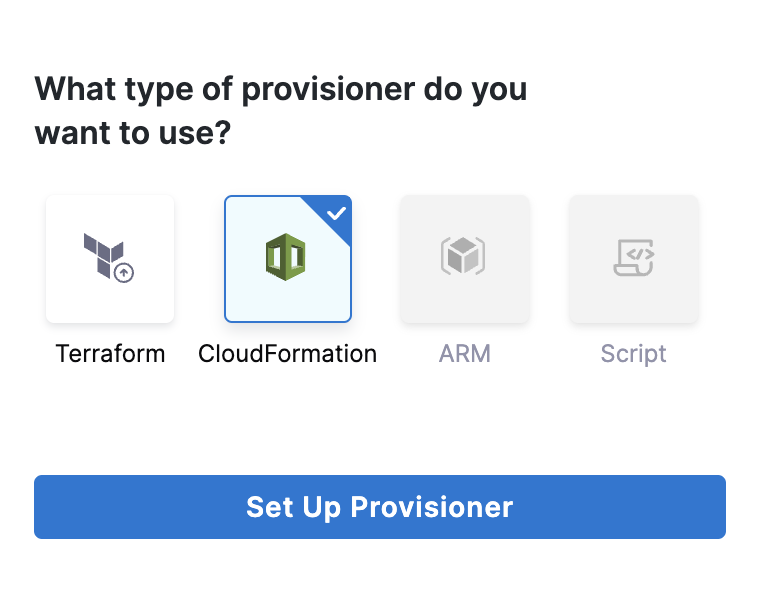
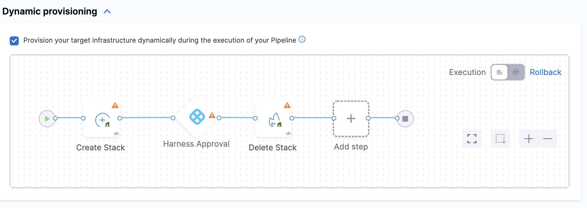

This topic provides an overview of how to use CloudFormation to provision infrastructure as part of your deployment process.

Harness can provision any resource that is supported by CloudFormation.

Looking for How-tos? See [CloudFormation How-tos](cloud-formation-how-tos.md).

## CloudFormation Provisioning Options

You can use Harness with CloudFormation in two ways:

* Target Infra Provisioning: provision the target infrastructure for a deployment, and then deploy to that provisioned infrastructure.
* Non-target Provisioning: provision any resources other than the target infrastructure for the deployment.

You can do both in the same stage if you want.

## CloudFormation Target Infra Provisioning Summary

You set up a CloudFormation target infrastructure provisioning in the following order:

1. Select Dynamic Provisioning. In the Pipeline stage **Infrastructure**, you select the **Dynamic Provisioning** option and select **CloudFormation**.

   
   
   Harness automatically adds the CloudFormation **Create Stack**, **Harness Approval**, and **Delete Stack** steps.
   
   
   
   You can change these steps, but these steps perform the most common CloudFormation target deployment infrastructure process. We use that process in our CloudFormation documentation.
2. In the CloudFormation Create Stack step, you link Harness to the CloudFormation templates you want to use. You add the scripts by connecting to a Git repo where the scripts are kept and setting up and other common options.
3. Map outputs to the target Infrastructure. Harness needs a few outputs so that it can target the provisioned infrastructure, such as a cluster namespace. You simply map some outputs to the required Harness target infrastructure settings.
4. Deployment. The Pipeline provisions the infrastructure defined in its target Infrastructure, and then, in the stage Execution, Harness deploys to that provisioned infrastructure.

### Limitations

Infrastructure provisioning is limited to what is available in the target environment.

For example, the cloud-agnostic Kubernetes infrastructure requires that you have an existing cluster, so you cannot provision a new cluster. But it does let you provision a namespace.

## Use CloudFormation for Non-Target Deployment Provisioning

You can use the Harness CloudFormation steps to provision any non-target resources also. You simply add the CloudFormation Create Stack step in the stage Execution.

See [CloudFormation How-tos](cloud-formation-how-tos.md).

## CloudFormation Rollback

When rollback happens, Harness rolls back the provisioned infrastructure/resources to the previous successful version of the CloudFormation stack.

Harness won't increment the serial in the state, but perform a hard rollback to the exact version of the state provided.

Harness determines what to rollback using the **Provision Identifier** entered in the **CloudFormation Rollback** step.

If you've made these settings using Harness expressions, Harness uses the values it obtains at runtime when it evaluates the expression.

See [Rollback Provisioned Infra with the CloudFormation Rollback Step](rollback-provisioned-infra-with-the-cloud-formation-rollback-step.md).

