Harness supports [Kustomize](https://kustomize.io/) kustomizations in your Kubernetes deployments. You can use overlays, multibase, plugins, sealed secrets, patches, etc, just as you would in any native kustomization.

## New to Kustomize?

In a nutshell, kustomizations let you create specific Kubernetes deployments while leaving the original manifests untouched. You drop a kustomization.yaml file next to your Kubernetes YAML files and it defines new behavior to be performed during deployment.  

Please review the video [Kustomize: Deploy Your App with Template Free YAML](https://youtu.be/ahMIBxufNR0) (30min).### Before You Begin

* [Kustomize Quickstart](../../onboard-cd/cd-quickstarts/kustomize-quickstart.md)


## Limitations

* Harness supports Kustomize and Kustomize Patches for [Rolling](../../cd-execution/kubernetes-executions/create-a-kubernetes-rolling-deployment.md), [Canary](../../cd-technical-reference/cd-k8s-ref/canary-deployment-step.md), [Blue Green](../../cd-execution/kubernetes-executions/create-a-kubernetes-blue-green-deployment.md) strategies, and the Kubernetes [Apply](../../cd-technical-reference/cd-k8s-ref/kubernetes-apply-step.md) and [Delete](../../cd-execution/kubernetes-executions/delete-kubernetes-resources.md) steps.
* Harness does not use Kustomize for rollback. Harness renders the templates using Kustomize and then passes them onto kubectl. A rollback works exactly as it does for native Kubernetes.
* You cannot use Harness variables in the base manifest or kustomization.yaml. You can only use Harness variables in kustomize patches you add in **Kustomize Patches Manifest Details**.
* **Kustomize binary versions:**  
Harness includes Kustomize binary versions 3.5.4 and 4.0.0. By default, Harness uses 3.5.4. To use 4.0.0, you must enable the feature flag `NEW_KUSTOMIZE_BINARY` in your account. Contact [Harness Support](mailto:support@harness.io) to enable the feature.
* Harness will not follow symlinks in the Kustomize and Kustomize Patches files it pulls.

## Visual Summary

The following diagram shows a very simple topology for implementing Kustomize.

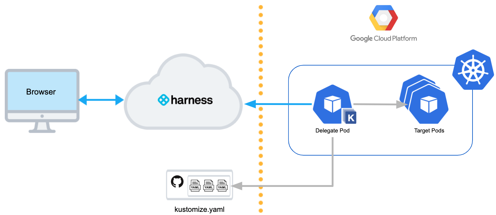

### Video

Here's a quick video showing you how to add Kustomize templates and Patches files in Harness. It covers other types like Helm Charts, also.

<!-- Video:
https://www.youtube.com/watch?v=dVk6-8tfwJc-->
<docvideo src="https://www.youtube.com/watch?v=dVk6-8tfwJc" />


## Review: Kustomize and Harness Delegates

All Harness Delegates include Kustomize by default. There is no installation required.

Your Delegate hosts, typically a pod in the target cluster, require outbound HTTPS/SSH connectivity to Harness and your Git repo.

The Delegate you use for Kustomize deployments must have access to the Git repo containing your Kustomize and resource files.The remainder of this topic assumes you have a running Harness Delegate and Cloud Provider Connector.

For details on setting those up, see:

* [Delegate Installation Overview](../../../first-gen/firstgen-platform/account/manage-delegates/delegate-installation-overview.md)
* [Define Your Kubernetes Target Infrastructure](../../cd-infrastructure/kubernetes-infra/define-your-kubernetes-target-infrastructure.md)

## Step 1: Add Manifests and Kustomization

Let's look at an example of connecting Harness to the repo containing the kustomization. We'll use a publicly available [helloword kustomization](https://github.com/wings-software/harness-docs/tree/main/kustomize/helloWorld) cloned from Kustomize.

All connections and operations are performed by Harness Delegates. You can add the Delegate separately or as part of adding the kustomization files.

In you Harness CD Pipeline, in a Deploy stage, click **Service**.

In **Service Definition**, in **Deployment Type**, click **Kubernetes**.

In **Manifests**, click **Add Manifest**.

**What about Artifacts?** In this example the kustomization uses a publicly-available NGINX Docker image from DockerHub, and the location of the image is hardcoded in the manifest. The **Artifacts** section is only used when the public artifact is not hardcoded in the manifest or the repo is private. In those cases, you add the image in **Artifacts** with a Connector for the repo and then reference the image in a Kustomize Patch file (`image: <+artifact.image>`). See [Option: Kustomize Patches](#option_kustomize_patches) below.

In **Specify Manifest Type**, click **Kustomize**, and click **Continue**.

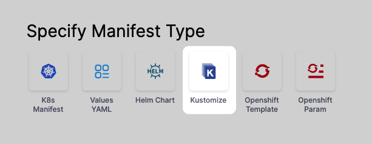

In **Specify Kustomize Store**, select your Git provider, such as **GitHub**.

If you already have a Git Connector that points to your Kustomization files, then select that. If not, click **New GitHub Connector**.

The **Git Connector** settings appear. Enter the settings described in [Connect to a Git Repo](../../../platform/7_Connectors/connect-to-code-repo.md).

Click **Continue**.

In **Manifest Details**, enter the following settings, test the connection, and click **Submit**. We are going to provide connection and path information for a kustomization located at `https://github.com/wings-software/harness-docs/blob/main/kustomize/helloWorld/kustomization.yaml`.
  * **Manifest Identifier:** enter **kustomize**.
  * **Git Fetch Type****:** select **Latest from Branch**.
  * **Branch:** enter **main**.
  * **Kustomize Folder Path:**`kustomize/helloWorld`. This is the path from the repo root.

The **Kustomize Plugin Path** is described below in [Option: Use Plugins in Deployments](#option_use_plugins_in_deployments).The kustomization is now listed.

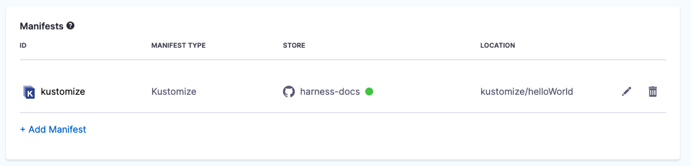

Click **Next** at the bottom of the **Service** tab.

Now that the kustomization is defined, you can define the target cluster for your deployment.

### Skip Versioning for Service

In Manifest Details, in Advanced, you can select **Skip Versioning for Service**.

By default, Harness versions ConfigMaps and Secrets are deployed into Kubernetes clusters. Harness uses a ConfigMap for release versioning.

In some cases, you might want to skip versioning.

When you enable **Skip Resource Versioning**, Harness will not perform versioning of ConfigMaps and Secrets for the deployment.

If you have enabled **Skip Resource Versioning** for a few deployments and then disable it, Harness will start versioning ConfigMaps and Secrets.

## Option: Optimize by Fetching a Subset of the Kustomize Files

When you specify a folder path for your Git repo in **Kustomize Folder Path** within **Manifest Details**, Harness fetches and downloads the complete repo. The amount of time it takes to fetch and download the files from your Git repo depends on the number of files present in your repo. A Git repo with hundreds or thousands of configuration files can take more time when Harness fetches those files.

Instead of fetching the entire Git repo, you can fetch a subset of the Kustomize manifests and configuration files. You can do this by specifying your Git repo folder path for **Kustomize Base Path** and the relative folder path for **Kustomize YAML Folder Path** in **Manifest Details**.

In **Manifest Details**, enter the following required settings:
  * **Manifest Name** enter the name for this manifest.
  * **Git Fetch Type****:** select **Latest from Branch**.
  * **Branch:** enter **main** or **master**.
  * **Kustomize Base Path:** When you select **Optimized Kustomize Manifest Collection**, this field changes from **Kustomize Folder Path** to **Kustomize Base Path**. Enter the folder path for your Git repo inside which all of the Kustomize dependencies and base manifests are present. Harness fetches and downloads this folder instead of the entire Git repo. The folder path shown in the dialog is an example.
  * **Kustomize YAML Folder Path**: enter the relative folder path for your Git repo where the kustomize.yaml file is located. The folder path shown in the dialog is an example.
    
    As an example, if kustomization.yaml is present in this path: **kustomize/multipleEnv/environments/production** and the **kustomize/multipleEnv** folder contains all of the kustomize dependencies, then the folder paths would be as follows:

    * **Kustomize Base Path**: kustomize/multipleEnv/
    * **Kustomize YAML Folder Path:** environments/production/


## Review: Artifact Sources and Kustomization

You can list artifacts in two ways:

* Artifacts can be hardcoded in the deployment YAML file deployed using your Kustomization files.
* You can add artifacts to the Service **Artifacts** section and reference them in Kustomize Patch files using the Harness variable `<+artifact.image>`. See [Option: Kustomize Patches](#option_kustomize_patches) below, and [Built-in Harness Variables Reference](../../../platform/12_Variables-and-Expressions/harness-variables.md).

## Option: Kustomize Patches

You cannot use Harness variables in the base manifest or kustomization.yaml. You can only use Harness variables in kustomize patches you add in **Kustomize Patches Manifest Details**.Kustomize patches override values in the base manifest. Harness supports the `patchesStrategicMerge` patches type.

For example, let's say you have a simple kustomization.yaml for your **application** folder like this:


```yaml
resources:  
  - namespace.yaml  
  - deployment.yaml  
  - service.yaml  
  - configmap.yaml
```
And you have an overlay for a production environment that points to the **application** folder like this:


```yaml
resources:  
  - ../../application  
namePrefix: nonpro-  
configMapGenerator:  
- name: example-config  
  namespace: default  
  #behavior: replace  
  files:  
    - configs/config.json  
patchesStrategicMerge:  
  - env.yaml
```
The `patchesStrategicMerge` label identifies the location of the patch **env.yaml**, which looks like this:


```yaml
apiVersion: apps/v1  
kind: Deployment  
metadata:  
  name: example-deploy  
spec:  
  template:  
    spec:  
      containers:  
      - name: example-app  
        env:  
        - name: ENVIRONMENT  
          value: Production
```
As you can see, it patches a new environment variable `name: ENVIRONMENT`.

Here's what the patching looks like side-by-side:

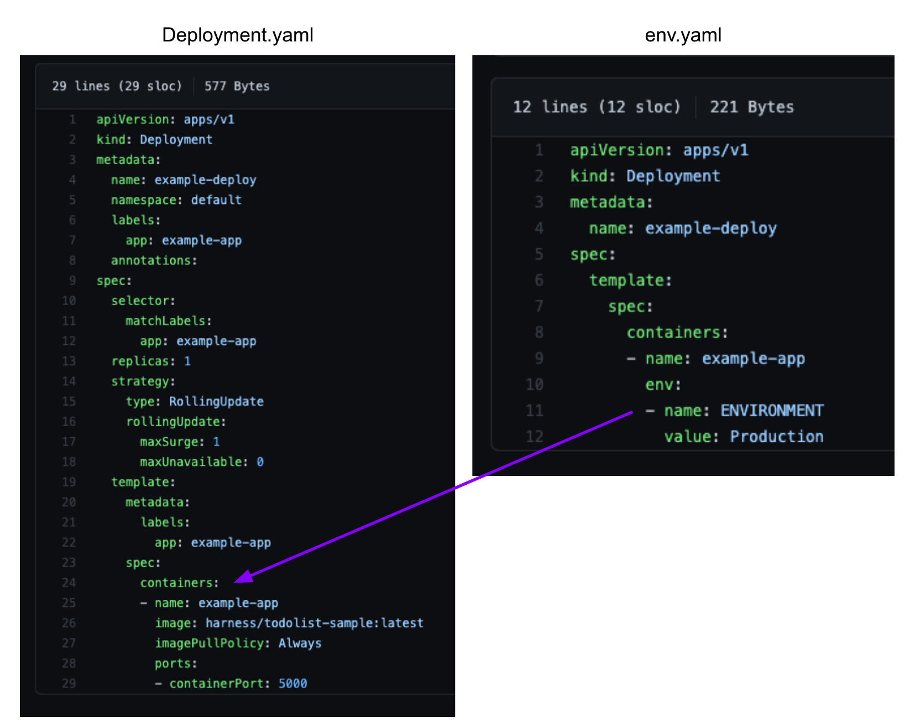

When the kustomization.yaml is deployed, the patch is rendered and the environment variable is added to the deployment.yaml that is deployed.

### Adding Kustomize Patches

You cannot use Harness variables in the base manifest or kustomization.yaml. You can only use Harness variables in kustomize patches you add in **Kustomize Patches Manifest Details**.In the Stage's **Service**, in **Manifests**, click **Add Manifest**.

In **Specify Manifest Type**, select **Kustomize Patches**, and click **Continue**.

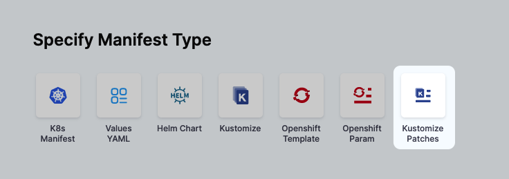

In **Specify Kustomize Patches Store**, select your Git provider and Connector. See [Connect to a Git Repo](../../../platform/7_Connectors/connect-to-code-repo.md).

The Git Connector should point to the Git account or repo where you Kustomize files are located. In **Kustomize Patches** you will specify the path to the actual patch files.

Click **Continue**.

In **Manifest Details**, enter the path to your patch file(s):
  * **Manifest Identifier:** enter a name that identifies the patch file(s). You don't have to add the actual filename.
  * **Git Fetch Type:** select whether to use the latest branch or a specific commit Id.
  * **Branch**/**Commit Id**: enter the branch or commit Id.
  * **File/Folder Path:** enter the path to the patch file(s) from the root of the repo. Click **Add File** to add each patch file. The files you add should be the same files listed in `patchesStrategicMerge` of the main kustomize file in your Service.

The order in which you add file paths for patches in **File/Folder Path** is the same order that Harness applies the patches during the kustomization build.Small patches that do one thing are recommended. For example, create one patch for increasing the deployment replica number and another patch for setting the memory limit.Click **Submit**. The patch file(s) is added to **Manifests**.

When the main kustomization.yaml is deployed, the patch is rendered and its overrides are added to the deployment.yaml that is deployed.

#### How Harness Uses patchesStrategicMerge

If the `patchesStrategicMerge` label is missing from the kustomization YAML file, but you have added Kustomize Patches to your Harness Service, Harness will add the Kustomize Patches you added in Harness to the `patchesStrategicMerge` in the kustomization file.

If you have hardcoded patches in `patchesStrategicMerge`, but not add these patches to Harness as Kustomize Patches, Harness will ignore them.

### Using Harness Variables in Patches

Kustomize does not natively support variable substitution but Harness supports variable substitution using [Harness variable expressions](../../../platform/12_Variables-and-Expressions/harness-variables.md) in Kustomize patches.

This allows you to configure any patch YAML labels as Harness variables expressions and replace those values at Pipeline runtime.

Let's look at an example.

Here is the deployment.yaml used by our kustomization:


```yaml
apiVersion: apps/v1  
kind: Deployment  
metadata:  
  name: example-deploy  
  namespace: default  
  labels:  
    app: example-app  
  annotations:  
spec:  
  selector:  
    matchLabels:  
      app: example-app  
  replicas: 1  
  strategy:  
    type: RollingUpdate  
    rollingUpdate:  
      maxSurge: 1  
      maxUnavailable: 0  
  template:  
    metadata:  
      labels:  
        app: example-app  
    spec:  
      containers:  
      - name: example-app  
        image: harness/todolist-sample:latest  
        imagePullPolicy: Always  
        ports:  
        - containerPort: 5000
```
You cannot use Harness variables in the base manifest or kustomization.yaml. You can only use Harness variables in kustomize patches you add in **Kustomize Patches Manifest Details**.You add the patch files that will patch deployment.yaml to **Kustomize Patches** **Manifest Details**. Only these patch files can use Harness variables.

We're going to use variables for `replicas` and `image`.

Let's look at the Harness variables in our Pipeline stage. Here are two Service-level variables:

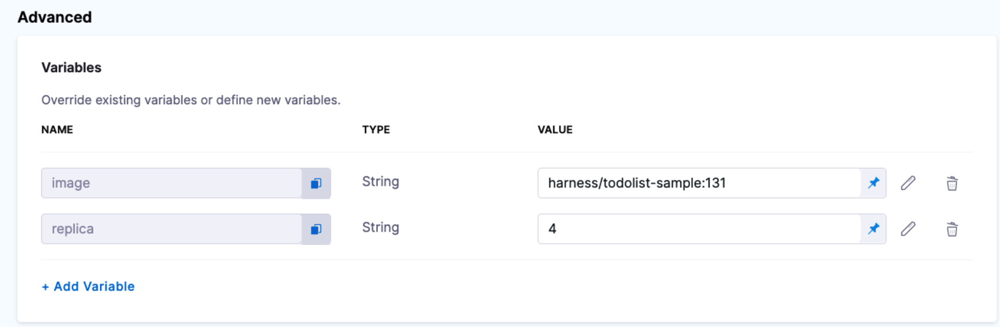

One variable is for the `image` and another for the `replicas` count.

A patch using these variables will look like this:


```yaml
apiVersion: apps/v1  
kind: Deployment  
metadata:  
 name: example-deploy  
 namespace: default  
spec:  
 template :  
   spec:  
     containers:  
       - name: example-app  
         image: <+serviceConfig.serviceDefinition.spec.variables.image>  
   
---  
apiVersion: apps/v1  
kind: Deployment  
metadata:  
 name: example-deploy  
 namespace: default  
spec:  
 replicas: <+serviceConfig.serviceDefinition.spec.variables.replica>
```
To get those variable references, you simply copy them:

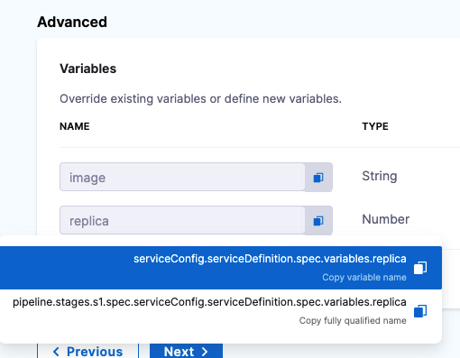

Add this patch in the Kustomize Patches **Manifest Details**:

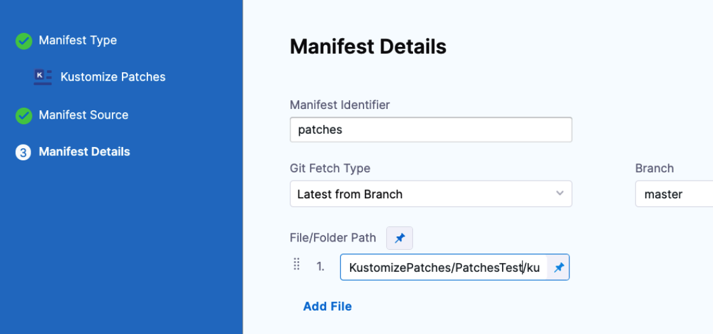

Now, when the Pipeline is run, the values for the two variables are rendered in the patch YAML and then the patch is applied to the deployment.yaml.

If you look at the Initialize phase of the deployment step (in Rolling, Canary, etc), you can see the variable values rendered in the Deployment manifest.

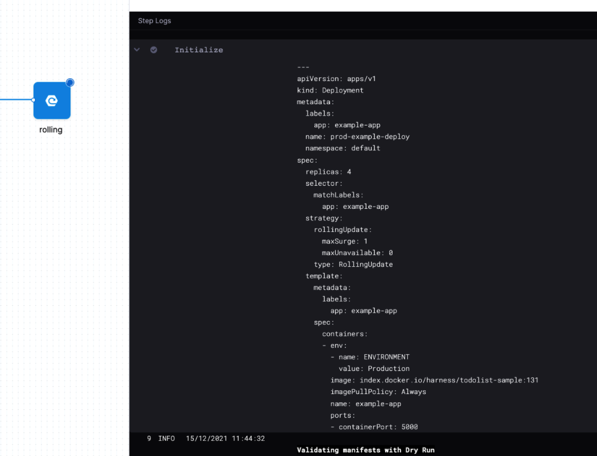

### Using Harness Secrets in Patches

You can also use Harness secrets in patches.

For example, let's say we have two secrets, one for `image` and one for `app`:

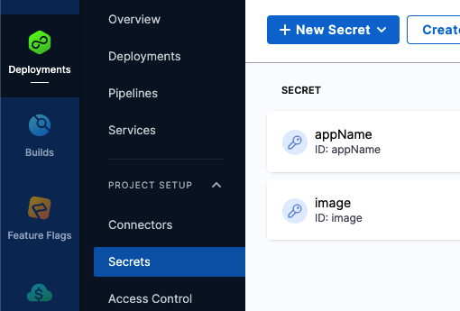

The following patch uses these secrets for `image` and `app`, referencing them using the expression `<+secrets.getValue("[secret name]")>`.


```yaml
apiVersion: apps/v1  
kind: Deployment  
metadata:  
  name: example-deploy  
  namespace: default  
spec:  
  template :  
    spec:  
      containers:  
        - name: example-app  
          image: <+secrets.getValue("image")>  
  
---  
apiVersion: v1  
kind: Service  
metadata:  
  name: example-service  
  namespace: default  
spec:  
  selector:  
    app: <+secrets.getValue("appName")>
```
The secret output in the manifest will be asterisks (\*). The secret value is not displayed.

See [Add Text Secrets](../../../platform/6_Security/2-add-use-text-secrets.md).

## Option: Overlays and Multibases

An overlay is a kustomization that depends on another kustomization, creating variants of the common base. In simple terms, overlays change pieces of the base kustomization.yaml. These are commonly used in patches.

A multibase is a type of overlay where copies of the base use the base but make additions, like adding a namespace.yaml. Basically, you are declaring that the overlays aren't just changing pieces of the base, but are new bases.

In both overlays and multibases, the most common example is staging and production variants that use a common base but make changes/additions for their environments. A staging overlay could add a configMap and a production overlay could have a higher replica count and persistent disk.

You can add overlay YAML files to the Service Manifests section just as you would add the standard kustomization.yaml.

Harness will look for the `resources` section of the overlay file to find the kustomization.yaml for the overlay and apply them both.


```yaml
resources:  
  - ../../application
```
In some cases you might want to deploy the standard kustomization.yaml in one stage and then the overlay in another. In this case, when you create the new stage, select **Propagate from**, select the standard kustomization.yaml stage, and then select **Stage Overrides**.

In **Manifests**, add the overlay kustomization.yaml and any patch files.

See [Propagate and Override CD Services](../../cd-services/cd-services-general/propagate-and-override-cd-services.md).

## Option: Use Plugins in Deployments

Kustomize offers a plugin framework to generate and/or transform a kubernetes resource as part of a kustomization.

You can add your plugins to the Harness Delegate(s) and then reference them in the Harness Service you are using for the kustomization.

When Harness deploys, it will apply the plugin you reference just like you would with the `--enable_alpha_plugins` parameter.

### Add Plugins to Delegate using INIT Script

To add a plugin to the Delegate, you can install it manually or use the `INIT_SCRIPT` environment variable in the Delegate config file to install it.

For steps on running scripts in Delegate config files, see [Run Scripts on Delegates](../../../platform/2_Delegates/delegate-guide/run-scripts-on-delegates.md).

Once the plugin is installed, you add its path to the Harness Service you are using for the kustomization. See [Path to Plugin in Service Manifest](#path_to_plugin_in_service_manifest).

For example, here is a ConfigMap generator plugin script:


```bash
MY_PLUGIN_DIR=$HOME/K_PLUGINS/kustomize/plugin/myDevOpsTeam/sillyconfigmapgenerator  
mkdir -p $MY_PLUGIN_DIR  
cat <<'EOF' >$MY_PLUGIN_DIR/SillyConfigMapGenerator  
#!/bin/bash  
# Skip the config file name argument.  
shift  
today=`date +%F`  
echo "  
kind: ConfigMap  
apiVersion: v1  
metadata:  
  name: the-map  
data:  
  today: $today  
  altGreeting: "$1"  
  enableRisky: "$2"  
"  
EOF  
cat $MY_PLUGIN_DIR/SillyConfigMapGenerator  
chmod +x $MY_PLUGIN_DIR/SillyConfigMapGenerator  
readlink -f $MY_PLUGIN_DIR/SillyConfigMapGenerator
```

Each plugin is added to its own directory, following this convention:

```bash
$XDG_CONFIG_HOME/kustomize/plugin  
    /${apiVersion}/LOWERCASE(${kind})
```
The default value of `XDG_CONFIG_HOME` is `$HOME/.config`. See [Extending Kustomize](https://kubectl.docs.kubernetes.io/guides/extending_kustomize/) from Kustomize.

In the script example above, you can see that the plugin is added to its own folder following the plugin convention:


```bash
$HOME/K_PLUGINS/kustomize/plugin/myDevOpsTeam/sillyconfigmapgenerator
```
Note the location of the plugin because you will use that location in the Harness Service to indicate where the plugin is located (described below).

Plugins can only be applied to Harness Kubernetes Delegates.#### Path to Plugin in Service Manifest

In the Harness Service that uses the Kustomization and plugin, in **Manifests**, select the existing Kustomize manifest or click **Add Manifest** and add a new as described in [Step 1: Add Manifests and Kustomization](#step_1_add_manifests_and_kustomization) above.

In **Manifest Details**, provide the path to the plugin on the Delegate host.

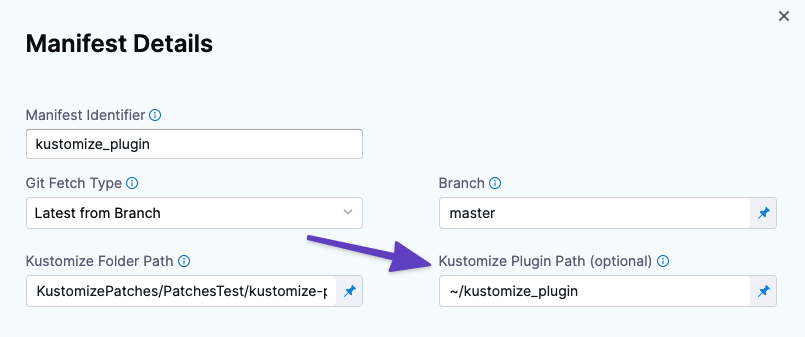

Click **Submit**. Harness is now configured to use the plugin when it deploys using Kustomize.

### Delegate Selection

You might have multiple Delegates installed in your infrastructure, so you have to make certain that Harness uses the Delegate with the plugin installed.

Each **Execution** step has a **Delegate Selector** setting where you can select the Delegate used by that the step.

For example, if your stage Execution has **Canary**, **Canary Delete**, and **Rolling** steps, open each step, select **Advanced**, and then select the **Delegate Selector** for the Delegate that has the plugin installed.

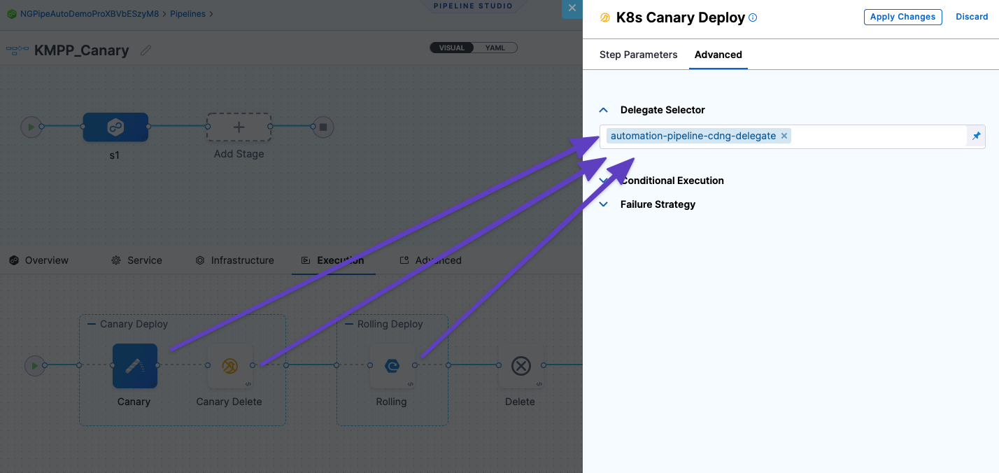

The Delegate Selector setting lists the Delegate Tags for all Delegates. You can see these Tags by looking at the Delegate details:

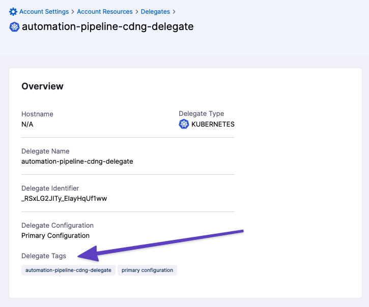

Now the Delegate with the plugin installed is used for the Pipeline steps, and the plugin is located using the path you provided in **Manifests**.

## Kustomize deployment with the Apply step

You can use the Apply step in your Kustomize deployments.

When you use Kustomize, the **File Path** in the Apply Step should be set according to the following conditions.

* **Default:** Apply step **File Path** is the path from the root of the repo to the folder with the kustomization YAML file is located. This is the same as the Kustomize Folder Path setting in the **Manifest Details**.

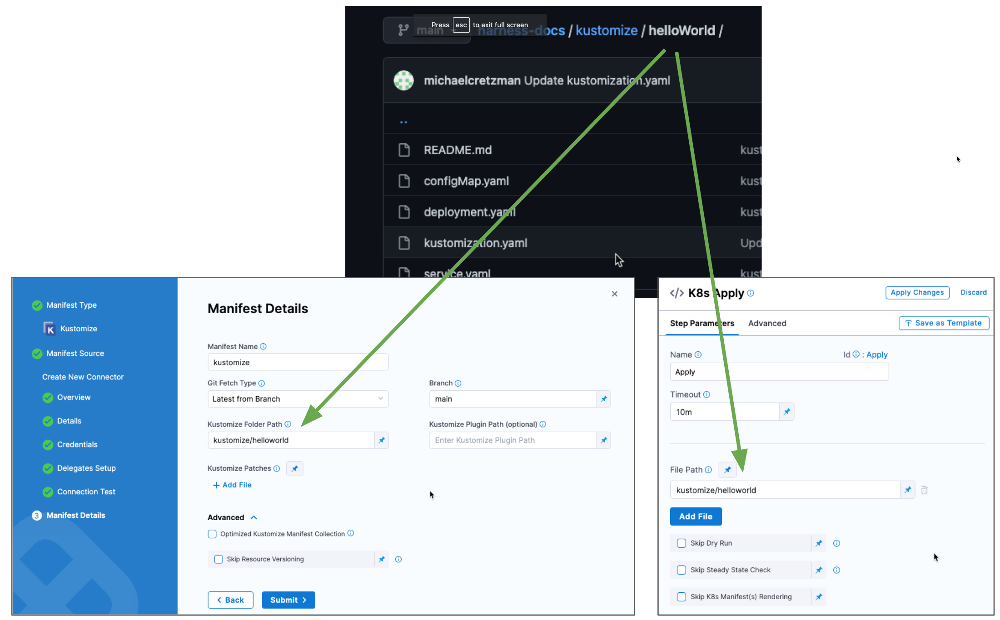* **Optimized Kustomize Manifest Collection:** When the **Optimized Kustomize Manifest Collection** option is enabled in **Manifest Details**, the Apply step **File Path** must be the same path as **Kustomize YAML Folder Path**.

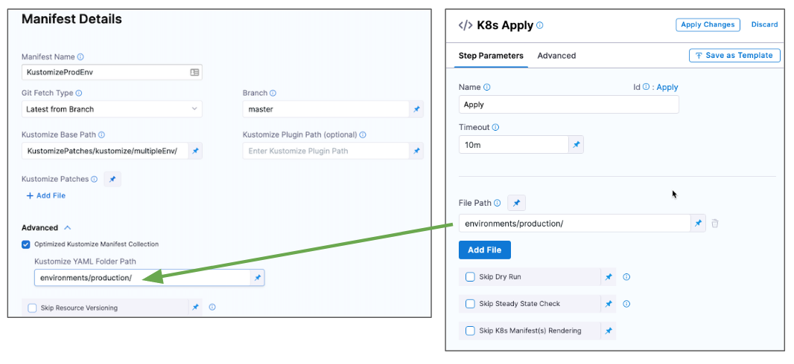

## Change the Default Path for the Kustomize Binary

The Harness Delegate ships with the 3.5.4 [release](https://github.com/kubernetes-sigs/kustomize/releases) of Kustomize.

If you want to use a different release of Kustomize, add it to a location on the Delegate, update the following Delegate files, and restart the Delegate.

### Kubernetes Delegate

Update the `value` environment variable in harness-delegate.yaml:


```yaml
...  
name: KUSTOMIZE_PATH  
value: "<path>"  
...
```
See [Install a Kubernetes Delegate](../../../platform/2_Delegates/delegate-guide/install-a-kubernetes-delegate.md).

### Docker Delegate

Add the Kustomize path environment variable in the Delegate Docker compose file:


```yaml
- KUSTOMIZE_PATH=<path>
```
See [Install the Docker Delegate](../../../platform/2_Delegates/delegate-install-docker/install-a-docker-delegate.md).

## Next Steps

* [Create a Kubernetes Rolling Deployment](../../cd-execution/kubernetes-executions/create-a-kubernetes-rolling-deployment.md)
* [Create a Kubernetes Canary Deployment](../../cd-execution/kubernetes-executions/create-a-kubernetes-canary-deployment.md)
* [Create a Kubernetes Blue Green Deployment](../../cd-execution/kubernetes-executions/create-a-kubernetes-blue-green-deployment.md)

