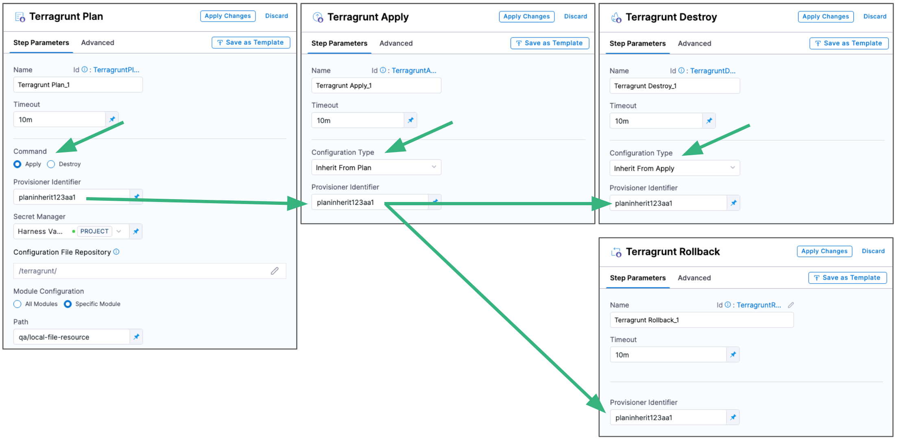

This topic describes how to run a Terragrunt plan or apply using the Terragrunt Apply step.

Typically, you run the [Terragrunt Plan](terragrunt-plan.md) step to preview your Terragrunt provisioning. Next, you add a Terragrunt Apply step to implement the plan. For more details, go to [Using Terragrunt steps together](#using-terragrunt-steps-together).

## Important: Install Terraform and Terragrunt on delegates

Terraform and Terragrunt must be installed on the Harness delegates used for deployment. You can install Terraform and Terragrunt manually or use the `INIT_SCRIPT` environment variable in the Delegate YAML.

For steps on using the `INIT_SCRIPT` environment variable, go to [Install software on the delegate with initialization scripts](https://developer.harness.io/docs/platform/Delegates/configure-delegates/run-scripts-on-delegates).

Here's an example of the installation script to install Terraform and Terragrunt:

```bash
## Terraform installation
set +x  
apt-get update  
apt-get install wget  
apt-get -y install git  
wget https://releases.hashicorp.com/terraform/0.13.3/terraform_0.13.3_linux_amd64.zip apt-get install unzip  
unzip terraform_0.13.3_linux_amd64.zip  
cp terraform /usr/bin/  
terraform --version  

## Terragrunt installation
wget https://github.com/gruntwork-io/terragrunt/releases/download/v0.28.0/terragrunt_linux_amd64  
mv terragrunt_linux_amd64 terragrunt  
chmod u+x terragrunt  
mv terragrunt /usr/local/bin/terragrunt  
terragrunt --version
```

## Using Terragrunt steps together

The Terragrunt steps can be used independently or you can connect them by using the same **Provisioner Identifier** in all of the steps.

Here's a common way to use all the steps together:

1. Terragrunt Plan step:
   1. Add the Terragrunt Plan step and define the Terragrunt script for it to use.
   2. Select **Apply** in **Command**. 
   3. Enter a **Provisioner Identifier**.
2. Terragrunt Apply step:
   1. Select **Inherit from Plan** in **Configuration Type**.
   2. Reference the Terragrunt Plan step using the same **Provisioner Identifier**.
3. Terragrunt Destroy step:
   1. Select **Inherit from Apply** or **Inherit from Plan** in **Configuration Type**.
   1. Reference the Terragrunt Apply or Plan step using the same **Provisioner Identifier**.
4. Terragrunt Rollback step:
   1. Reference the Terragrunt Apply or Plan step using the same **Provisioner Identifier**.

<!--  -->

<docimage path={require('./static/2161eed44e5b1ef3369542d40747af39160c7a25b71f03f160ce1e29329c6bab.png')} />


## Add a Terragrunt Apply step

You can add Terragrunt steps anywhere in your CD stage's **Execution**. The most common order is `Terragrunt Plan -> Terragrunt Apply -> Terragrunt Destroy`. 

:::note

You add the [Terragrunt Rollback](terragrunt-rollback.md) step in the stage **Rollback** section.

:::

To add a Terragrunt Apply step, do the following:

1. In your CD stage Execution, click **Add Step**, and then click **Terragrunt Apply**.
2. Enter the following Terragrunt Apply settings.

### Name

1. In **Name**, enter a name for the step. Use a name that describes the infrastructure the step plans to provision.

### Timeout

```mdx-code-block
import TimeoutSetting from '/docs/continuous-delivery/shared/timeout-setting.md';
```

<TimeoutSetting />

Provisioning can be time-consuming. Use at least `5m`.

### Configuration Type

This setting determines whether you want to apply a Terragrunt plan from a previous Terragrunt Plan step or run a separate Terragrunt script.

There are two options:

- Inline.
- Inherit From Plan.


:::info

  Terragrunt Apply and Destroy steps do not support inheriting from a Terragrunt Plan step with **All Modules** selected in **Module Configuration**.

:::

### Provisioner Identifier

You use the **Provisioner Identifier** in subsequent steps to refer to the plan run in this step.

1. Enter a unique value in Provisioner Identifier.

The most common use of **Provisioner Identifier** is between the Terragrunt Plan and Terragrunt Apply or Terragrunt Destroy steps. 

For the Terragrunt Apply step to apply the plan from the Terragrunt Plan step, it uses the same **Provisioner Identifier**.

For the Terragrunt Destroy step to destroy the plan from the Terragrunt Plan step, it uses the same **Provisioner Identifier**.

Here's an example of how the **Provisioner Identifier** is used across steps:

<!--  -->

<docimage path={require('./static/2161eed44e5b1ef3369542d40747af39160c7a25b71f03f160ce1e29329c6bab.png')} />

#### Provisioner Identifier Scope

The **Provisioner Identifier** is a project-wide setting. You can reference it across pipelines in the same project.

For this reason, it's important that all your project members know the provisioner identifiers. Sharing this information will prevent one member building a pipeline from accidentally impacting the provisioning of another member's pipeline.

### Secret Manager

1. Select a Harness [secrets manager](https://developer.harness.io/docs/platform/Security/harness-secret-manager-overview) to use for encrypting/decrypting and saving the Terragrunt plan file.

A Terragrunt plan is a sensitive file that could be misused to alter resources if someone has access to it. Harness avoids this issue by never passing the Terragrunt plan file as plain text.

Harness only passes the Terragrunt plan between the Harness Manager and delegate as an encrypted file using a secrets manager.

When the `terragrunt plan` command runs on the Harness delegate, the delegate encrypts the plan and saves it to the secrets manager you selected. The encrypted data is passed to the Harness Manager.

When the plan is applied, the Harness manager passes the encrypted data to the delegate.

The delegate decrypts the encrypted plan and runs it.

### Configuration File Repository

**Configuration File Repository** is where the Terragrunt script and files you want to use are located.

Here, you'll add a connection to the Terragrunt script repo.

1. Click **Specify Config File** or click the edit icon. The **Terragrunt Config File Store** settings appear.
2. Click the provider where your files are hosted.
    
    
3. Select or create a [Git connector](https://developer.harness.io/docs/platform/Connectors/connect-to-code-repo) for your repo.
4. Once you have selected a connector, click **Continue**.
   
   In **Config File Details**, provide the Git repo details.
5. In **Git Fetch Type**, select **Latest from Branch** or **Specific Commit Id**.
   
   When you run the Pipeline, Harness will fetch the script from the repo.
   
   **Specific Commit Id** also supports Git tags. If you think the script might change often, you might want to use **Specific Commit Id**. For example, if you are going to be fetching the script multiple times in your pipeline, Harness will fetch the script each time. If you select **Latest from Branch** and the branch changes between fetches, different scripts are run.
6. In **Branch**, enter the name of the branch to use.
7. In **File Path**, enter the path from the root of the repo to the file containing the script.
8. Click **Submit**.

Your Terragrunt Plan step is now ready. 

You can now configure a Terragrunt [Apply](terragrunt-apply.md), [Destroy](terragrunt-destroy.md), or [Rollback](terragrunt-rollback.md) step to use the Terragrunt script from this Terragrunt Plan step.

The following sections cover common Terragrunt Plan step options.

### Module Configuration

Use this setting to specify the Terraform modules you want Terragrunt to use.

In **Module Configuration**, you are telling Harness where to locate your terragrunt.hcl file. The terragrunt.hcl itself will point to a Terraform module using the source parameter like this:

```
locals {  
}  
  
terraform {  
//  source = "git::git@github.com:Tathagat-289/terraformResources.git//module3"  
  source = "github.com/Tathagat-289/terraformResources//module3"  
}  
  
# Include all settings from the root terragrunt.hcl file  
include {  
  path = find_in_parent_folders()  
}  
  
inputs = {  
  tfmodule3 = "tfmodule4"  
  slmodule3 = "sleepmodule4"  
  tfv = "tfversion1"  
  sl = "sl1"  
}
```

You have two options:

- **All Modules**. Harness will use all of the terragrunt.hcl files starting from the *folder* you specify in **Path**.
  
  If you select **All Modules**, you might want to use **Backend Configuration** to store your state file. Harness will not sync with the current state when **All Modules** is selected. Instead, Harness simply applies the terragrunt.hcl files.

  :::info
  
   - When **All Modules** is selected, the **Export JSON representation of Terragrunt Plan** option is not supported.
   - Terragrunt Apply and Destroy steps do not support inheriting from a Terragrunt Plan step with **All Modules** selected.
  
  :::
- **Specific Module**. Harness will use a single terragrunt.hcl file in the folder you specify in **Path**.

The **Path** setting supports [fixed values, runtime inputs, and expressions](https://developer.harness.io/docs/platform/references/runtime-inputs/).


### Workspace

Harness supports Terraform workspaces. A Terraform workspace is a logical representation of one your infrastructures, such as Dev, QA, Stage, Production.

Workspaces are useful when testing changes before moving to a production infrastructure. To test the changes, you create separate workspaces for Dev and Production.

A workspace is really a different state file. Each workspace isolates its state from other workspaces. For more information, see [When to use Multiple Workspaces](https://www.terraform.io/docs/state/workspaces.html#when-to-use-multiple-workspaces) from Hashicorp.

Here is an example script where a local value names two workspaces, default and production, and associates different instance counts with each:

```
locals {  
  counts = {  
      "default"=1  
      "production"=3  
  }  
}  
  
resource "aws_instance" "my_service" {  
  ami="ami-7b4d7900"  
  instance_type="t2.micro"  
  count="${lookup(local.counts, terraform.workspace, 2)}"  
  tags {  
         Name = "${terraform.workspace}"  
    }  
}
```

In the workspace interpolation sequence you can see the count is assigned by applying it to the workspace variable (`terraform.workspace`) and that the tag is applied using the variable also.

1. In **Workspace**, enter the name of the workspace to use.

Harness will pass the workspace name you provide to the `terraform.workspace` variable, thus determining the count. Using the example above, if you provide the name `production`, the count will be 3.

You can also set **Workspace** as a [runtime inputs or expression](https://developer.harness.io/docs/platform/references/runtime-inputs/) and use a different workspace name each time the pipeline is run.

### Terraform Var Files

1. In **Terraform Var Files**, provide values for the Terraform input variables in the Terraform module (config.tf) that your Terragrunt config file uses.

For example, here's a Terraform config.tf file with variables for access and secret key:

```
variable "access_key" {}  
  
variable "secret_key" {}  
  
provider "aws" {  
  access_key = var.access_key  
  secret_key = var.secret_key  
  region = "us-east-1"  
}  
...
```

You provide values for these variables in **Terraform Var Files**.

You can use inline or remote tfvar settings.

If you use inline, you can simply paste in the input variables, like this:

```
count_of_null_resources = "7"
file_message = "testing tvar"
```

You can Harness [variable](https://developer.harness.io/docs/platform/Variables-and-Expressions/harness-variables) and [secret](https://developer.harness.io/docs/first-gen/firstgen-platform/security/secrets-management/use-encrypted-text-secrets) expressions in the inputs also.


### Backend Configuration

Depending on which platform you store your remote state data, Terragrunt and Terraform allow you to pass many different credentials and configuration settings, such as access and secret keys. 

For example:

```
resource_group_name  = "tfResourceGroup"
storage_account_name = "myterraformremoteback"
container_name       = "azure-backend"
```

For example, see the settings available for [AWS S3](https://www.terraform.io/docs/backends/types/s3.html#configuration) from Terraform and review [Keep your remote state configuration DRY](https://terragrunt.gruntwork.io/docs/features/keep-your-remote-state-configuration-dry/) from Terragrunt.

1. In **Backend Configuration**, enter values for each backend config (remote state variable) in the Terragrunt config (.hcl) or Terraform script (config.tf) file.

### Targets

1. In **Target**, target one or more specific modules in your Terraform script, just like using the `terraform plan -target` command. See [Resource Targeting](https://www.terraform.io/docs/commands/plan.html#resource-targeting) from Terraform.

If you have multiple modules in your script and you do not select one in **Targets**, all modules are used.

You can also use [runtime inputs or expressions](https://developer.harness.io/docs/platform/references/runtime-inputs/) for your targets. 

For example, you can create a stage variable named `module` and then enter the variable `<+stage.variables.module>` in **Targets**. 

### Environment Variables

In **Environment Variables**, you can reference additional environment variables in the Terraform script ultimately used by the Terragrunt plan. These are in addition to any variables already in the script.

1. Click **Add** and enter a name and value for the environment variable.
    
    For example, the name `TF_LOG` and the value `TRACE`, or the name `ARM_CLIENT_ID` and the value `<+secrets.getValue("account.tg_azure_client_id")>`.

You can use Harness variables and secrets for the name and value.

Environment variables can also be deleted using the Terragrunt [Destroy](terragrunt-destroy.md) step.

### Export JSON representation of Terragrunt Plan

:::info

When **All Modules** is selected in **Module Configuration**, the **Export JSON representation of Terragrunt Plan** option is not supported.

:::

Enable this setting to use a JSON representation of the plan that is implemented in this Terragrunt Plan step.

In subsequent Execution steps, such as a Shell Script step, you can reference the plan using this expression format:

```
<+execution.steps.[Terragrunt Plan step Id].plan.jsonFilePath>
```

For example, if you had a Terragrunt Plan step with the Id `Plan_Step`, you could use the expression in a Shell Script step like this:

```
cat "<+execution.steps.Plan_Step.plan.jsonFilePath>"
```


#### Scope of Expression

**Export JSON representation of the Terragrunt Plan** is available only between the Terragrunt Plan step and subsequent Terragrunt Apply step. The expression will fail to resolve if used after the Terragrunt Apply step.

If used across stages, the Terragrunt Plan step can be used in one stage and the Terragrunt Apply step can be used in a subsequent stage. The expression will resolve successfully in this case.

The JSON of the Terragrunt Plan step is not available after Rollback.