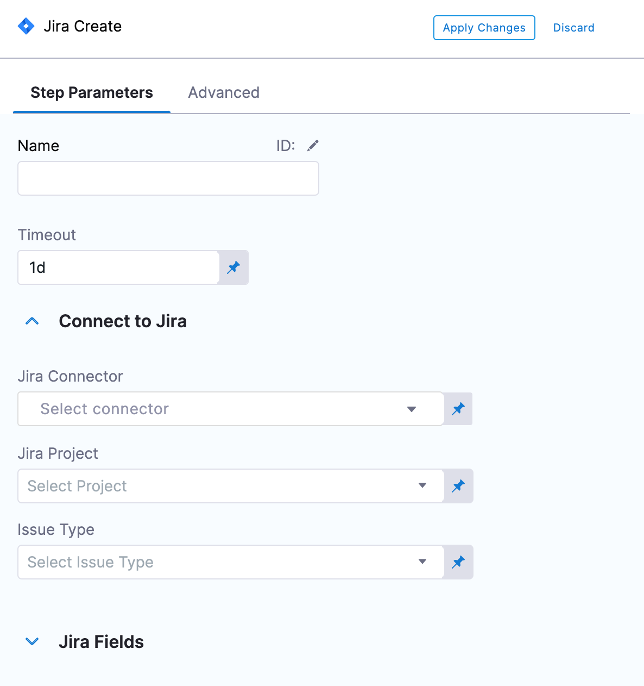
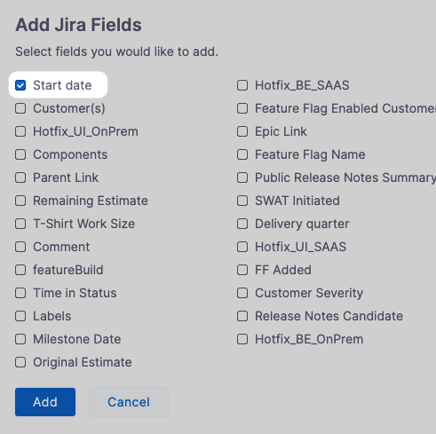
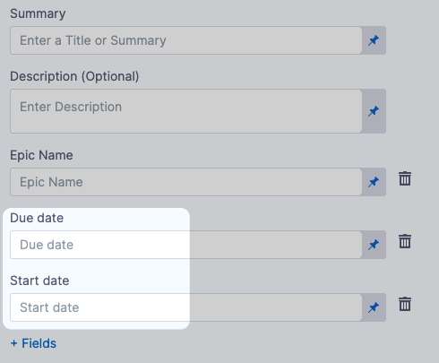
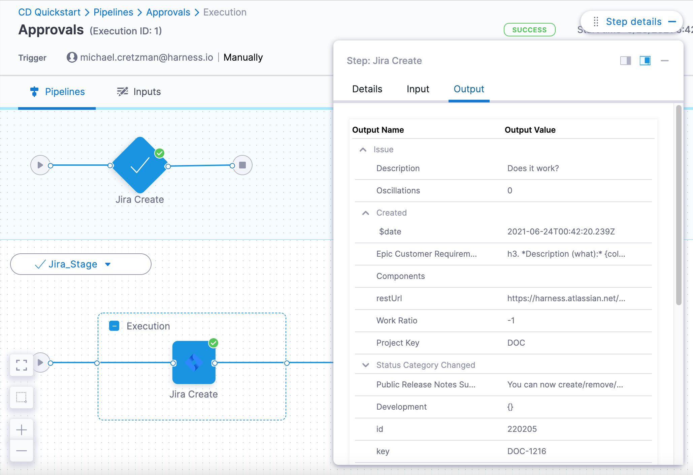
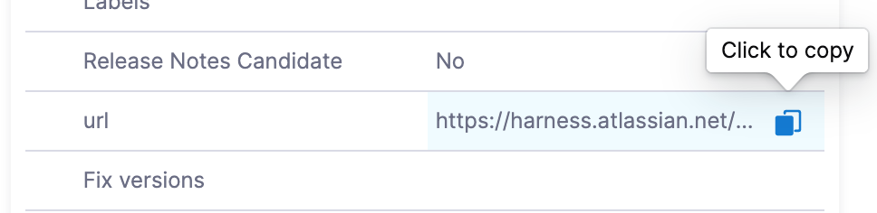

You can create a Jira issue as a step in the execution of a Pipeline using the Create Jira step.

You can add the Create Jira step to a Harness CD stage or an Approval stage.

You can also [update Jira Issues](update-jira-issues-in-cd-stages.md) and [add Jira Approval stages and steps](../../../platform/9_Approvals/adding-jira-approval-stages.md).

## Before You Begin

* [Connect to Jira](../../../platform/7_Connectors/connect-to-jira.md): you can add a Harness Jira Connector before or during the Create Jira step setup.

## Visual Summary

The following video shows you how to use the Jira Create, Jira Update, and Jira Approval steps:

## Limitations

While it's not a strict limitation, some users can forget that when you use a Jira Create step it creates a new, independent Jira issue every time it is run (as opposed to [updating](update-jira-issues-in-cd-stages.md) the same issue).

It is important to remember that you should only add Jira Create to a stage if you want to create a new Jira issue on every run of the stage.

## Step 1: Add a Jira Create Step

In a Harness CD or Approval stage, in **Execution**, click **Add Step**.

Click **Jira Create**. The Jira Create step appears.

In **Name**, enter a name that describes the step.

In **Timeout**, enter how long you want Harness to try to create the issue before failing (and initiating the stage or step [Failure Strategy](../../../platform/8_Pipelines/define-a-failure-strategy-on-stages-and-steps.md)).

In **Jira Connector**, create or select the [Jira Connector](../../../platform/7_Connectors/connect-to-jira.md) to use.

In **Project**, select a Jira project from the list. A Jira project is used to create the issue key and ID when the issue is created. The unique issue number is created automatically by Jira.

In **Issue Type**, select a Jira issue type from the list of types in the Jira project you selected.

## Step 2: Add Issue Fields

In Jira Fields, you can select specific fields within a Jira issue. For more information, see [Jira Custom Fields](../../../first-gen/continuous-delivery/model-cd-pipeline/workflows/jira-integration.md#jira-custom-fields).

Harness supports only Jira fields of type `Option`, `Array`, `Any`, `Number`, `Date`, and `String`. Harness does not integrate with Jira fields that manage users, issue links, or attachments. This means that Jira fields like Assignee and Sprint are not accessible in Harness' Jira integration.

## Review: Jira Date Field Support

Among the custom fields Harness supports are Baseline End Date and Start Date Time. If your Jira project uses these fields, they are available in Fields:

Once you have selected these fields their settings appear.

You can also use advanced dates using Harness expressions and the `current()` function. For example:

* `<+currentDate().plusDays(2).plusMonths(1)>`: current date plus one month and two days.
* `<+currentTime()>`: for current date time fields.

Harness supports the following functions.

For date-only fields:

 `currentDate().plusYears(1).plusMonths(1).plusWeeks(1).plusDays(1)`

For date and time fields:

`currentTime().plusYears(1).plusMonths(1).plusWeeks(1).plusDays(1).plusHours(1).plusMinutes(1).plusSeconds(1).plusNanos(1)`

The number 1 is used as an example. You can add whatever number you need.

## Option: Advanced Settings

In Advanced, you can use the following options:

* [Step Skip Condition Settings](../../../platform/8_Pipelines/w_pipeline-steps-reference/step-skip-condition-settings.md)
* [Step Failure Strategy Settings](../../../platform/8_Pipelines/w_pipeline-steps-reference/step-failure-strategy-settings.md)

## Step 3: Apply and Test

Click **Apply Changes**. The Jira Create step is added to the stage.

Run the Pipeline.

In the Pipeline execution view, click the **Jira Create** step, and then click the **Output** tab.

You can see all of the fields for the new Jira issue you created.

Locate **URL** and copy its value.

In a new browser tab, paste the URL and press Enter.

The new issue appears in Jira.

## See Also

* [Update Jira Issues in CD Stages](update-jira-issues-in-cd-stages.md)

