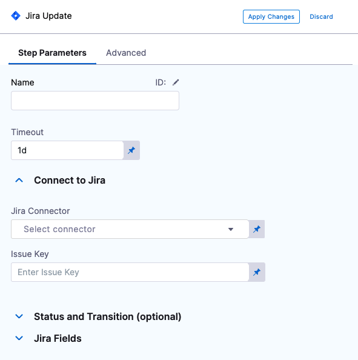
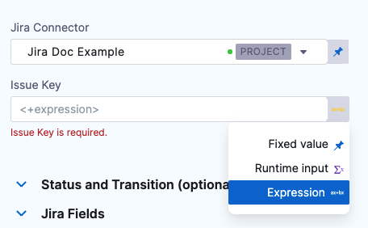
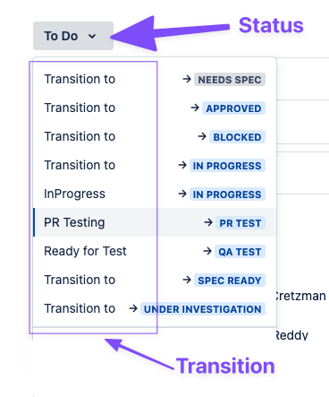
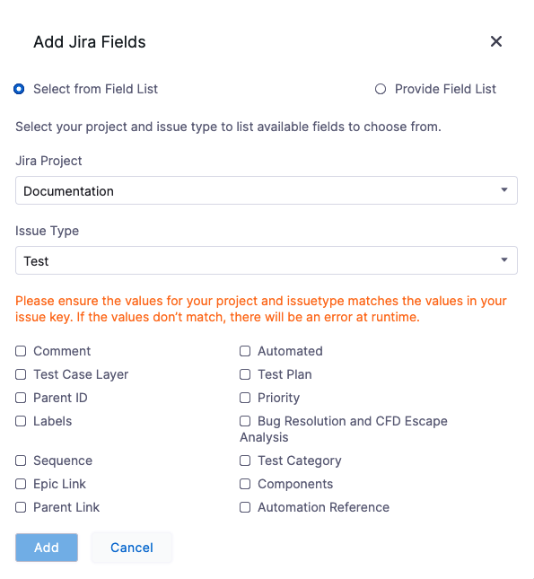
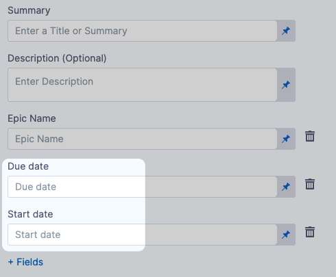

This topic describes how to update a Jira issue using the Update Jira step.

You can add the Update Jira step to a Harness CD stage or an Approval stage.

You can also [create Jira Issues](create-jira-issues-in-cd-stages.md) and add [Jira Approval stages and steps](../../../platform/9_Approvals/adding-jira-approval-stages.md).

## Before You Begin

* [Connect to Jira](../../../platform/7_Connectors/connect-to-jira.md)
* [Adding Jira Approval Stages and Steps](../../../platform/9_Approvals/adding-jira-approval-stages.md)

## Visual Summary

The following video shows you how to use the Jira Create, Jira Update, and Jira Approval steps:

## Limitations

* Harness supports only Jira fields of type `Option`, `Array`, `Any`, `Number`, `Date`, and `String`. Harness does not integrate with Jira fields that manage users, issue links, or attachments. This means that Jira fields like Assignee and Sprint are not accessible in Harness' Jira integration.

## Step 1: Add a Jira Update Step

In a Harness CD or Approval stage, in **Execution**, click **Add Step**.

Click **Jira Update**. The Jira Update step appears.

In **Name**, enter a name that describes the step.

In **Timeout**, enter how long you want Harness to try to update the issue before failing (and initiating the stage or step [Failure Strategy](../../../platform/8_Pipelines/define-a-failure-strategy-on-stages-and-steps.md)).

In **Jira Connector**, create or select the [Jira Connector](../../../platform/7_Connectors/connect-to-jira.md) to use.

In **Project**, select the Jira project that contains the issue you want to update.

In **Issue Key**, enter the Jira issue key of the issue you want to update.

## Option: Use an Expression in Issue Key

In **Issue Key**, you can use an expression to reference the Key ID from another Jira Create or Jira Update step.

The Jira Create or Jira Update step you want to reference must be before the Jira Update step that references it in the stage.

First, identify the step where you want to get the ID from. In this example, we'll use a Jira Create step.

You'll have to close the Jira Update step to get the the ID from the previous step. An ID is required, so you can just enter any number for now and click **Save**.In the Pipeline, click **Execution History**.

Select a successful execution, and click the Jira Create step in the execution.

Click the **Output** tab, locate the **Key** setting, and click the copy button.

The expression will look something like this:

`<+pipeline.stages.Jira_Stage.spec.execution.steps.jiraCreate.issue.key>`

Now you have the expression that references the key ID from this step.

Go back to your Jira Update step. You can just select **Edit Pipeline**.

In **Issue Key**, select **Expression**.

**Issue Key**, paste in the expression you copied from the previous Jira Create step.

Now this Jira Update step will update the issue created by the Jira Create step.

Some users can forget that when you use a Jira Create step it creates a new, independent Jira issue every time it is run. If you are using the same issue ID in Jira Update, you are updating a new issue every run.### Option: Status and Transition

In **Status**, enter the status type (Issue Action) to update the issue with (In Progress, Done, etc). Harness will automatically update the issue with this status.

In **Transition Name**, enter the name of the transition to move the issues into (for example, `Transition to`, `PR Testing`, `Ready for Test`).

If the issue is not part of a Jira workflow and does not have transition options, then the step will fail.See [Statuses and transitions](https://support.atlassian.com/jira-cloud-administration/docs/work-with-issue-workflows/#Workingwithworkflows-steps) from Atlasssian.

## Step 2: Add Issue Fields

In Jira Fields, you can select specific fields to update within a Jira issue. For more information, see [Jira Custom Fields](../../../first-gen/continuous-delivery/model-cd-pipeline/workflows/jira-integration.md#jira-custom-fields).

Harness supports only Jira fields of type `Option`, `Array`, `Any`, `Number`, `Date`, and `String`. Harness does not integrate with Jira fields that manage users, issue links, or attachments. This means that Jira fields like Assignee and Sprint are not accessible in Harness' Jira integration.### Review: Jira Date Field Support

Among the custom fields Harness supports are Baseline End Date and Start Date Time. If your Jira project uses these fields, they are available in Fields:

Once you have selected these fields their settings appear.

You can also use advanced dates using stage variables and the `current()` function. For example:

* `<+currentDate().plusDays(2).plusMonths(1)>`: current date plus one month and two days.
* `<+currentTime()>`: for current date time fields.

Harness supports the following functions.

For date-only fields:

 `currentDate().plusYears(1).plusMonths(1).plusWeeks(1).plusDays(1)`

For date and time fields:

`currentTime().plusYears(1).plusMonths(1).plusWeeks(1).plusDays(1).plusHours(1).plusMinutes(1).plusSeconds(1).plusNanos(1)`

The number 1 is used as an example. You can add whatever number you need.

## Option: Advanced Settings

In Advanced, you can use the following options:

* [Step Skip Condition Settings](../../../platform/8_Pipelines/w_pipeline-steps-reference/step-skip-condition-settings.md)
* [Step Failure Strategy Settings](../../../platform/8_Pipelines/w_pipeline-steps-reference/step-failure-strategy-settings.md)

## Step 3: Apply and Test

Click **Apply Changes**. The Jira Update step is added to the stage.

Run the Pipeline.

In the Pipeline execution view, click the **Jira Update** step, and then click the **Output** tab.

You can see all of the fields for the new Jira issue you created.

Locate **URL** and copy its value.

In a new browser tab, paste the URL and press Enter.

The updated issue appears in Jira.

## See Also

* [Create Jira Issues in CD Stages](create-jira-issues-in-cd-stages.md)
* [Adding Jira Approval Stages and Steps](../../../platform/9_Approvals/adding-jira-approval-stages.md)

