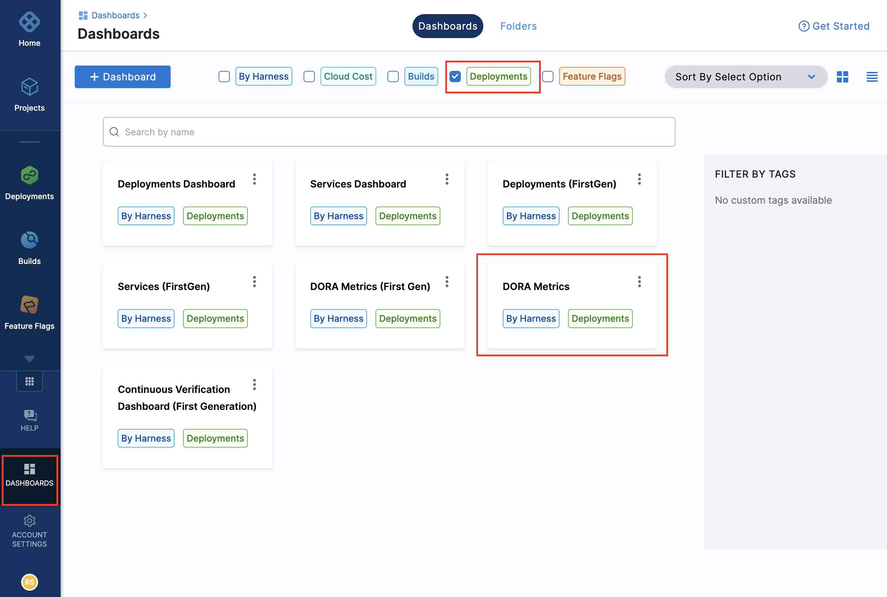

You can view DevOps Research and Assessment (DORA) metrics using **Dashboards** **> DORA Metrics** on the Harness platform. DORA metrics are key for understanding the performance of software development teams. By understanding these metrics, you’re empowered to iterate and make improvements for your business. 

## Available DORA metrics

Using the DORA metrics dashboard, you can view these metrics: 

* Deployments Frequency
* Mean Time to Restore (MTTR)
* Change Failure Rate

For each of these metrics you can choose to visualize the data by:

* Today
* Yesterday
* Last 7 days
* Last 14 days
* Last 28 days
* Last 30 days
* Last 90 days
* Last 180 days
* Last 365 days
* Year to date
* This week
* This month
* This quarter
* This year
* Previous week
* Previous month
* Previous quarter
* Previous Year
* Custom

You can filter these metrics by: 

* Date
* Projeect ID
* Service name

## How to view DORA metrics

To view the DORA metrics dashborad:

1. Go to the Harness platform.
2. On the left navigation, select **Dashboard**, then select the **Harness** and **Deployments** filters.
3. Select the **DORA Metrics** tile.

   

