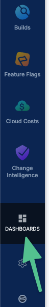
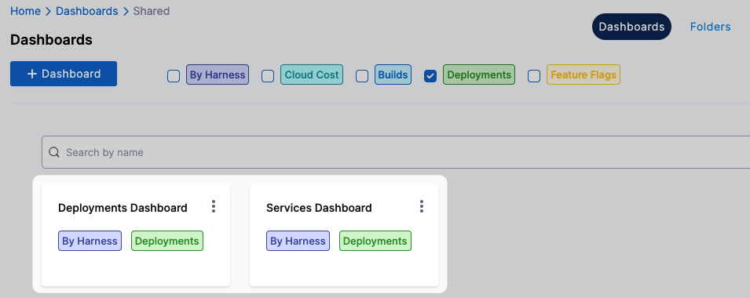
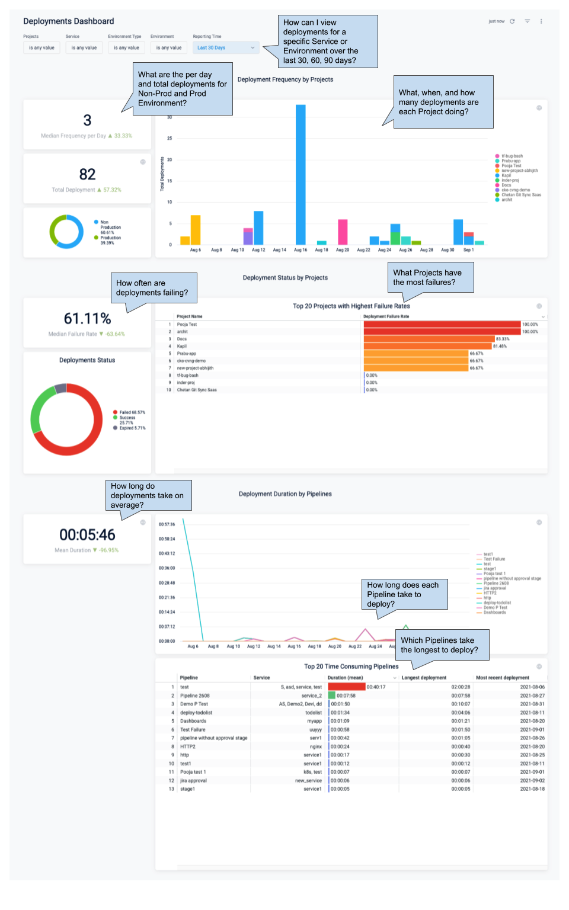
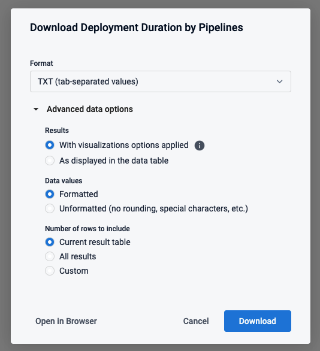
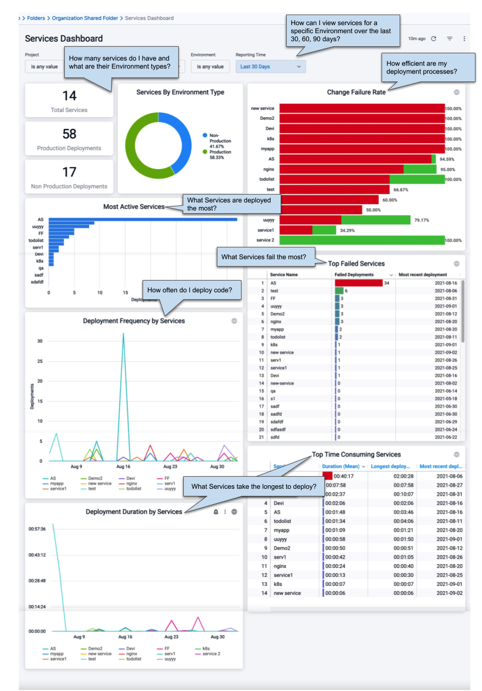

This topic describes how you can use DORA and other advanced metrics for deployments and services in CD Dashboards.

Deployments and Services can be measured within the CD module (**Overview** and **Services** in the **Deployments** module), and using the Harness Platform Dashboards (**Dashboards**). Platform Dashboards also let you create highly advanced custom dashboards.

## Overview and Services Dashboards

Deployments are tracked in the **Overview** dashboard and Services are tracked in the **Services** dashboard.

### Overview Dashboard

The Overview dashboard provides status for deployments and workloads and an overall **Deployments Health** metric:

### Services Dashboard

**What is a Harness Service?** A Harness Service is both a logical and configuration view of the services you deploy.

The logical view is immutable and contains a name, unique Id, and description. The configuration view can be changed with each stage of a Pipeline and contains the artifacts, manifests, repo URLs, etc for that stage's deployment of the Service.

**What is a Service instance in Harness?** Harness licensing is determined by the service instances you deploy. A service instance is when you use Harness to deploy the underlying infrastructure for the instance. For example, an instance of a Kubernetes workload where Harness creates the pods.

The Services dashboard provides an overview of all the Services and Service instances in your Project:

Click a Service in the Total Services table drills down to show more Service details:

## Platform Dashboards

The account-wide Platform Dashboards in Harness contain built-in dashboards that provide advanced details about your deployments and services.

You can also create your own custom dashboards describing dimensions, aggregates, calculations, and data relationships.

The Platform Dashboards use [LookML](https://docs.looker.com/data-modeling/learning-lookml/what-is-lookml), a dependency-tracking tool that provides predefined data types and syntax for data modeling.

### Built-in CD Dashboards

Currently, there are two built-in CD Dashboads: **Deployments** and **Services**.

To view these dashboards, in Harness, click **Dashboards**.

In **Dashboards**, click **Deployments** or **By Harness**.

Look for **Deployments Dashboard** and **Services Dashboard** in the dashboards that appear.

Let's look at each dashboard.

#### Deployments

The Deployments dashboard provides deployment frequency, status, and duration data in detail:

Clicking on data points or Service and Project names brings up data tables.

Click on the Pipeline or Deployment and a new browser tab opens with the Pipeline or deployment from the record.

All data can be downloaded in multiple formats with multiple options.

#### Services

The Services dashboard lets you measure the efficiency of your Service deployments by Environment and overall.

### Custom CD Dashboards

You can create custom CD dashboards that visualize deployment data by different dimensions and measures.

Here's a quick video showing how to create a CD custom dashboard:

See [Create Dashboards](../../platform/18_Dashboards/create-dashboards.md).

