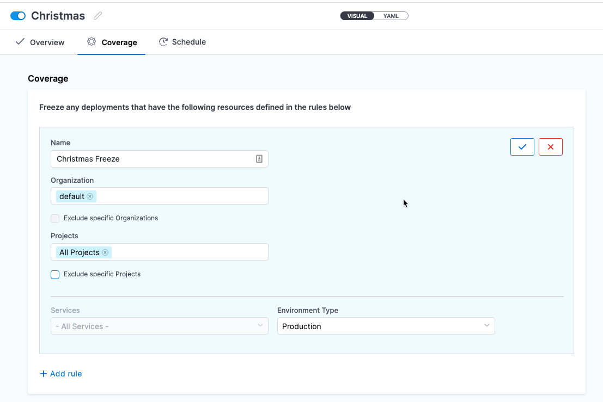
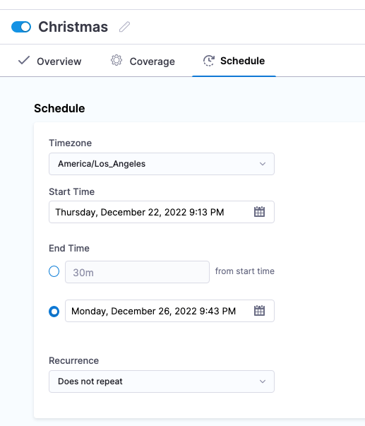

:::note

Currently, Deployment Freeze is behind the feature flag `NG_DEPLOYMENT_FREEZE`. Contact [Harness Support](mailto:support@harness.io) to enable the feature.

:::

## Deployment freeze summary

If you are new to deployment freezes, review the following summary.

Deployment freeze summary

A deployment freeze is a period of time during in which no new changes are made to a system or application. This ensures that a system or application remains stable and free of errors, particularly in the lead-up to a major event or release.

During a deployment freeze, only critical bug fixes and security patches might be deployed, and all other changes are put on hold until the freeze is lifted.

Deployment freezes are commonly used in software development to ensure that a system is not destabilized by the introduction of new code in new application versions.

## Harness freeze windows

In Harness, you set up a deployment freeze as a **freeze window**. 

A freeze window is defined using one or more rules and a schedule. The rules define the Harness orgs, projects, services, and environments to freeze. 

The schedule define when to freeze deployments and the recurrence, if any (yearly, monthly, etc).

### Freeze window scope

Freeze windows can be set at the Harness account, org, or project levels, with the following differences:

- Account: rules can apply to all or multiple **orgs and projects** in the account.
- Org: rules can apply to all or multiple **projects** in the org.
- Project: rules can apply to all or multiple **services and environments** in the project.

### Exceptions

For each scope level, you can select all subordinate entities and then add exceptions. For example, you can select **All Projects** at the org level, but then select one or more projects as exceptions.

Exceptions save you the time of having to select multiple subordinate entities individually.

### What about pipelines already running?

If a pipeline is running and a freeze happens, the pipeline will contine to run until the current stage of the pipeline has executed. Once that stage executes, the freeze is implemented and no further stage will execute.

If the freeze happens to a running pipeline and it is unable to complete all stages, the status of the pipeline execution is listed as **Aborted With Freeze**.

### Freeze windows only apply to CD stages

Deployment Freeze is a CD feature only. It does not apply to other module stages like CI and Feature Flags.

If a pipeline includes a CD stage and other module stages, like CI and Feature Flags, the freeze window is applied to the CD stage(s) **only**. The other stages in the pipeline will continue to run.

### Trigger freeze

You can create triggers in Harness to execute a pipeline under multiple conditions, such as a change to a Helm Chart, artifact, etc.

When a freeze is running, triggers will not execute frozen pipelines. The trigger invocations are rejected. 

You can create a freeze window notification to notify users when a trigger invocation was rejected. Notification are described below.

### API freeze

A freeze window applies to the [Harness API](https://apidocs.harness.io/) also.

If you have set up a deployment freeze on an account, org, or project, you cannot initiate deployment on the frozen entities during the freeze schedule.

### Access control

Deployment freeze access control is configured using the **Deployment Freeze** role permissions.

- Manage: add/edit/delete freeze at any level.
- Global: enable/disable freeze at account level.

## Create a freeze window

1. Ensure your Harness user account using a role with the required permissions.
   
   Freeze windows can be set at the Harness account, org, or project levels.

2. Select the scope for the freeze window:
   1. Account: go to **Account Settings** > **Freeze Windows**.
   2. Org: go to **Account Settings** > **Organizations** > select an org > click **Freeze Windows** in **Organization Level Governance**.
   3. Project: go to **Freeze Windows**.
3. ...

Now you can define the rules for the freeze window.

### Define rules

### Schedule freeze

## Notify users of freeze window event

- Freeze window is enabled
- Deployments are rejected due to freeze window
- Trigger invocations are rejected due to freeze window

## Enabling and disabling freeze windows

You can enable and disable freeze windows in the following ways:

## Freeze all deployments for an account

## Deployment freeze best practice

Here are some best practices for implementing a deployment freeze:

- Communicate clearly with all team members about the deployment freeze, including its purpose, duration, and any exceptions that may be made.
- Prioritize critical bug fixes and security updates that must be made during the deployment freeze, and put in place processes for reviewing and approving these changes.
- Ensure that all necessary testing has been completed and that the current state of the system is stable before implementing the deployment freeze.
- Monitor the system closely during the deployment freeze to ensure that it remains stable and that any necessary updates can be made quickly and efficiently.
- After the deployment freeze is lifted, conduct a thorough review of the system to ensure that it is functioning properly and that any changes made during the freeze did not introduce any new issues.