:::note

Currently, this feature is behind the feature flag `MULTI_SERVICE_INFRA`. Contact [Harness Support](mailto:support@harness.io) to enable the feature.

:::

This topic describes how to use multiple Services and multiple Environments in a deployment.

Often, you will deploy one Service to one Environment in a CD stage. In some cases, you might want to use multiple Services and Environments in the same stage.

For example, let's say you host 1 infrastructure per customer and want to deploy your service to all customer infrastructures in the same pipeline. Instead of creating separate stages for each service and Infrastructure combination, you can just deploy a single service to all Infrastructures in the same stage.

Another example would be when you have multiple QA environments and what to deploy to all of them together.

With multiple Harness Services and Environments in the same CD stage, you can:

* Deploy one Service to multiple Environments.
* ​Deploy multiple Services to one Environment.
* ​Deploy multiple Services to multiple Environments.

## Creating multiple Services and Environments

You can create Services, Environments, and Environment Groups inline when creating your CD stage, or you can create them separately and select them in the stage.

For more information on Services and Environments, go to [Services and Environments Overview](../onboard-cd/cd-concepts/services-and-environments-overview.md).

## Deploy one Service to multiple Environments or Infrastructures

You can deploy one Service to multiple Environments.

1. In your CD stage, click **Service**.
2. In **Select Services**, select the Service you want to deploy. Here's an example using Nginx:
   
   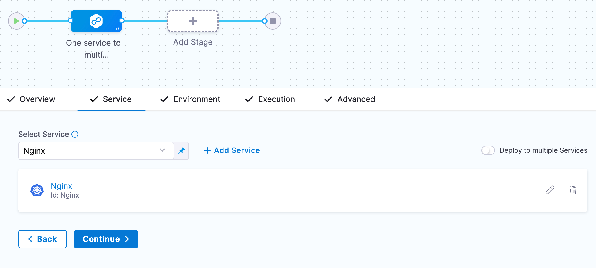

3. Click **Continue**.
4. In **Environments**, enable **Deploy to multiple Environments or Infrastructures**.
   You can select one or more Environments, and then one or more Infrastructures in each Environment.
5. In **Specify Environments**, select one or more **Environments**. Each Environment is now listed.
1. For each Environment, in **Specify Infrastructures**, select one or more Infrastructures, or select **All**.
   Here's an example using one Environment and two of its Infrastructures.

   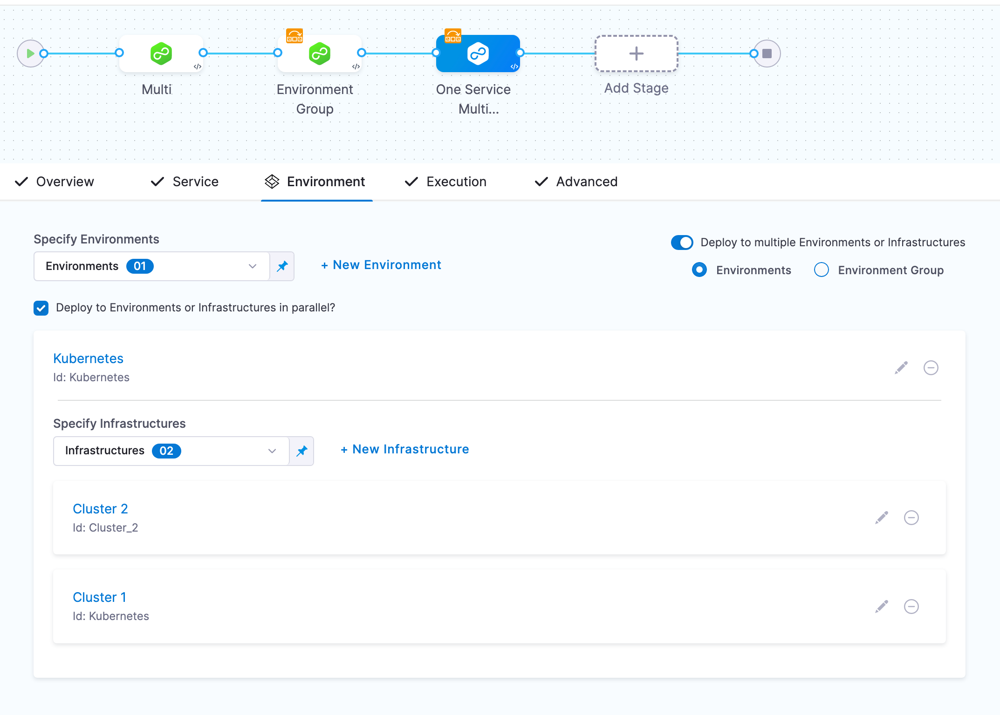

   For details on **Deploy to Environments or Infrastructures in parallel?**, go to [Deploying in parallel or serial](#deploying_in_parallel_or_serial) below.

1. Click **Continue**, select an Execution strategy, and complete the Execution steps.
2. Click **Save**.
3. Click **Run**, and then **Run Pipeline**.
   You can see both Infrastructures displayed in the target Environment:
   
   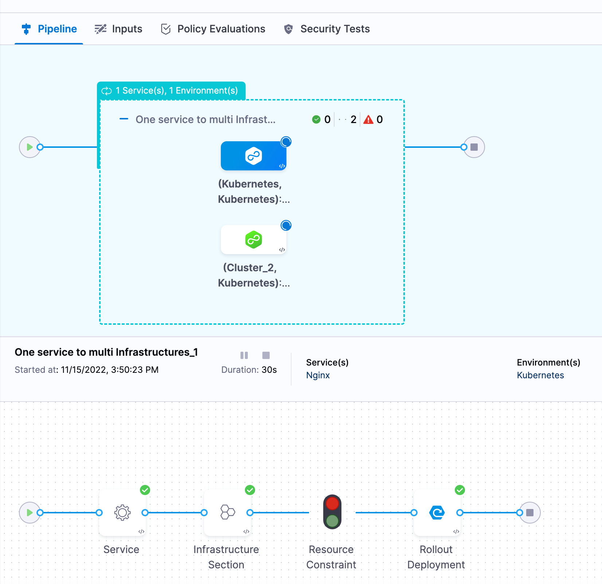

   You can click each Infrastructure to see the deployment to it or user the console view to jump between the Infrastructures:

   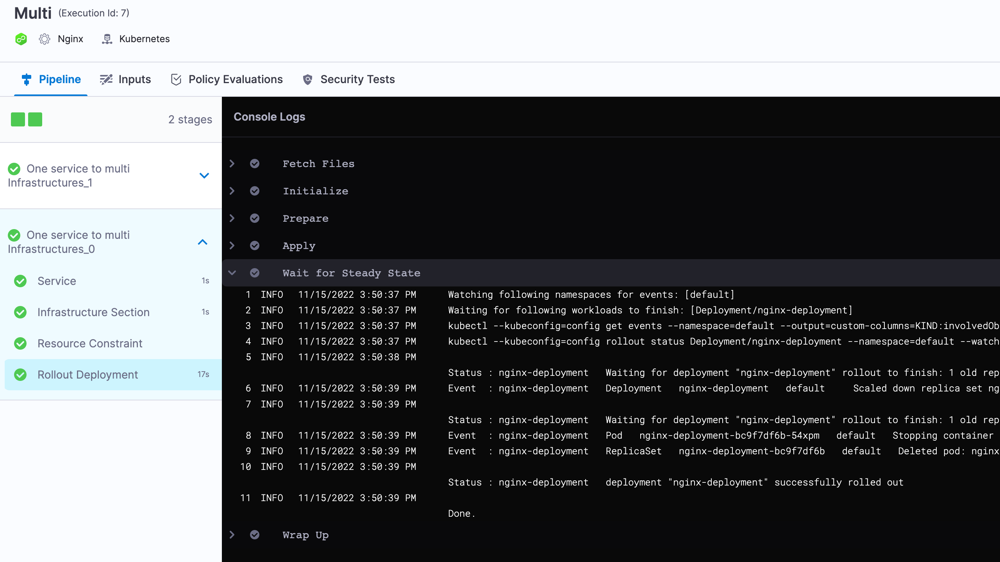

## Deploy multiple Services to one Environment

You can deploy multiple Services to the same Environment and single Infrastructure. You can deploy the Services serially or in parallel.

1. In your CD stage, click **Service**.
2. Enable the **Deploy multiple Services** setting.
3. In **Select Services**, select the Services you want to deploy.

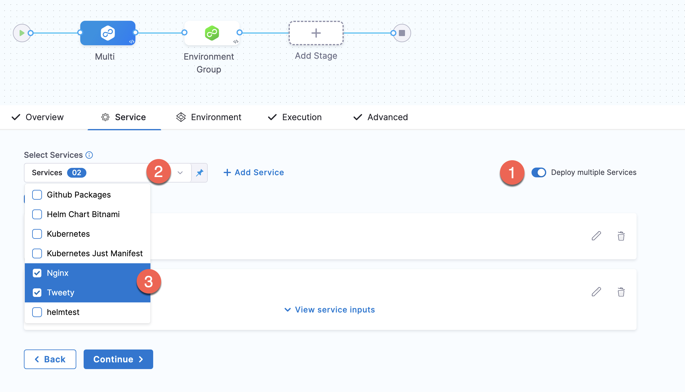

For information on **Deploy services in parallel**, go to [Deploying in parallel or serial](#deploying_in_parallel_or_serial) below.

If one or more of the Services uses Runtime Inputs, you can view the settings or switch them to Fixed Value and add a value.

The Services displayed depend on the **Deployment Type** in **Overview**. For example, if the deployment type is Kubernetes, only Kubernetes Services are listed in the **Select Services** list.

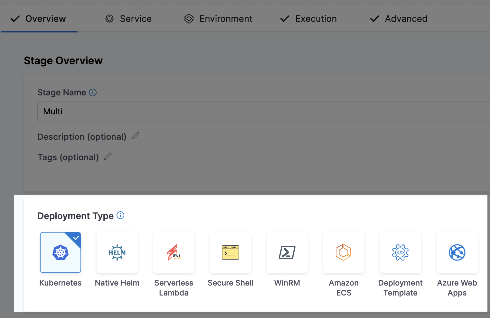

1. Click **Continue**.
2. In **Environment**, select a single Environment and Infrastructure. You don't need to enable **Deploy to multiple Environments or Infrastructures**.

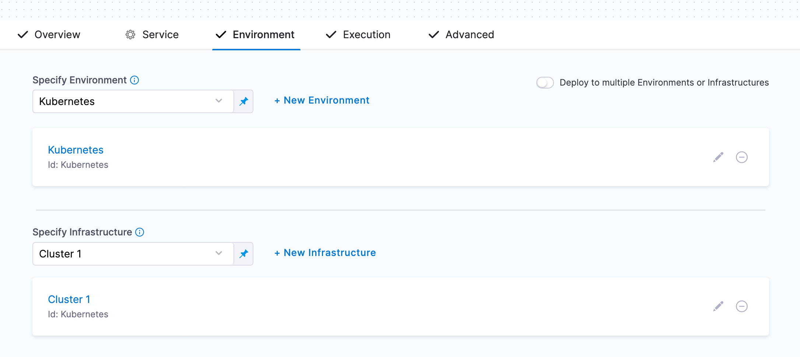

1. Click **Continue**, select an Execution strategy, and complete the Execution steps.
2. Click **Save**.
3. Click **Run**, and then **Run Pipeline**.

You can see the two Service deployments running in parallel on the same Infrastructure.

## Deploy multiple Services to multiple Environments

You can deploy multiple Services to multiple Environments and Infrastructures. You can deploy the Services serially or in parallel.

1. In your CD stage, click **Service**.
2. Enable the **Deploy multiple Services** setting.
3. In **Select Services**, select the Services you want to deploy.
   

   For information on **Deploy services in parallel**, go to [Deploying in parallel or serial](#deploying_in_parallel_or_serial) below.If one or more of the Services uses Runtime Inputs, you can view the settings or switch them to Fixed Value and add a value.

   

   The Services displayed depend on the **Deployment Type** in **Overview**.

1. Click **Continue**.
2. In **Environment**, enable **Deploy to multiple Environments or Infrastructures**.
3. Select multiple Environments and Infrastructures.
   In the following example, we are deploying to a single Environment but multiple Infrastructures in the Environment.
   
   
   
4. Click **Continue**, select an Execution strategy, and complete the Execution steps.
5. Click **Save**.
6. Click **Run**, and then **Run Pipeline**.

You can see the two Service deployments running in parallel on both Infrastructures.

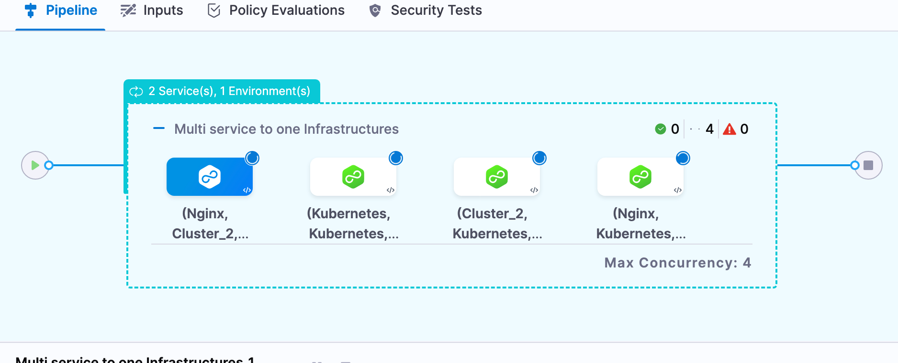

The Service deployments are grouped by Infrastructure. The first two Services are running in parallel on one Infrastructure and the second two Services are running on the other Infrastructure.

## Deploying in parallel or serial

You can deploy Services to Environments and Infrastructures in parallel or serial, with the following options:

* Services in parallel to Environments in parallel.
* Services in parallel to Environments in serial.
* Services in serial to Environments in parallel.
* Services in serial to Environments in serial.

Parallel executions are shown vertically and serial executions are show horizontally.

You can see two Service deployments running in parallel on the same Infrastructure.

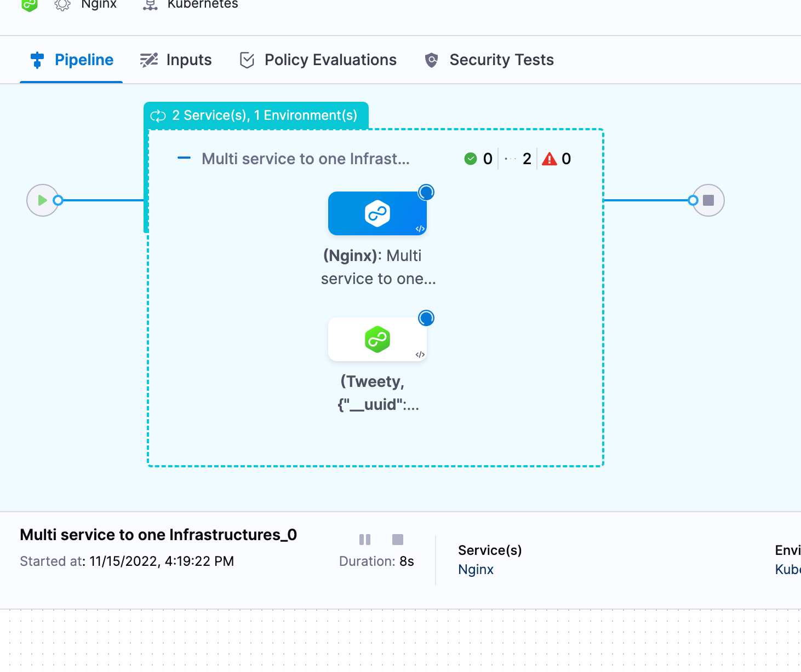

Here you can see two Service deployments run serially on the same Infrastructure:

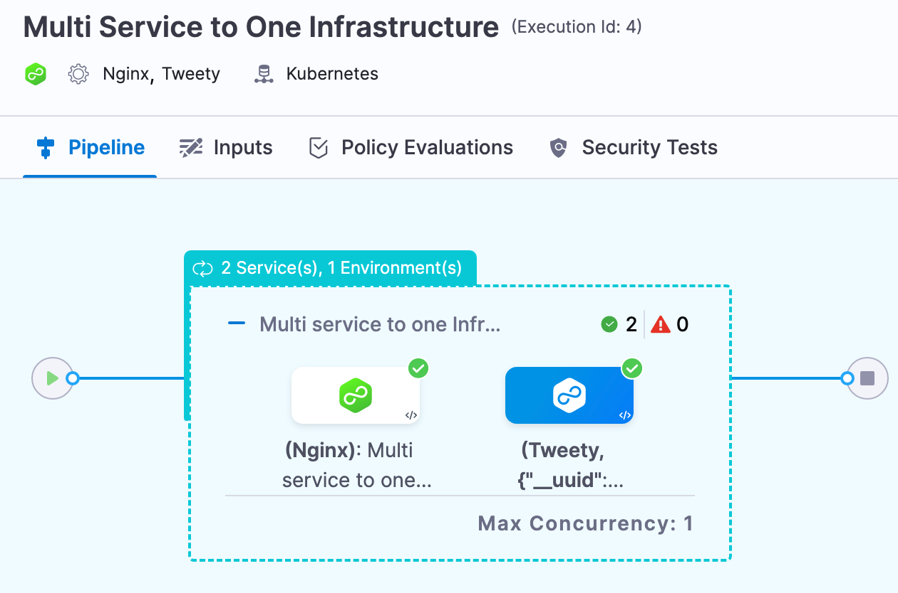

## Using Environment Groups

You can select target Environments and Infrastructures using Environment Groups.

1. In **Environment**, select **Deploy to multiple Environments or Infrastructures**, and then select **Environment Groups**.
2. In **Specify Environment Group**, select one **Environment Group**. You cannot select multiple Environment Groups.
3. In **Specify Environments**, select the Environments you want to use.
4. For each Environment, in **Specify Infrastructures**, select the Infrastructures you want to use.

Here's an example with an Environment Group containing two Environments. One Environment has two Infrastructures and the other has one Infrastructure.

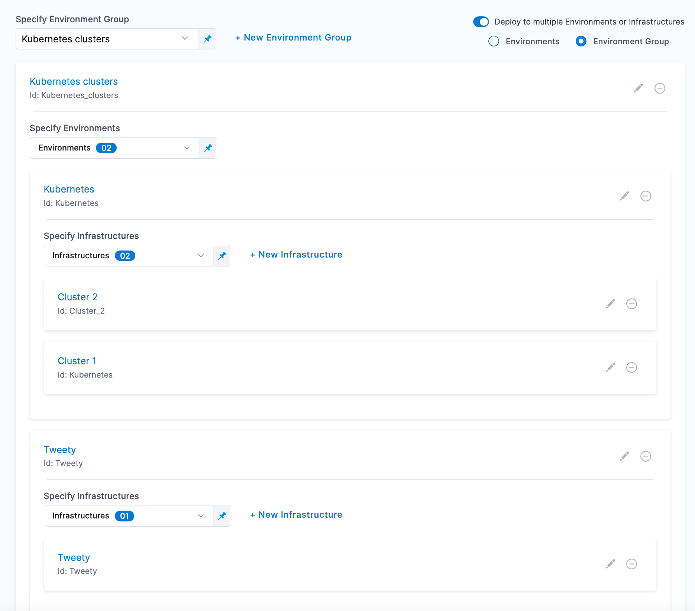

Here's what the deployment looks like:

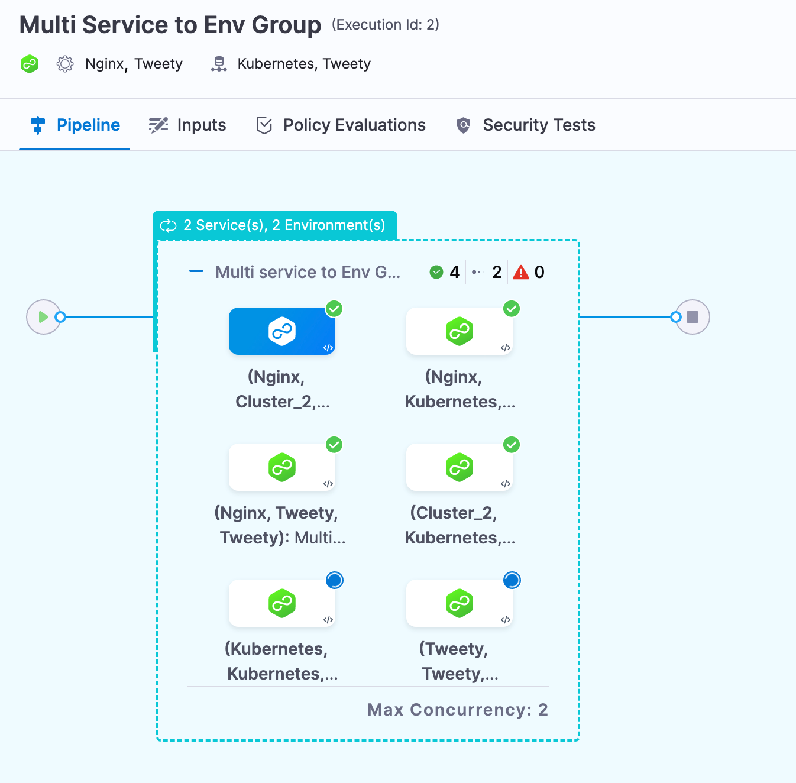

The console view can also help view multiple deployments clearly:

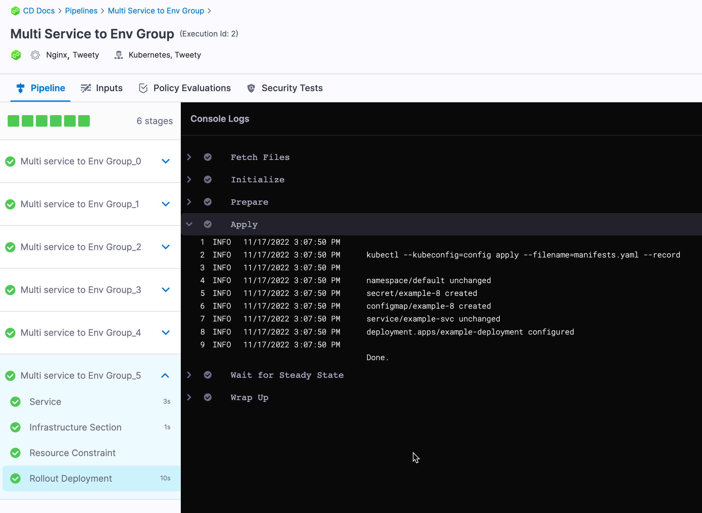

## Propagating multiple Services in stages

When you add additional CD stages to a pipeline you can propagate the multiple Services the same way you would with one Service.

For details on propagating Services in stages, go to [Propagate and Override CD Services](../cd-services/cd-services-general/propagate-and-override-cd-services.md).

## Rollback with multiple Services and Environments

With a multi Service to multi Infrastructure stage, every combination of Service and Infrastructure is treated as a separate deployment.

Consequently, if you are deploying Services A and B to Infrastructure 1 and the deployment of Service A to Infrastructure 1 fails, it will only impact the deployment of Service B to Infrastructure 1 if the Services are deployed serially (and Service A is first).

If the Services are deployed in parallel, the failure of of Service A to Infrastructure 1 will not impact the deployment of of Service B to Infrastructure 1. The failed deployment of Service A to Infrastructure 1 will roll back, but the deployment of of Service B to Infrastructure 1 will not roll back.

## Triggers and multiple Services

Triggers are applied at the pipeline level. If you have a Trigger that runs a pipeline when a Service's manifest or artifact changes, and that Service is part of a multi Service stage, the Trigger will initiate the deployment of all Services in that pipeline.

The Trigger runs the entire pipeline, not just the Service with the manifest or artifact that initiated the Trigger.

## Max Concurreny

When you view a multi Service or Environment deployment, you can see **Max Concurrency**:

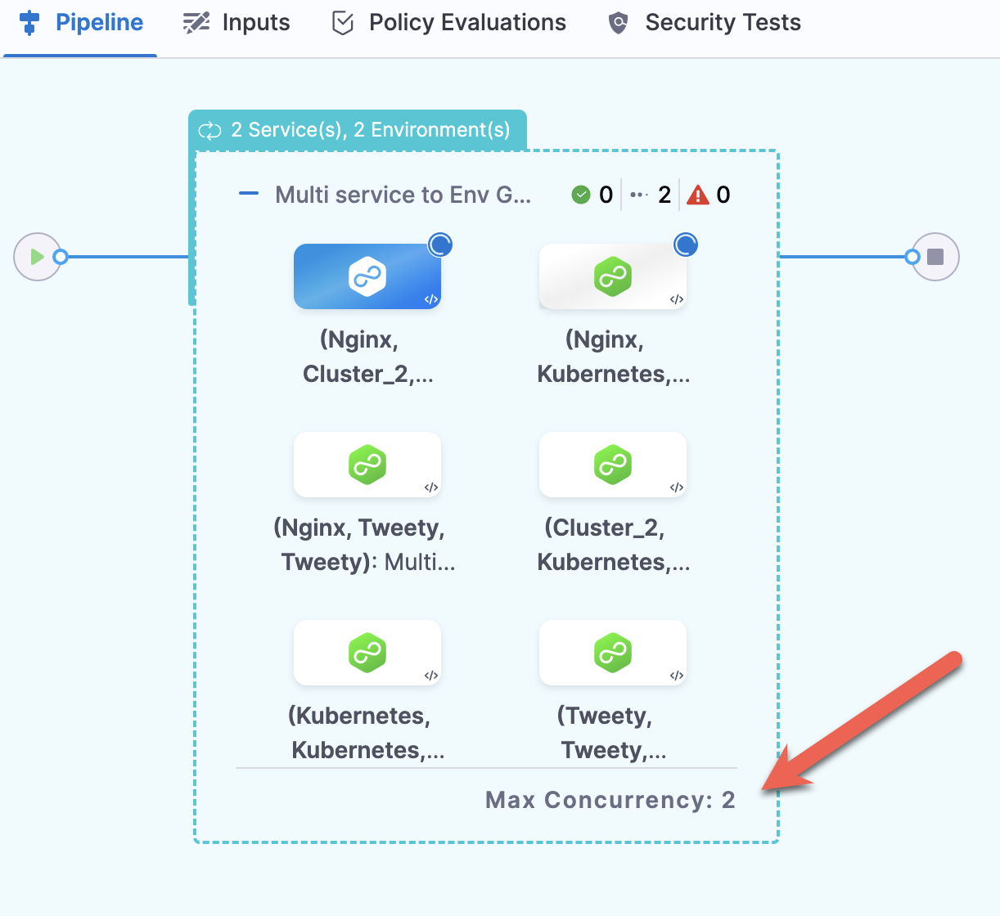

Max Concurrency changes based on the following:

* If you select **Deploy services in parallel**, Max Concurrency is equal to the number of Services.
* If you select **Deploy to Environments or Infrastructures in parallel**, Max Concurrency is equal to the number of Environments or Infrastructures.
* If you select **Deploy services in parallel** and **Deploy to Environments or Infrastructures in parallel**, Max Concurrency is equal to the number of Services multiplied by the number of Environments.

