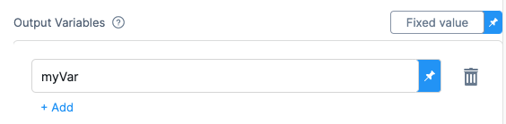

The Container step lets you run any Docker container in your Kubernetes cluster as part of your CD stage.

Harness orchestrates the container in your cluster as part of your Harness deployment. 

## Use cases

A common use case of the Container step is running tests on your cluster.

Another example is implementing Mobile Device Management (MDM)/User Experience Management (UEM). You can leverage the Container step and call the MDM/UEM APIs from Harness.

## Important notes

Please review the following important notes.

### Infrastructure provider support

Currently, the Harness Container step supports Kubernetes infrastructures only.

### Registry support

Currently, Harness can fetch containers from the following registries:

- Docker Hub
- Google Container Registry
- AWS Elastic Container Registry
- Azure Container Registry
- Artifactory
- Nexus

## Add a Container step

You add the Container step in the CD stage **Execution** section. The Container step is supported in all the deployment strategies (rolling blue green canary, custom).

```mdx-code-block
import Tabs from '@theme/Tabs';
import TabItem from '@theme/TabItem';
```
```mdx-code-block
<Tabs>
  <TabItem value="Visual" label="Visual" default>
```

1. In the CD stage **Execution** section, select **Add Step**, and then select **Container**.
2. Enter the following settings and select **Apply Changes**.

### Name

1. Enter a name for the step.

### Timeout

You can use:

- `w` for weeks.
- `d` for days.
- `h` for hours.
- `m` for minutes.
- `s` for seconds.
- `ms` for milliseconds.

The maximum is `53w`.

Timeouts can be set at the pipeline-level also, in the pipeline **Advanced Options**.

### Container registry

1. Select or create a Harness connector that connects to the Docker registry where your container is hosted.
2. Ensure that the user account used in the connector has permission to fetch the container.

### Image

1. Enter the image and tag to use for this container. For example, `maven:3.6.3-jdk-8` or `curlimages/curl:7.73.0`.

If you are fetching the image from a provider that requires a FQN (fully-qualified name), such as GCR or ECR, of the Docker image, use the FQN here. 

Here are some examples:

- Docker Hub: `maven:3.6.3-jdk-8`
- GCR: `us.gcr.io/playground-123/my-image`
- ECR: `40000005317.dkr.ecr.us-east-1.amazonaws.com/todolist:0.2`

### Shell

1. Select the type of shell you want to run your script.


### Command

1. Enter the commands you want to run in the container.

You don't need to create a Kubernetes deployment and service for the container in your script. Harness will take care of Kubernetes orchestration.

You also don't need to add `docker run` to your script.

Simply add the contents of the script you want to execute.

For example, if you would normally run this:

```
docker run --rm -it -v $(pwd):/app -w /app maven:3.6.3-jdk-8 bash -c "..."
```

You can just enter what you would write in `...`.

### Connector

1. Select or create a Harness connector to connect to the cluster and namespace where you want to run the step.

### Namespace

1. Enter the namespace in the cluster where you want to run the step.

### Set container resources

1. Set the maximum resources limit values for the resources used by the container at runtime.

- **Limit Memory:** the maximum memory that the container can use. You may express memory as a plain integer or as a fixed-point number using the suffixes G or M. You may also use the power-of-two equivalents Gi and Mi.
- **Limit CPU:** the maximum number of cores that the container can use. CPU limits are measured in cpu units. Fractional requests are allowed; you can specify one hundred millicpu as 0.1 or 100m. 

For more information, go to [Resource units in Kubernetes ](https://kubernetes.io/docs/concepts/configuration/manage-resources-containers/#resource-units-in-kubernetes) from Kubernetes.

### Image pull policy

1. Select an option to set the pull policy for the image.

- **Always:** the kubelet queries the container image registry to resolve the name to an image digest every time the kubelet launches a container. If the kubelet encounters an exact digest cached locally, it uses its cached image; otherwise, the kubelet downloads (pulls) the image with the resolved digest, and uses that image to launch the container.
- **If Not Present:** the image is pulled only if it is not already present locally.
- **Never:** the image is assumed to exist locally. No attempt is made to pull the image.

### Output variables

Output variables are outputs that are defined and captured after the Container step execution.

Output variables expose environment variables for use by other steps/stages of the pipeline. You may reference the output variable of a step using the step Id and the name of the variable in output variables.

Let's look at a simple example.

1. In the Command in a step, export a new variable using the following syntax:

    ```
    export myVar=varValue
    ```

    
2. In a later Shell Script step, reference the output variable:

    ```
    echo <+steps.S1.output.outputVariables.myVar>
    ```

The syntax for referencing output variables between steps in the same stage looks similar to the example below.

```
<+[stepId].output.outputVariables.[varName]>
```

The syntax for referencing output variables between steps in different stages looks similar to the example below.

```
<+stages.[stageID].execution.steps.[stepId].output.outputVariables.[varName]>
```

### Environment variables

Environment variables may be injected into the container and used in the script in **Command**. 

When using these environment variables, make sure to enter a **Name** and **Value** for each variable.

You may also reference environment variables in the script by their name. For example, in Bash, this would be (`$var_name` or `${var_name}`). In Windows PowerShell, the reference would be (`$Env:varName`).

For **Value**, you may enter [fixed values, runtime inputs, and expressions](https://developer.harness.io/docs/platform/references/runtime-inputs/).

For example, if you created the environment variables `DB_HOST`, `DB_URL`, and `DB_PASSWORD`, your script could reference them like this:

```
DB_URL=$DB_URL
user=$DB_HOST
password=$DB_PASSWORD
```

For example, you can set **Value** as an expression and reference the value of some other setting in the stage or pipeline.

```mdx-code-block
  </TabItem>
  <TabItem value="YAML" label="YAML">
```

1. In **Pipeline Studio**, select **YAML**
2. Paste the following YAML example and select **Save**:

```
              - step:
                  type: Container
                  name: Test
                  identifier: Test
                  spec:
                    connectorRef: Docker_Hub_with_Pwd
                    image: maven:3.6.3-jdk-8
                    command: echo "Run some smoke tests"
                    shell: Sh
                    infrastructure:
                      type: KubernetesDirect
                      spec:
                        connectorRef: K8s_Cluster_1675446740237
                        namespace: default
                        resources:
                          limits:
                            cpu: "0.5"
                            memory: 500Mi
                    outputVariables: []
                    envVariables: {}
                  timeout: 1d

```

```mdx-code-block
  </TabItem>
</Tabs>
```

## Advanced settings

In **Advanced**, you can use the following options:

* [Delegate Selector](https://developer.harness.io/docs/platform/delegates/manage-delegates/select-delegates-with-selectors/)
* [Conditional Execution](https://developer.harness.io/docs/platform/pipelines/w_pipeline-steps-reference/step-skip-condition-settings/)
* [Failure Strategy](https://developer.harness.io/docs/platform/pipelines/w_pipeline-steps-reference/step-failure-strategy-settings/)
* [Looping Strategy](https://developer.harness.io/docs/platform/pipelines/looping-strategies-matrix-repeat-and-parallelism/)
