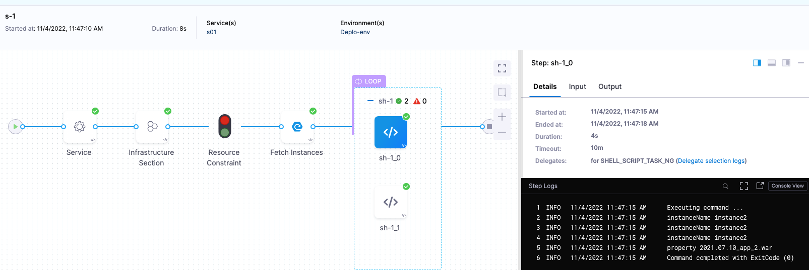
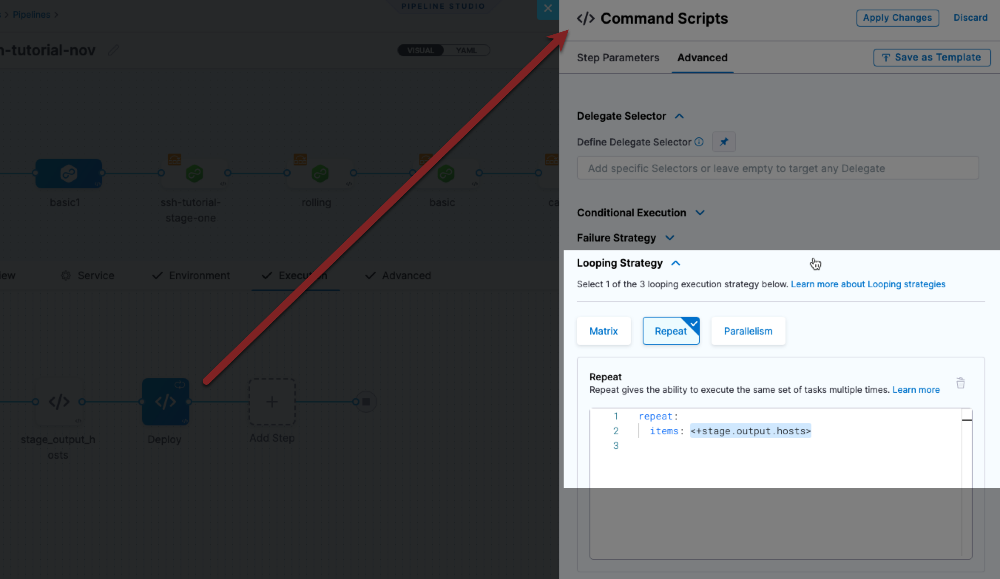
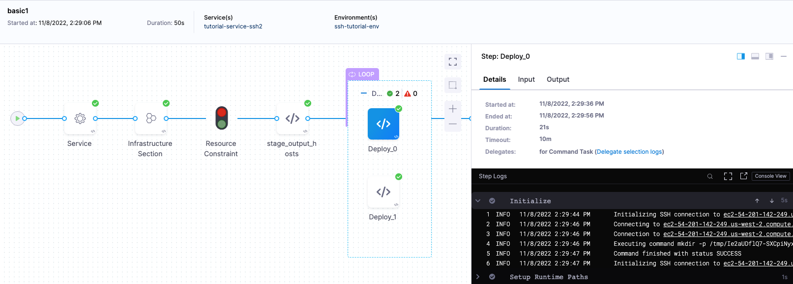

When you are deploying to multiple hosts, such as with an SSH, WinRM, or Deployment Template stage, you can run the same step on all of the target hosts.

To run the step on all hosts, you use the Repeat [Looping Strategy](../../../platform/8_Pipelines/looping-strategies-matrix-repeat-and-parallelism.md) and identify all the hosts for the stage as the target:


```yaml
repeat:  
  items: <+stage.output.hosts>
```

Here's an example with a Shell Script step:


## Create your Pipeline

You can use the Repeat Looping Strategy with `<+stage.output.hosts>` to target multiple hosts in the following deployment types:

* [SSH (Traditional)](../../onboard-cd/cd-quickstarts/ssh-ng.md)
* [WinRM](../../onboard-cd/cd-quickstarts/win-rm-tutorial.md)
* [Custom deployments using Deployment Templates](../../onboard-cd/cd-quickstarts/custom-deployment-tutorial.md)

All three types can deploy your artifacts to hosts located in Microsoft Azure, AWS, or any platform-agnostic Physical Data Center (PDC).

In the case of SSH and WinRM you can use the **Repeat** Looping Strategy with `<+stage.output.hosts>` on a step anywhere in Execution because the hosts are fetched as part of the Environment.

For **Deployment Templates**, any step using the Repeat Looping Strategy with `<+stage.output.hosts>` must come after the **Fetch Instances** step.

## Add your step

1. In **Execution**, click **Add Step** and then select and configure the step you want to run on all hosts.

Depending on the type of step you are adding, you might want to reference the host instances.

For example, you might be running a Shell Script step on all hosts.

## Reference hosts in steps using expressions

You can use all of the `<+instance...>` expressions to reference your hosts.

For Microsoft Azure, AWS, or any platform-agnostic Physical Data Center (PDC):

* [<+instance.hostName>](../../../platform/12_Variables-and-Expressions/harness-variables.md#instance-host-name)
* [<+instance.host.hostName>](../../../platform/12_Variables-and-Expressions/harness-variables.md#instance-host-host-name)
* [<+instance.name>](../../../platform/12_Variables-and-Expressions/harness-variables.md#instance-name)

For Microsoft Azure or AWS:

* [<+instance.host.privateIp>](../../../platform/12_Variables-and-Expressions/harness-variables.md#instance-host-private-ip)
* [<+instance.host.publicIp>](../../../platform/12_Variables-and-Expressions/harness-variables.md#instance-host-public-ip)

`instance.name` has the same value as `instance.hostName`. Both are available for backward compatibility.### Set Looping Strategy

The Repeat [Looping Strategy](../../../platform/8_Pipelines/looping-strategies-matrix-repeat-and-parallelism.md) allows you to repeat the step for all target hosts. The strategy will iterate through the list of hosts. The list of hosts is identified with the expression `<+stage.output.hosts>`.

1. In your step, click **Advanced**.
2. Click **Looping Strategy**.
3. Click **Repeat** and enter the following:
  ```
  repeat:  
    items: <+stage.output.hosts>
  ```
  Here's an example with a Shell Script step:

  
1. Click **Apply Changes**.

## Run your Pipeline

Once you run your Pipeline you will see the step applied to multiple hosts.

For example, here is a Custom Deployment stage using a Deployment Template.



The Fetch Instances step returned two instances and the Shell Script step was executed on both using the Loop Strategy.

Here is an SSH deployment example with a Command step that uses `<+stage.output.hosts>`:



Once the Pipeline is run, you can see each of the Deploy step run on each of the two target hosts:



You can also add a Shell Script step to echo `<+stage.output.hosts>` to see the target hosts. The expression will resolve to a list like this SSH example that deploys to AWS EC2 instances:


```
[ec2-54-201-142-249.us-west-2.compute.amazonaws.com, ec2-54-190-26-183.us-west-2.compute.amazonaws.com]
```

## Supported Deployments

The ​`<+instance...>` expression is only supported in SSH, WinRM, and Custom deployments using Deployment Templates.

