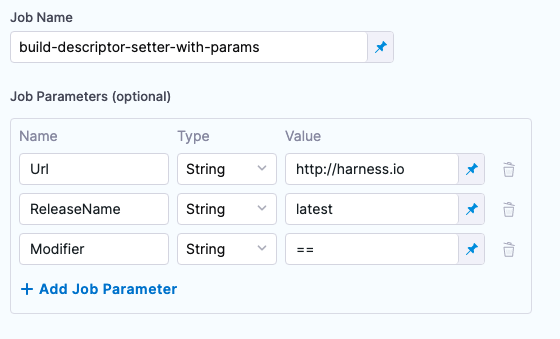
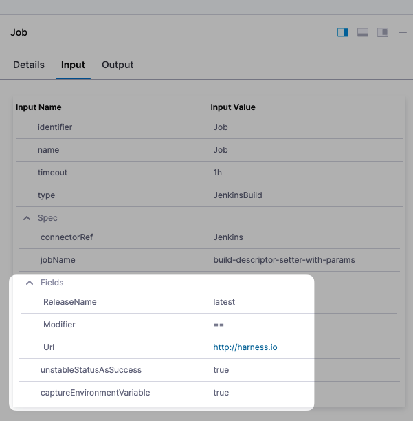
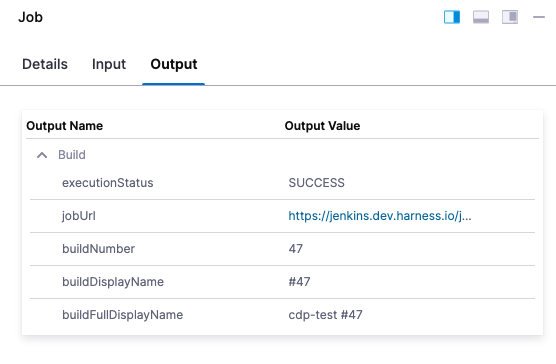

This topic describes how to use the Jenkins step in a Harness CD pipeline.

Continuous Integration (CI) can be performed in Harness using the module and [CI Pipelines](../../../continuous-integration/ci-quickstarts/ci-pipeline-basics.md).

If you are using Harness Continuous Delivery (CD) but not Harness Continuous Integration (CI), you can still perform CI using the Jenkins step in your CD stage.

Harness integrates with [Jenkins](https://jenkins.io/), enabling you to run Jenkins jobs and dynamically capture inputs and outputs from the jobs. 

## Supported platforms and technologies

See [Supported Platforms and Technologies](../../../first-gen/starthere-firstgen/supported-platforms.md).

## Limitations and requirements

* **EnvInject plugin**: For Harness to capture Jenkins environment variables, your Jenkins configuration requires the [EnvInject plugin](https://wiki.jenkins.io/display/JENKINS/EnvInject+Plugin). The plugin does not provide full compatibility with the pipeline plugin. Go to [known limitations](https://plugins.jenkins.io/envinject) from Jenkins for more information.
* **CD and custom stage types only**: The Jenkins step is available in CD (deploy) and custom stages only.
* **Jenkins with GitHub plugin**: Branch names cannot contain double quotes if you are using Jenkins with a GitHub plugin. If any previous build executed by Jenkins used a branch with double quotes in its name, delete the history of branches built already, or recreate the job.

## Jenkins integration

With the **Jenkins** step, you can execute Jenkins jobs in the stage's shell session.

When executing a job, you can also *dynamically capture* the output from the job, using runtime variables based on the context. You can then use those variables in another step in the same or other stage or pipeline.

### What information is available to capture?

Any Jenkins job information in the particular shell session of the pipeline can be captured and output using one or more Jenkins steps. In addition, you can capture information available using the built-in Harness variables. For more information, go to [Built-in and Custom Harness Variables Reference](../../../platform/12_Variables-and-Expressions/harness-variables.md).

Capturing and exporting output in the Jenkins step can be very powerful. For example, a Jenkins step could capture Jenkins build information, and a Harness service could echo the build information and use it in a complex function, and then export the output down the pipeline for further evaluation.

## Add the Jenkins step

This step assumes you have a created a pipeline and CD stage. If you are new to stages, go to [Add a Stage](../../../platform/8_Pipelines/add-a-stage.md).

In your CD Stage's **Execution**, select **Add Step**, then select **Jenkins**.

## Jenkins connector

Select the Jenkins server you added as a Harness Jenkins connector. For more information, go to [Connect to Jenkins](../../../platform/7_Connectors/connect-to-jenkins.md).

## Job name

Select the Jenkins job (also called a project) to execute. The list is automatically populated using the Jenkins server you set up in the Jenkins connector you selected.

## Use runtime inputs and expressions

You can use runtime inputs or expressions for the Jenkins connector and job name.

Go to [Fixed Values, Runtime Inputs, and Expressions](../../../platform/20_References/runtime-inputs.md) for more information.

## Job parameters

If you are using a [parameterized build](https://wiki.jenkins.io/display/JENKINS/Parameterized+Build), when you select the job in **Job Name**, Harness will automatically populate any job parameters from the server.



You can also add parameters manually by selecting **Add Job Parameter**.

Runtime inputs and expressions are supported for the **Value** only. You can reference a job parameter from the **Input** tab of the executed step.


| **Job parameters from Jenkins step** | **Executed Jenkins step inputs** |
| --- | --- |
|  |  |

## Treat unstable Jenkins status as success

If this setting is enabled then `Unstable` statuses will be considered as `Success`.

## Advanced settings

In **Advanced**, you can use the following options:

* [Delegate Selector](https://developer.harness.io/docs/platform/delegates/manage-delegates/select-delegates-with-selectors/)
* [Conditional Execution](https://developer.harness.io/docs/platform/pipelines/w_pipeline-steps-reference/step-skip-condition-settings/)
* [Failure Strategy](https://developer.harness.io/docs/platform/pipelines/w_pipeline-steps-reference/step-failure-strategy-settings/)
* [Looping Strategy](https://developer.harness.io/docs/platform/pipelines/looping-strategies-matrix-repeat-and-parallelism/)
* [Policy Enforcement](https://developer.harness.io/docs/platform/Policy-as-code/harness-governance-overview)

## Captured environment variables from Jenkins builds

For Harness to capture Jenkins environment variables, your Jenkins configuration requires the [EnvInject plugin](https://wiki.jenkins.io/display/JENKINS/EnvInject+Plugin). The plugin does not provide full compatibility with the pipeline plugin. Go to [known incompatibilities](https://wiki.jenkins.io/display/JENKINS/EnvInject+Plugin#EnvInjectPlugin-Knownincompatibilities) from Jenkins for more information. Harness captures certain environment variables from the Jenkins build.

The following list shows examples of the environment variables and the expressions you can use to reference them.

* **Job Status:** `<+execution.steps.[step_Id].build.executionStatus>`
* **Job URL:** `<+execution.steps.[step_Id].build.jobUrl>`
* **Build number:** `<+execution.steps.[step_Id].build.buildNumber>`
* **Build display name:** `<+execution.steps.[step_Id].build.buildDisplayName>`
* **Full build display name:** `<+execution.steps.[step_Id].build.buildFullDisplayName>`

Here's a sample script.

```
echo "Job Status:" <+execution.steps.Jenkins_Build.build.executionStatus>
echo "Job URL:" <+execution.steps.Jenkins_Build.build.jobUrl>
echo "Build number:" <+execution.steps.Jenkins_Build.build.buildNumber>
echo "Build display name:" <+execution.steps.Jenkins_Build.build.buildDisplayName>
echo "Full build display name:" <+execution.steps.[step_Id].build.buildFullDisplayName>
```

:::note

If you are using [step groups](../../cd-technical-reference/cd-gen-ref-category/step-groups.md) the expressions must include the step group Ids also.

For example, `<+execution.steps.[step group Id].steps.[step Id].build.jobUrl>`.

:::

You can reference this job information in subsequent steps in your pipeline or in another pipeline.

To reference the job information in another stage in this pipeline, use the full pipeline path to the build information. For example, `<+pipeline.stages.[stage_Id].spec.execution.steps.[step_Id].build.executionStatus>`.

## Multibranch pipeline support

For Harness to capture Jenkins environment variables, your Jenkins configuration requires the [EnvInject plugin](https://wiki.jenkins.io/display/JENKINS/EnvInject+Plugin). The plugin does not provide full compatibility with the pipeline plugin. Go to [known incompatibilities](https://wiki.jenkins.io/display/JENKINS/EnvInject+Plugin#EnvInjectPlugin-Knownincompatibilities) from Jenkins for more information. The Jenkins multibranch pipeline (workflow multibranch) feature enables you to automatically create a Jenkins pipeline for each branch on your source control repo.

Each branch has its own [Jenkinsfile](https://jenkins.io/doc/book/pipeline/jenkinsfile/), which can be changed independently. This features enables you to handle branches better by automatically grouping builds from feature or experimental branches.

In **Job Name**, multibranch pipelines are displayed alongside other jobs, with the child branches as subordinate options.

Select **>** and select the branch.

## Output expressions

You can copy expressions for the job outputs from the **Output** tab of the Jenkins step.

