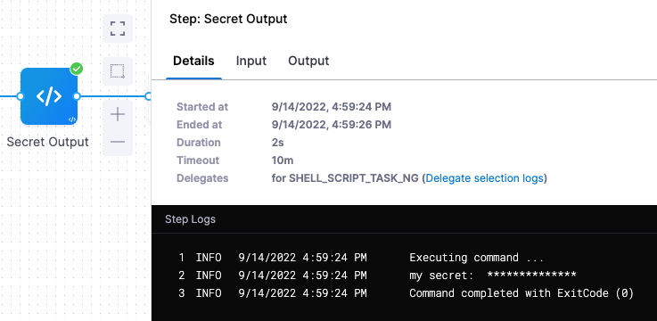

You can run shell scripts in a CD stage using the **Shell Script** step.

With the Shell Script step, you can execute scripts in the shell session of the stage in the following ways:

* Execute scripts on the host running a Harness Delegate. You can use Delegate Selectors to identify which Harness Delegate to use.
* Execute scripts on a remote target host in the deployment Infrastructure Definition.

This topic provides a simple demonstration of how to create a script in a Shell Script step, publish its output in a variable, and use the published variable in a subsequent step.

## Before You Begin

* [Kubernetes deployment tutoral](../../onboard-cd/cd-quickstarts/kubernetes-cd-quickstart.md)
* [Define Your Kubernetes Target Infrastructure](../../cd-infrastructure/kubernetes-infra/define-your-kubernetes-target-infrastructure.md): You can run a Shell Script step in a CD stage without specifying specs or artifacts, but you do need to set up the Infrastructure Definition.

## Limitations

See [Shell Script Step Reference](../../cd-technical-reference/cd-gen-ref-category/shell-script-step.md).

## Step 1: Add Your Script

When the script in the Shell Script step is run, Harness executes the script on the target host's or Delegate's operating system. Consequently, the behavior of the script depends on their system settings.

For this reason, you might wish to begin your script with a shebang line that identifies the shell language, such as `#!/bin/sh` (shell), `#!/bin/bash` (bash), or `#!/bin/dash` (dash). For more information, see the [Bash manual](https://www.gnu.org/software/bash/manual/html_node/index.html#SEC_Contents) from the GNU project.

To capture the shell script output in a variable, do the following:

In the stage, in **Execution**, click **Add Step**.

Select **Shell Script**.

Enter a name for the step. An Id is generated. This Id identifies the step and is used in variable expressions. For example, if the Id is **Shell Script**, the expression might be `<+steps.Shell_Script.output.outputVariables.myvar>`.

In **Script**, enter a bash script. For example, the variable names `BUILD_NO`and `LANG`:

```
BUILD_NO="345"  
LANG="en-us" 
```
You don't need to use `export` for the variables to use them with **Script Output Variables**. You can simply declare them, like `BUILD_NO="345"`. Export is for using the variables in child processes within the script.You must use quotes around the value because environment variables are Strings.

### Using Harness expressions in your scripts

If you need quotes around the [Harness variable expressions](../../../platform/12_Variables-and-Expressions/harness-variables.md) in your script, use single quotes, like this:

`export EVENT_PAYLOAD='<+trigger.eventPayload>'` 

If you use [Harness variable expressions](../../../platform/12_Variables-and-Expressions/harness-variables.md) in comments in your script, Harness will still try to evaluate and render the variable expressions. Don't use variable expressions that Harness cannot evaluate.

## Option: Specify Input Variables

While you can simply declare a variable in your script using a Harness expression or string for its value, using Input Variables provides some additional benefits:

* You can more easily identify and manage the Harness expressions used in your script.
* You can template your script.

You can declare the variable using **Name** and **Value** in **Script Input Variables** and then reference the variable in the script just as you would any other variable: `$var_name`.

You can also use expressions in **Value**. For example, if you have an Output Variable from a previous Shell Script step, you can copy it from the executed step **Outputs**.

In **Script Input Variables**, you simply select **Expression** and paste the expression in **Value**:


In the Script, you declare the variable using the **Name** value.


At deployment runtime, Harness will evaluate the expression and the variable will contain its output.

## Option: Specify Output Variables

Shell Script step Output Variables have a maximum size of 512KB.To export variables from the script to other steps in the stage, you use the **Script Output Variables** option.

Let's look at a simple example of a script with the variable **name**:

```
name=123
```
The `name` variable cannot be used outside the script unless you use **Script Output Variables**.

You do not need to use `export` for the variables to use them with **Script Output Variables**. You can simply declare them, like `name="123"`. Export is for using the variables in child processes within the script.In **Script Output Variables**, in **Value**, you enter the name of the script variable you want to output (`name`).

In **Name**, enter a name to use in other steps that will reference this variable. This is the output variable name that will be used in a Harness expression for referencing the output variable.


The format to reference the output variable can be one of the following:

* Within the stage:
	+ Referencing the step output:
		- `<+steps.[step_id].output.outputVariables.[output_variable_name]>`.
	+ Referencing the step output execution:
		- `<+execution.steps.[step_id].output.outputVariables.[output_variable_name]>`
* Anywhere in the Pipeline:
	+ `<+pipeline.stages.[stage_Id].spec.execution.steps.[step_id].output.outputVariables.[output_variable_name]>`

For example, it could be `<+steps.Shell_Script.output.outputVariables.newname>`.

Here's an example showing how the **Script Output Variables** references the exported variable, and how you reference the output variable name to get that value:


So now the result of `<+steps.Shell_Script.output.outputVariables.newname>` is `123`.

To find the expression to reference your output variables, find the step in the Pipeline execution, and click its **Output** tab.


You will get the full path to the variable, like this:`<+pipeline.stages.Shell_Script.execution.steps.Shell_Script.outputVariables.newname>`.

If you are using it in the same stage, you can remove everything up to `steps` (`pipeline.stages.Shell_Script.execution.`).

Now you can use `<+steps.Shell_Script.output.outputVariables.newname>` to reference the output variable.

### Output Variables as Secrets

You can select String or Secret for your output variable.


When you select Secret and reference the output variable later in the Pipeline, Harness will automatically sanitize the resolved secret value in the logs.

Let's look at an example. First, you add the output variable as a Secret:


Next, you reference that output variable as a secret, like this:


```
echo "my secret: " <+steps.CreateScript.output.outputVariables.myvar>
```
When you run the Pipeline, the resolved output variable expression is sanitized:



## Option: Harness Expressions in Variables

You can use Harness variable expressions in your scripts and in the **Script Input Variables** and **Script Output Variables**.

For **Script Input Variables** and **Script Output Variables**, you simply select **Expression**, and then paste in the Harness variable expression.


## Step 2: Specify Where to Run the Script

In **Execution Target**, select **Specify on** **Target Host** or **On Delegate**.

In you select On Delegate, the script is executed on whichever Delegate runs the step. You can use **Delegate Selector** in **Advanced** to pick the Delegate(s) if needed.

See [Select Delegates with Selectors](../../../platform/2_Delegates/delegate-guide/select-delegates-with-selectors.md).

If you select **Target Host**, enter the following:

* **Target Host:** enter the IP address or hostname of the remote host where you want to execute the script. The target host must be in the **Infrastructure Definition** selected when you created the workflow, and the Harness Delegate must have network access to the target host. You can also enter the variable `<+instance.name>` and the script will execute on whichever target host is used during deployment.
* **SSH Connection Attribute:** select the execution credentials to use for the shell session. For information on setting up execution credentials, see [Add SSH Keys](../../../platform/6_Security/4-add-use-ssh-secrets.md).

## Option: Advanced Settings

See [Shell Script Step Reference](../../cd-technical-reference/cd-gen-ref-category/shell-script-step.md).

## Notes

### Stopping Scripts After Failures

The Shell Script command will continue to process through the script even if a script step fails. To prevent this, you can simply include instructions to stop on failure in your script. For example:

* `set -e` - Exit immediately when a command fails.
* `set -o pipefail` - Sets the exit code of a pipeline to that of the rightmost command to exit with a non-zero status, or to a zero status if all commands of the pipeline exit successfully.
* `set -u` - Treat unset variables as an error and exit immediately.

For more information, see this article: [Writing Robust Bash Shell Scripts](https://www.davidpashley.com/articles/writing-robust-shell-scripts/).

### Published Variables Not Available

This error happens when you are publishing output via the **Script Output Variables** setting and your Shell Script step exits early from its script.

There are many errors that can result from this situation. For example, you might see an error such as:

```
FileNotFoundException inside shell script execution task
```

If you exit from the script (`exit 0`), values for the context cannot be read.

Instead, if you publish output variables in your Shell Script command, structure your script with `if...else` blocks to ensure it always runs to the end of the script.

### Using Secrets in Scripts

You can use Harness secrets in your Shell Script steps.

See [Add Text Secrets](../../../platform/6_Security/2-add-use-text-secrets.md).

Basically, you use `<+secrets.getValue("secret_Id")>` to refer to the secret.

### Shell Scripts and Security

Harness assumes that you trust your Harness users to add safe scripts to your Shell Script steps.

Please ensure that users adding scripts, as well as executing deployments that run the scripts, are trusted.

