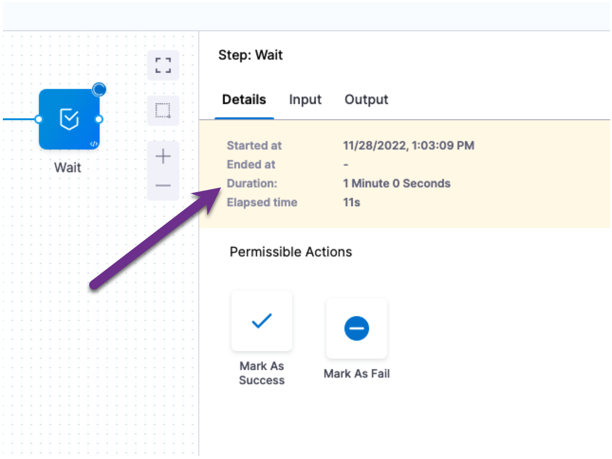
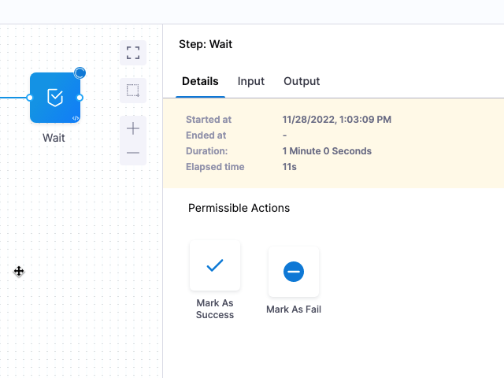

:::note

Currently, this feature is behind the feature flag `WAIT_STEP`. Contact [Harness Support](mailto:support@harness.io) to enable the feature.

:::

This topic describes how to use the Wait step included in Harness pipeline stages.

Imagine you want to automatically pause and hold a pipeline execution while you check third party systems, such as checking to ensure that a Kubernetes cluster has the necessary resources, or that a database schema has been updated.

Harness pipelines include the Wait step so you can pause the pipeline execution for any amount of time. After the wait time expires, the pipeline execution proceeds.

When the Wait step is running, it provides **Mark as Success** and **Mark as Failed** options. **Mark as Success** ends the wait period and proceeds with the execution. **Mark as Failed** initiates the Failure Strategy for the step or stage, if any, or simply fails the execution.

## Add the Wait step

The Wait step is available in Approval, Custom, CD, and Feature Flag stages. You can add the Wait step anywhere in those stages.

1. In your stage **Execution** (or **Rollout Strategy** in Feature Flags), click **Add Step**, and then click **Wait**.
2. Enter a name for the step.
3. In **Duration**, enter how long the Wait step should run. Once the timeout occurs, the pipeline execution proceeds.  
When the Wait step runs, the duration is displayed in its **Details**.  

4. Click **Apply Changes**.

### Duration

The allowed values for **Duration** are:

* `w` for weeks
* `d` for days
* `h` for hours
* `m` for minutes
* `s` for seconds
* `ms` for milliseconds

The maximum is `53w`.

You can use a Fixed Value, Runtime input, or Expression for **Duration**.

If you use Runtime input, you can enter the wait time when you run the pipeline. You can also set it in a Trigger.

If you use an Expression, ensure that the Expression resolves to one of the allowed time values. 

For information on Fixed Value, Runtime input, and Expression, go to [Fixed Values, Runtime Inputs, and Expressions](../../../platform/20_References/runtime-inputs.md). 

## Marking the Wait step as Success or Fail

When the Wait step is running, it provides **Mark as Success** and **Mark as Failed** options. **Mark as Success** ends the wait period and proceeds with the execution. **Mark as Failed** initiates the Failure Strategy for the step or stage.

For information on Failure Strategies, go to [Define a Failure Strategy on Stages and Steps](../../../platform/8_Pipelines/define-a-failure-strategy-on-stages-and-steps.md).

For example, let's say a Wait step has the Failure Strategy **Manual Intervention**. When the user clicks **Mark as Failed**, they are prompted with the **Manual Intervention** options:

If no Failure Strategy is set at the step or stage level, then clicking **Mark as Failed** simply fails the pipeline execution at the Wait step.

## Notes

* The Wait step is available in Approval, Custom, CD, and Feature Flag stages.
* The Wait step does not use a Harness Delegate. It is run by the Harness platform. There is no **Delegate Selector** in the Wait step's **Advanced** settings.

