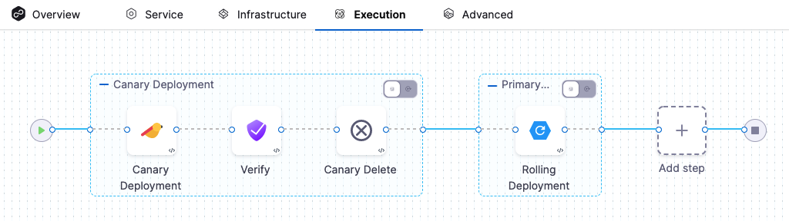
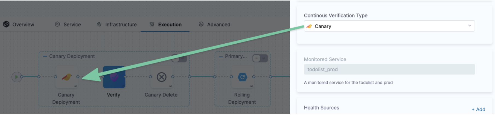

Harness CV integrates with New Relic to:

* Verify that the deployed service is running safely and performing automatic rollbacks.
* Apply machine learning to every deployment to identify and flag anomalies in future deployments.

This topic covers how to add and configure New Relic as a Health Source for the Verify step.

## Before You Begin

* [Add New Relic as a Verification Provider](https://docs.harness.io/article/g21fb5kfkg-connect-to-monitoring-and-logging-systems)

## Review: CV Setup Options

To use the Verify step, you will need a Harness Service Reliability Management Monitored Service. In the simplest terms, a Monitored Service is basically a mapping of a Harness Service to a service monitored by your APM or logging tool.

You can set up a Monitored Service in the Service Reliability Management module or in the Verify step in a CD stage. The process is the same.

No matter where you set up the Monitored Service, once it's set up, it's available to both Service Reliability Management and CD modules.

In this topic we'll set up the Monitored Service as part of the **Verify** step.

## Step 1: Add Verify Step

There are two ways to add the Verify step:

* **When selecting the stage deployment strategy:**  
The **Verify** step can be enabled in a CD stage the first time you open the **Execution** settings and select the deployment strategy. When you select the deployment strategy you want to use, there is also an **Enable Verification** option. Select the **Enable Verification** option.  
Harness will automatically add the **Verify** step. For example, here is a stage where Canary strategy and the **Enable Verification** option were selected.
* **Add the Verify step to an existing Execution setup:** You can also add the Verify step to the Execution section of a CD stage in a Pipeline you previously created. Simply click **Add Step** after the deployment step, and then select **Verify**.

## Step 2: Enter a Name and Timeout

In **Name**, enter a name for the step.

In **Timeout**, enter a timeout value for the step.

You can use:

* `w` for weeks
* `d` for days
* `h` for hours
* `m` for minutes
* `s` for seconds
* `ms` for milliseconds

The maximum is `53w`.Timeouts can be set at the Pipeline level also.

## Step 3: Select a Continuous Verification Type

In **Continuous Verification Type**, select a type that matches your [deployment strategy](verify-deployments-with-the-verify-step.md#step-3-select-a-continuous-verification-type).

## Step 4: Create a Monitored Service

In **Monitored Service**, click **Click to autocreate a monitored service**.

Harness automatically creates a Monitored Service using a concatenation of the Service and Environment names. For example, a Service named `todolist` and an Environment named `dev` will result in a Monitored Service named `todolist_dev`.

If the stage Service or Environment settings are [Runtime Inputs](https://ngdocs.harness.io/article/f6yobn7iq0-runtime-inputs), the Monitored Service and Health Sources settings will show up in the **Runtime Input** settings when you run the Pipeline.

## Step 5: Add Health Sources

A Health Source is basically a mapping of a Harness Service to the service in a deployment environment monitored by an APM or logging tool.

In **Health Sources**, click **Add**. The **Add New Health Source** settings appear.

1. In **Select health source type**, select New Relic.
2. In **Health Source Name**, enter a name for the Health Source.
3. Under **Connect Health Source**, click **Select Connector**.
4. In **Connector** settings, you can either choose an existing connector or click **New Connector.**

1. Click **Apply Selected**. The Connector is added to the Health Source.
2. In **Select Feature**, select the NewRelic feature to be used.

1. Click **Next**. The **Customize Health Source** settings appear.

The subsequent settings in **Customize Health Source** depend on the Health Source Type you selected. You can customize the metrics to map the Harness Service to the monitored environment. In Applications & Tiers, enter the following details:

1. In **Find a New Relic application** type the name of an application.
2. In **Find an AppDynamics tier** type a tier name from which you want usage metrics, code exceptions, error conditions, or exit calls.

In **Metric Packs** select the metrics you want Harness to use.

Click **Submit**. The Health Source is displayed in the Verify step.

You can add one or more Health Sources for each APM or logging provider.

## Step 6: Select Sensitivity

In **Sensitivity**, select **High**, **Medium**, or **Low** based on the risk level used as failure criteria during the deployment.

## Step 7: Select Duration

Select how long you want Harness to analyze and monitor the logs/APM data points. Harness waits for 2-3 minutes to allow enough time for the data to be sent to the APM/logging tool before it analyzes the data. This wait time is a standard with monitoring tools.

The recommended **Duration** is **10 min** for logging providers and **15 min** for APM and infrastructure providers.

## Step 8: Specify Artifact Tag

In **Artifact Tag**, use a [Harness expression](https://newdocs.helpdocs.io/article/lml71vhsim-harness-variables) to reference the artifact in the stage Service settings.

The expression `<+serviceConfig.artifacts.primary.tag>` refers to the primary artifact.

## Option: Advanced Settings

In **Advanced**, you can select the following options:

* [Step Skip Condition Settings](https://docs.harness.io/article/i36ibenkq2-step-skip-condition-settings)
* [Step Failure Strategy Settings](https://docs.harness.io/article/htrur23poj-step-failure-strategy-settings)
* [Select Delegates with Selectors](https://docs.harness.io/article/nnuf8yv13o-select-delegates-with-selectors)

See [Advanced Settings](verify-deployments-with-the-verify-step.md#option-advanced-settings).

## Step 9: Deploy and Review Results

After setting up the **Verify** step, click **Apply Changes**.

Click **Run** to run the pipeline.

In **Run Pipeline**, select the tag for the artifact if a tag was not added in the **Artifact Details** settings.

Click **Run Pipeline**.

When the Pipeline is running, click the **Verify** step. You can see that the verification takes a few minutes.

Once verification is complete, the Verify step shows the following:

The risk level might initially display a number of violations, but the red and orange colored host often change to green over the duration.

### Summary

The **Summary** section shows the number of logs that are in violation.

### Console View

Click **Console View** or simply click **View Details** in **Summary** to take a deeper look at verification.

If you have more than one Health Source, you can use the **View** dropdown to select each one.

You can use the search option to search for any specific metric or transaction you want.

